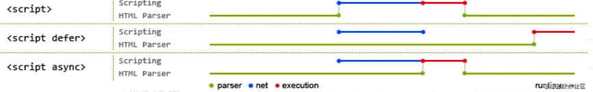

# Javascript 原生函数与属性

:::details 查看目录
[[TOC]]
:::


## 属性获取

### Object.keys

返回一个由一个给定对象的自身可枚举属性组成的数组，数组中属性名的排列顺序和正常循环遍历该对象时返回的顺序一致 。

返回的是所有可枚举属性键，也就是属性下的 enumerable: true。但不包括 Symbol 值作为名称的属性键。

### Object.getOwnPropertyNames

返回一个由指定对象的所有自身属性的属性名（包括不可枚举属性但不包括 Symbol 值作为名称的属性）组成的数组。

返回的是对象所有自己的属性键 ，包括不可枚举属性但不包括 Symbol 值作为名称的属性键。

### Object.getOwnPropertySymbols

一个给定对象自身的所有 Symbol 属性的数组。

返回一个给定对象自身的所有 Symbol 属性键的数组。

## 节点位置关系

### Node.contains

返回的是一个布尔值，来表示传入的节点是否为该节点的后代节点

### Node.compareDocumentPosition

比较当前节点与任意文档中的另一个节点的位置关系

```ts
const compareMask = node.compareDocumentPosition(otherNode)
```

## 获取文本

### HTMLElement.innerText

- 对 HTML 标签进行解析；
- 对 CSS 样式进行带限制的解析和渲染；
- 将 ASCII 实体转换为对应的字符；
- 剔除格式信息（如\t、\r、\n 等），将多个连续的空格合并为一个

### Node.textContent

- 对 HTML 标签进行剔除
- 将 ASCII 实体转换为相应的字符
- 对 HTML 标签是剔除不是解析，也不会出现 CSS 解析和渲染的处理，因此`<br/>`等元素是不生效的。
- 不会剔除格式信息和合并连续的空格，因此\t、\r、\n 和连续的空格将生效

## 节点取值

### value

特定的一些 HTMLElement 元素，用 value 属性获取其值。常见的有 value 属性的元素如下：

- `HTMLInputElement <input value="1" />`
- `HTMLTextAreaElement <textarea value= "你哈" />`
- `HTMLButtonElement <button value= "提交" />`
- `HTMLDataElement <data value="21053">圣女果</data>`
- `HTMLSelectElement <select><option value ="volvo">Volvo</option>`
- `HTMLOptionElement <select><option value ="volvo">Volvo</option>`
- `HTMLProgressElement <progress value="22" max="100"></progress>`

### Node.nodeValue

对于 text, comment, 和 CDATA 节点来说, nodeValue 返回该节点的文本内容.

对于 attribute 节点来说, 返回该属性的属性值.

返回值是一个具有以下值的位掩码：

| 常量名                                    | 十进制值 | 含义                   |
| :---------------------------------------- | :------- | :--------------------- |
| DOCUMENT_POSITION_DISCONNECTED            | 1        | 不在同一文档中         |
| DOCUMENT_POSITION_PRECEDING               | 2        | otherNode 在 node 之前 |
| DOCUMENT_POSITION_FOLLOWING               | 4        | otherNode 在 node 之后 |
| DOCUMENT_POSITION_CONTAINS                | 8        | otherNode 包含 node    |
| DOCUMENT_POSITION_CONTAINED_BY            | 16       | otherNode 被 node 包含 |
| DOCUMENT_POSITION_IMPLEMENTATION_SPECIFIC | 32       | 待定                   |

## 节点复制

### Document.adoptNode

从其他的 document 文档中获取一个节点。该节点以及它的子树上的所有节点都会从原文档删除 (如果有这个节点的话), 并且它的 ownerDocument 属性会变成当前的 document 文档。之后你可以把这个节点插入到当前文档中。

**语法**

```js
const node = document.adoptNode(externalNode)
```

**node**: 导入当前文档的新节点。新节点的 parentNode 是 null, 因为它还没有插入当前文档的文档树中，属于游离状态。

**externalNode**: 将要从外部文档导入的节点。

> 该方法不但可以从 iframe 中获取 adopt 元素，在同一 document 文档下的不同两个元素中也可以使用，该方法可以实现从左边栏列表中选取某些元素加载到右边栏的功能。

### Document.importNode

将外部文档的一个节点拷贝一份，然后可以把这个拷贝的节点插入到当前文档中。（源节点不会从外部文档中删除，被导入的节点是源节点的一个拷贝。）

**语法**

```js
const node = document.importNode(externalNode, deep)
```

:::tip
**node**: 导入当前文档的新节点。新节点的 parentNode 是 null, 因为它还没有插入当前文档的文档树中，属于游离状态。

**externalNode**: 将要从外部文档导入的节点。

**deep(可选)**: 一个布尔值，表明是否要导入节点的后代节点。
:::


### Node.cloneNode

Node.cloneNode() 方法返回调用该方法的节点的一个副本。

**语法**

```js
const dupNode = node.cloneNode(deep)
```

:::tip
**node**: 将要被克隆的节点

**dupNode**: 克隆生成的副本节点

**deep(可选)**: 是否采用深度克隆，如果为 true，则该节点的所有后代节点也都会被克隆，如果为 false，则只克隆该节点本身。
:::


`Node.cloneNode` 有一个 `boolean` 类型的可选参数`deep`: 

- true: 则该节点的所有后代节点也都会被克隆
- false: 则只克隆该节点本身

:::tip 
  - `cloneNode deep` 参数在不同版本的浏览器实现中，默认值可能不一样， 所以强烈建议写上值。
  -  `cloneNode` 会克隆一个元素节点会拷贝它所有的属性以及属性值,当然也就包括了属性上绑定的事件(比如 οnclick="alert(1)"),但不会拷贝那些使用 addEventListener()方法或者 node.onclick = fn 这种用 JavaScript 动态绑定的事件。
  - 在使用 `Node.appendChild()`或其他类似的方法将拷贝的节点添加到文档中之前，那个拷贝节点并不属于当前文档树的一部分，也就是说，它没有父节点。
  - 如果 `deep` 参数设为 `false`,则不克隆它的任何子节点。该节点所包含的所有文本也不会被克隆，因为文本本身也是一个或多个的 `Text` 节点。
  - 如果 `deep` 参数设为 `true`,则会复制整棵 `DOM` 子树 (包括那些可能存在的 `Text` 子节点).对于空结点 (例如``和`<input>`元素), 则 `deep` 参数无论设为 `true` 还是设为 `false`, 都没有关系，但是仍然需要为它指定一个值。
:::

如果原始节点设置了 ID，并且克隆节点会被插入到相同的文档中，那么应该更新克隆节点的 ID 以保证唯一性。name 属性可能也需要进行修改，取决于你是否希望有相同名称的节点存在于文档中。
想要克隆一个节点来添加到另外一个文档中，请使用`Document.importNode()`代替本方法。

## 父节点

### Node.childNodes

节点的子节点集合，包括元素节点、文本节点还有属性节点

childNodes 返回所有类型的节点

### ParentNode.children

返回的只是节点的元素节点集合, 即 nodeType 为 1 的节点。

## 添加节点

### node.appendChild

将一个节点附加到指定父节点的子节点列表的末尾处

### ParentNode.append

方法在 `ParentNode` 的最后一个子节点之后插入一组 `Node` 对象或 `DOMString` 对象。被插入的 `DOMString` 对象等价为 `Text` 节点.

- `ParentNode.append()` 允许追加 `DOMString` 对象，而 `Node.appendChild()` 只接受 `Node` 对象。
- `ParentNode.append()` 没有返回值，而 `Node.appendChild()` 返回追加的 Node 对象。
- `ParentNode.append()` 可以追加多个节点和字符串，而 `Node.appendChild()` 只能追加一个节点。

## 函数调用 call, apply, bind

**相同点，都能改变被调用函数的 this 指向。**

- call: 第二个参数开始，可以接收任意个参数
- apply: 第二个参数，必须是数组或者类数组
- bind: 第二个参数开始，可以接收任意个参数 , 返回的是一个新的函数
- bind 调用多次，this 指向第一次第一个参数

```js
function log() {
  console.log('this', this)
}
console.log(log.bind({ val: 1 }).bind({ val: 2 })()) // { val: 1 }
```

虽然 `this` 的指向不会再变改变，但是参数还是继续接受， `arguments` 长度为 `2`， 第一次 `bind` 的 `1`，第二次 `bind` 的 `2` , 都照单全收。

```js
function log() {
  console.log('this', this) // { val: 1 }
  console.log('arguments', arguments) // { '0': 1, '1': 2 }
}

console.log(log.bind({ val: 1 }, 1).bind({ val: 2 }, 2)()) // 1
```

### Function.prototype.call

使用一个指定的 `this` 值和单独给出的一个或多个参数来调用一个函数。

### Function.prototype.apply

调用一个具有给定 this 值的函数，以及以一个数组（或类数组对象）的形式提供的参数

### Function.prototype.bind

方法创建一个新的函数，在 `bind()` 被调用时，这个新函数的 `this` 被指定为 `bind()` 的第一个参数，而其余参数将作为新函数的参数，供调用时使用。

```js
function sum(...args) {
  const total = args.reduce((s, cur) => {
    return s + cur
  }, 0)

  return (this.base || 0) + total
}

const context = {
  base: 1000,
}

const bindFun = sum.bind(context, 1, 2)

const callResult = sum.call(context, 1, 2, 3, 4)
const applyResult = sum.apply(context, [1, 2, 3, 4])
const bindResult = bindFun(3, 4)

console.log('call:', callResult) // 1010
console.log('apply:', applyResult) // 1010
console.log('bind:', bindResult) // 1010
```

## 字符串截取

### String.prototype.substr

返回一个字符串中从指定位置开始到指定字符数的字符

语法：第二参数，是需要截取的长度

```js
str.substr(start[, length])
```

### String.prototype.substring

返回一个字符串在开始索引到结束索引之间的一个子集, 或从开始索引直到字符串的末尾的一个子集。

语法：第二参数，结束索引

```js
str.substring(indexStart[, indexEnd])
```

```js
const str = '我们都是好孩子'

console.log(str.substr()) // 我们都是好孩子
console.log(str.substring()) // 我们都是好孩子

console.log(str.substr(1)) // 们都是好孩子
console.log(str.substring(1)) // 们都是好孩子

console.log(str.substr(-1)) // 子
console.log(str.substring(-1)) // 我们都是好孩子

console.log(str.substr(1, 2)) // 们都
console.log(str.substring(1, 2)) // 们
```

## 遍历

### for in

获取 enumerable:true 的属性键

### for of

遍历属性值。不受到 enumerable 限制。

## 域名信息

### location.host

包含：主机名，如果 URL 的端口号是非空的，还会跟上一个 ':' ，最后是 URL 的端口号

### location.hostname

返回域名

```js
const anchor = document.createElement('a')

anchor.href = 'https://developer.mozilla.org:443/en-US/Location.host'
console.log(anchor.host == 'developer.mozilla.org:443') // false
console.log(anchor.host == 'developer.mozilla.org') // true

console.log(anchor.hostname == 'developer.mozilla.org:443') // false
console.log(anchor.hostname == 'developer.mozilla.org') // true

anchor.href = 'https://developer.mozilla.org:4097/en-US/Location.host'
console.log(anchor.host == 'developer.mozilla.org:4097') // true
console.log(anchor.hostname == 'developer.mozilla.org') // true
```

默认端口下， host 等于 hostname

host 额外包含端口号

## 异步加载脚本

### defer

异步加载，按照加载顺序执行脚本的

### async

异步加载，乱序执行脚本。


