# 浏览器观察者 Observer API

:::details
[[TOC]]
:::


## 总体对比

|      | IntersectionObserver                                                                     | MutationObserver                                                                                  | ResizeObserver                                         | PerformanceObserver                                                            |
| :--- | :--------------------------------------------------------------------------------------- | :------------------------------------------------------------------------------------------------ | :----------------------------------------------------- | :----------------------------------------------------------------------------- |
| 用途 | 观察一个元素是否在视窗可见                                                               | 观察 DOM 中的变化                                                                                 | 观察视口大小的变化                                     | 监测性能度量事件                                                               |
| 方法 | `observe()` <br/> `disconnect()` <br/> `takeRecords()`                                         | `observe()` <br/> `disconnect()` <br/> `takeRecords()` <br/> `unobserve()`                              | `observe()` <br/> `disconnect()` <br/> `unobserve()`         | `observe()` <br/> `disconnect()` <br/> `takeRecords()`                               |
| 取代 | Dom Mutation events                                                                      | `getBoundingClientRect()` 返回元素的大小及其相对于可视窗口的位置,`Scroll` 和 `Resize` 事件              | `Resize` 事件                                            | `Performance` 接口                                                               |
| 用途 | 1. 无限滚动 <br/> 2. 图片懒加载 <br/> 3. 兴趣埋点 <br/> 4. 控制动画/视频执行（性能优化） | 1. 更高性能的数据绑定及响应 <br/> 2. 实现视觉差滚动 <br/> 3. 图片预加载 <br/> 4. 实现富文本编辑器 | 1. 更智能的响应式布局（取代@media）<br/> 2. 响应式组件 | 1. 更细颗粒的性能监控 <br/> 2. 分析性能对业务的影响（交互快/慢是否会影响销量） |


## Intersection Observer,交叉观察者

`IntersectionObserver` 可以监听一个元素和可视区域相交部分的比例,然后在可视比例达到某个阈值的时候触发回调。

### 浏览器兼容性

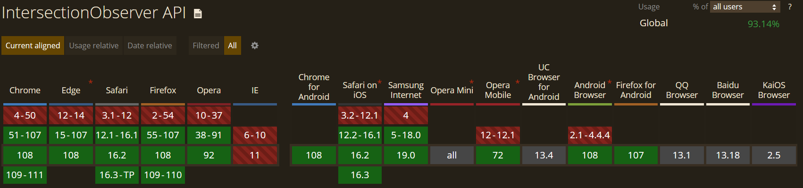

### 语法

```js
var observer = new IntersectionObserver(callback[, options]);
```

:::tip `callback` 是一个回调函数,里面返回监听目标元素的实时数据组成的数组
  - `time` 时间戳
  - `rootBounds` 根元素的位置信息
  - `boundingClientRect` 目标元素的位置信息
  - `intersectionRect` 交叉部分的位置信息
  - `intersectionRatio` 目标元素的可见比例,看下图示
  - `target` 等
:::

:::tip `options` 是一些配置
  - `root` 目标元素的祖先元素,即该元素必须是目标元素的直接或间接父级
  - `rootMargin` 一个在计算交叉值时添加至 `root` 的边界盒中的一组偏移量,写法类似 `CSS` 的 `margin`
  - `threshold` 规定了一个监听目标与边界盒交叉区域的比例值,可以是一个具体的数值或是一组 `0.0`到 `1.0` 之间的数组
:::

  

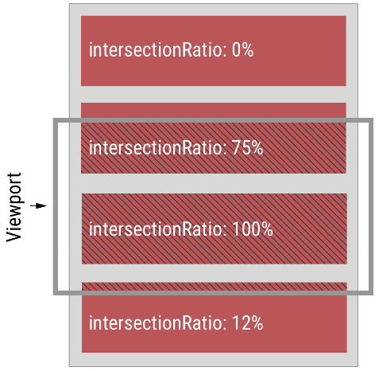

:::tip 

**开始监听元素:** `observer.observe(target)`

**停止对某目标的监听:** `observer.unobserve(target)`

**终止对所有目标的监听:** `observer.disconnect()`
:::

### polyfill

```shell
pnpm add intersection-observer
```

使用

```shell
# 入口文件引入即可
import 'intersection-observer'
```

### 示例

```vue
<script setup>
const intersectionObserver = new IntersectionObserver(
  (entries) => {
    console.log('info:')
    entries.forEach((item) => {
      console.log(item.target, item.intersectionRatio)
    })
  },
  {
    threshold: [0.5, 1],
  }
)
</script>

<template>
  <div id="box1">
    BOX111
  </div>
  <div id="box2">
    BOX222
  </div>
</template>

<style>
#box1,
#box2 {
  width: 100px;
  height: 100px;
  background: blue;
  color: #fff;

  position: relative;
}
#box1 {
  top: 500px;
}
#box2 {
  top: 800px;
}
</style>
```

创建一个 `IntersectionObserver` 对象,监听 `box1` 和 `box2` 两个元素,当可见比例达到` 0.5` 和 `1` 的时候触发回调。

可以看到元素 `box1` 和 `box2` 在可视范围达到一半（`0.5`）和全部（`1`）的时候分别触发了回调。

数据采集的时候,希望知道某个元素是否是可见的,什么时候可见的,就可以用这个 api 来监听,还有做图片的懒加载的时候,可以当可视比例达到某个比例再触发加载。

## Mutation Observer,变动观察者

`MutationObserver` 可以监听对元素的属性的修改、对它的子节点的增删改。

### 兼容性

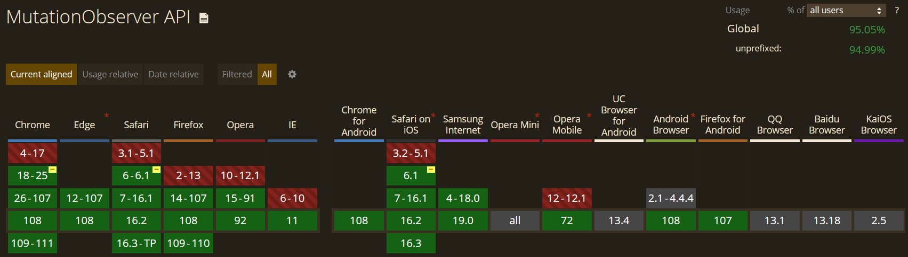

### 语法

```js
const observer = new MutationObserver(callback)
```

**开始监听**

```js
observer.observe(target, config)
```

:::tip `config` 填写需要监听属性
  - attributes 布尔类型 属性的变动
  - childList 布尔类型 子节点的变动（指新增,删除或者更改）
  - characterData 布尔类型 节点内容或节点文本的变动。
  - subtree 布尔类型 是否将该观察器应用于该节点的所有后代节点
  - attributeOldValue 布尔类型 观察 attributes 变动时,是否需要记录变动前的属性值
  - characterDataOldValue 布尔类型 观察 characterData 变动时,是否需要记录变动前的值
  - attributeFilter 数组 需要观察的特定属性（比如['class','src']）
:::

🔜 **终止对所有目标的监听:**  `observer.disconnect()`

**takeRecords():**  从 `MutationObserver` 的通知队列中删除所有待处理的通知,并将它们返回到 `MutationRecord` 对象的新 `Array` 中。

### polyfill

如果你的浏览器不需要兼容 `IE9`,`IE10` 浏览器,推荐使用 `MutationObserver` 实现 `DOM` 变化的检测。

如果你的项目需要兼容 `IE9`,`IE10` 浏览器,同时想要实现对 `DOM` 变化的检测,则可以试试 `Mutation events`。

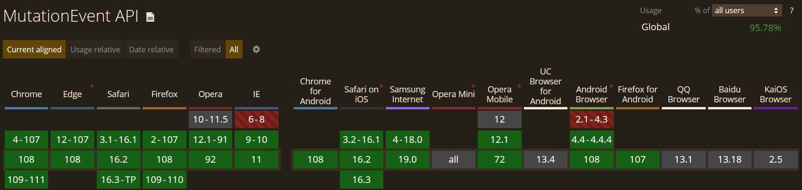

`Mutation events` 语法上相对简单易懂很多, 你就认为是和'`click`', '`mouseover`'一样的 DOM 事件用就好了。

:::tip  支持的事件列表如下:

- `DOMAttrModified` (Chrome/Safari 不支持)
- `DOMAttributeNameChanged`
- `DOMCharacterDataModified`
- `DOMElementNameChanged`
- `DOMNodeInserted`
- `DOMNodeInsertedIntoDocument` (IE 不支持)
- `DOMNodeRemoved`
- `DOMNodeRemovedFromDocument` (IE 不支持)
- `DOMSubtreeModified`
:::

具体描述见下表（IE 不支持的两个我们忽略,这个就算没兼容性问题和很少用到）:

| 事件名称                 | 事件描述             |
| :----------------------- | :------------------- |
| `DOMAttrModified`          | DOM 属性发生修改     |
| `DOMAttributeNameChanged`  | DOM 属性名发生变化   |
| `DOMCharacterDataModified` | DOM 文本数据发生修改 |
| `DOMElementNameChanged`    | DOM 元素名发生变化   |
| `DOMNodeInserted`          | DOM 节点插入         |
| `DOMNodeRemoved`           | DOM 节点删除         |
| `DOMSubtreeModified`       | DOM 子元素修改       |

使用例子:

```js
element.addEventListener(
  'DOMNodeInserted',
  (event) => {
    // event.target就是依次插入的DOM节点
  },
  false
)
```

**Chrome/Safari 不支持 DOMAttrModified 的处理**

`Object.defineProperty`,可以方便对自定义属性的变化进行检测。

```js
// 重新定义rows属性
Object.defineProperty(ell, 'rows', {
  writeable: true,
  enumerable: true,
  get() {
    return this.getAttribute('rows')
  },
  set(rows) {
    this.setAttribute('rows', rows)
    // rows变化了,重渲染
    this.render()
  },
})
```

`Object.defineProperty `语法如下:

```js
Object.defineProperty(obj, prop, descriptor)
```

### 示例

```vue
<script setup>
setTimeout(() => {
  box.style.background = 'red'
}, 2000)

setTimeout(() => {
  const dom = document.createElement('button')
  dom.textContent = '东东东'
  box.appendChild(dom)
}, 3000)

setTimeout(() => {
  document.querySelectorAll('button')[0].remove()
}, 5000)

onMounted(() => {
  const mutationObserver = new MutationObserver((mutationsList) => {
    console.log(mutationsList)
  })

  mutationObserver.observe(box, {
    attributes: true,
    childList: true,
  })
})
</script>

<template>
  <div id="box">
    <button>光</button>
  </div>
</template>

<style>
#box {
  width: 100px;
  height: 100px;
  background: blue;

  position: relative;
}
</style>
```

2s 的时候修改背景颜色为红色,3s 的时候添加一个 button 的子元素,5s 的时候删除第一个 button。

第一次改变的是 `attributes`,属性是 `style`:

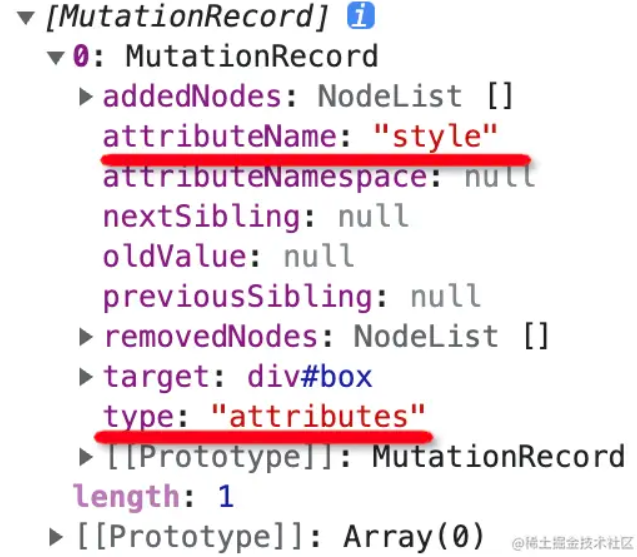

第二次改变的是 `childList`,添加了一个节点:

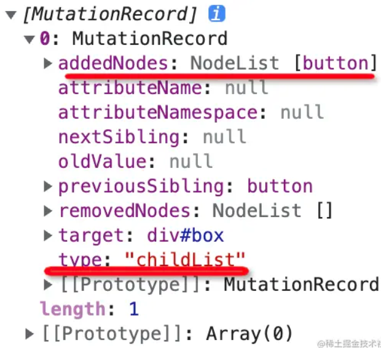

第三次也是改变的 `childList`,删除了一个节点:

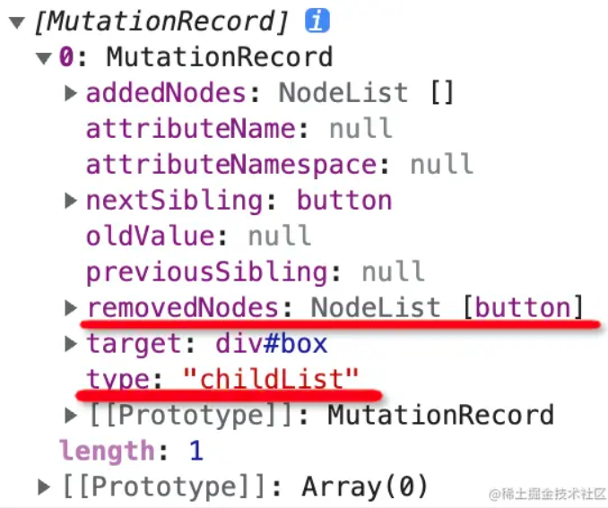

比如文章水印被人通过 `devtools` 去掉了,那么就可以通过 `MutationObserver` 监听这个变化,然后重新加上,让水印去不掉。

## Resize Observer,尺寸观察者

元素可以用 `ResizeObserver` 监听大小的改变,当 `width`、`height` 被修改时会触发回调。

### 浏览器兼容性

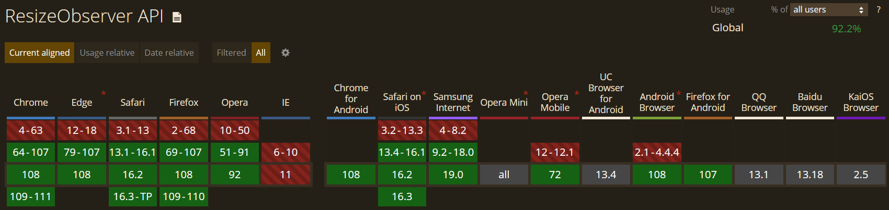

### 语法

```js
const observer = new ResizeObserver(callback)
observer.observe(target)
```

**开始监听元素:** `observer.observe(target)`

**停止对某目标的监听:** `observer.unobserve(target)`

**终止对所有目标的监听:** `observer.disconnect()`

触发回调后的第一个参数是一个 `ResizeObserverEntry` 对象。这里的 `entry.target` 是 `DOM` 节点本身,而 `entry.contentRect` 是一个对象,包含了节点的位置属性,如 `width`、`height`、`left`、`right`、`bottom`、`left`、`x`、`y` 等。

- `width`: 指元素本身的宽度,不包含 padding, border 值
- `height`: 指元素本身的高度,不包含 padding, border 值
- `top`: 指 `padidng-top` 的值
- `left`: 指 `padding-left` 的值
- `right`: 指 `left` + `width` 的值
- `bottom`: 值 `top` + `height` 的值
- `x`: 大小与 `top` 相同
- `y`: 大小与 `left` 相同

### polyfill

```
pnpm add resize-observer-polyfill
```

```js
import ResizeObserver from 'resize-observer-polyfill'

const ro = new ResizeObserver((entries, observer) => {
  for (const entry of entries) {
    const { left, top, width, height } = entry.contentRect

    console.log('Element:', entry.target)
    console.log(`Element's size: ${width}px x ${height}px`)
    console.log(`Element's paddings: ${top}px ; ${left}px`)
  }
})

ro.observe(document.body)
```

### 示例

```vue
<script setup>
onMounted(() => {
  const box = document.querySelector('#box')

  const resizeObserver = new ResizeObserver((entries) => {
    console.log('当前大小', entries)
  })
  resizeObserver.observe(box)

  setTimeout(() => {
    box.style.width = '200px'
  }, 3000)
})
</script>

<template>
  <div id="box" />
</template>

<style>
#box {
  width: 100px;
  height: 100px;
  background: blue;
}
</style>
```

大小变化被监听到了,看下打印的信息

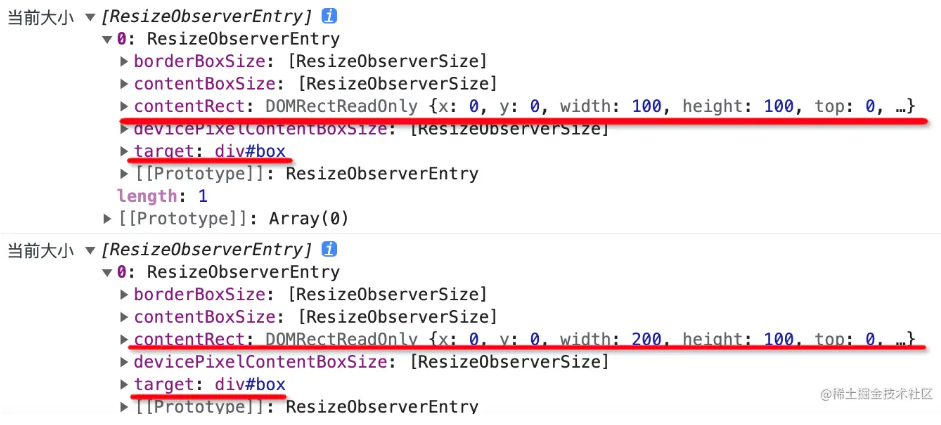

可以拿到元素和它的位置、尺寸。

## Performance Observer,性能观察者

`PerformanceObserver` 用于监听记录 `performance` 数据的行为, 一旦记录了就会触发回调, 这样我们就可以在回调里把这些数据上报。

比如 `performance` 可以用 `mark` 方法记录某个时间点:

```js
performance.mark('registered-observer')
```

用 measure 方法记录某个时间段:

```js
performance.measure('button clicked', 'from', 'to')
```

后两个个参数是时间点,不传代表从开始到现在。

我们可以用 `PerformanceObserver` 监听它们:

```html
<html>
  <body>
    <button onclick="measureClick()">Measure</button>

    

    <script>
      const performanceObserver = new PerformanceObserver(list => {
        list.getEntries().forEach(entry => {
          console.log(entry) // 上报
        })
      })
      performanceObserver.observe({ entryTypes: ['resource', 'mark', 'measure'] })

      performance.mark('registered-observer')

      function measureClick() {
        performance.measure('button clicked')
      }
    </script>
  </body>
</html>
```

创建 `PerformanceObserver` 对象,监听 `mark`（时间点）、`measure`（时间段）、`resource`（资源加载耗时） 这三种记录时间的行为。

然后我们用 `mark` 记录了某个时间点,点击 `button` 的时候用 `measure` 记录了某个时间段的数据,还加载了一个图片。

当这些记录行为发生的时候,希望能触发回调,在里面可以上报。

### mark

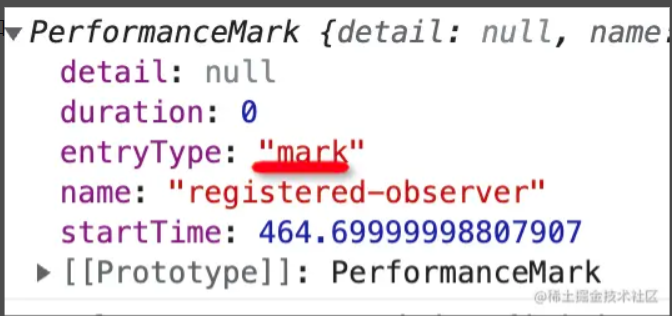

### resource

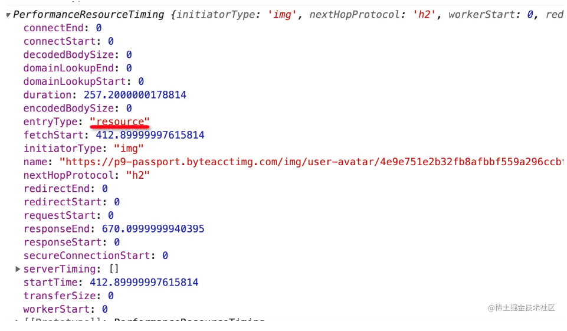

### measure

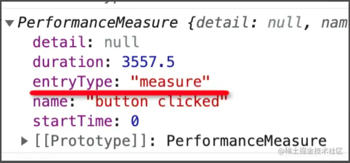


:::tip 参考资料

[浏览器的 5 种 Observer,你用过几种？](https://juejin.cn/post/7064557881492209678#heading-0)

[现代浏览器观察者 Observer API 指南](https://juejin.cn/post/6844903976937209863)

[JS 中的观察者们 —— 四种 Observers](https://xiaotianxia.github.io/blog/vuepress/js/four_kinds_of_observers.html)

[IntersectionObserver API 应用总结](https://juejin.cn/post/6844904121833619469)

[懒加载核心实现之 intersectionobserver 交叉观察器踩坑](https://blog.csdn.net/jiajia199470/article/details/109580507)

[聊聊 JS DOM 变化的监听检测与应用](https://www.zhangxinxu.com/wordpress/2019/08/js-dom-mutation-observer/)
:::
