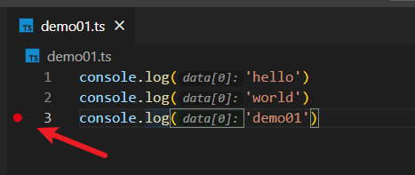
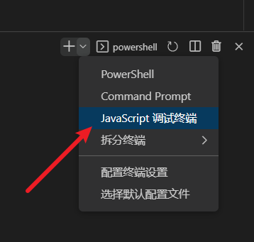
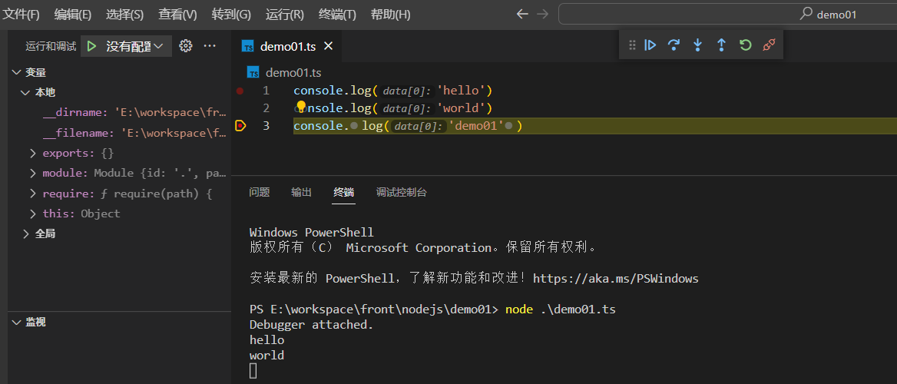

# Node.js 开发和调试


## VS Code中调试node

1. 新建一个node文件`hello.ts`或`hello.js`, 内容如下

```ts
console.log('hello')
console.log('world')
console.log('demo01')
```

2. 通过vscode添加断点



3. 切换vscode的终端类型为: Javascript 调试终端



4. 在调试终端执行node文件, 此时就会停在断点位置

```shell
node ./hello.ts
```




## 文件操作

### 判断是文件还是目录

```js
import { accessSync, readdirSync, statSync } from 'node:fs'

const fileOrDirFullPath = '文件或目录的全路径名'
const stats = statSync(fileOrDirFullPath)
if (stats.isDirectory()) 
  console.log('是目录')

else if (stats.isFile()) 
  console.log('是文件')

```

### 判断文件或目录是否存在

```js
import { accessSync, constants } from 'node:fs'

const fileOrDirFullPath = '文件或目录的全路径'
try {
  accessSync(fileOrDirFullPath, constants.F_OK)
  console.log('文件或目录存在')
}
catch (err) {
  console.log('文件或目录不存在')
}
```

### 判断文件或目录是否可读/可写

#### 是否可写

```js
import { accessSync, constants } from 'node:fs'

const fileOrDirFullPath = '文件或目录的全路径'
try {
  accessSync(fileOrDirFullPath, constants.R_OK)
  console.log('文件或目录可读')
}
catch (err) {
  console.log('文件或目录不可读')
}
```

#### 是否可读

```js
import { accessSync, constants } from 'node:fs'

const fileOrDirFullPath = '文件或目录的全路径'
try {
  accessSync(fileOrDirFullPath, constants.W_OK)
  console.log('文件或目录可写')
}
catch (err) {
  console.log('文件或目录不可写')
}
```

#### 判断文件是否存在且写

```js
import { accessSync, constants } from 'node:fs'

const fileOrDirFullPath = '文件全路径'
try {
  accessSync(fileOrDirFullPath, constants.F_OK | constants.W_OK)
  console.log('文件存在且可写')
}
catch (err) {
  console.log('文件不存在或不可写')
}
```

### 获取目录下的所有文件和文件夹的名称

```js
import { readdirSync, statSync } from 'node:fs'

const dirFullPath = '指定目录的绝对路径'

// 返回dirFullPath目录下的所有文件夹和文件的名称
const allDirAndFileNameArr = readdirSync(dirFullPath)
allDirAndFileNameArr.map((dirOrFileName) => {
  console.log(dirOrFileName)
})
```


:::tip  参考资料
[如何在 Node.js 中判断一个文件是否存在？](https://cloud.tencent.com/developer/article/1688742)
:::


## 监听文件或目录变化

### 使用`chokidar`实现

```
pnpm add chokidar
```

```js
import path from 'node:path'
import { writeFileSync } from 'node:fs'
import { fileURLToPath } from 'node:url'
import chokidar from 'chokidar'

const __filename = fileURLToPath(import.meta.url)
const __dirname = path.dirname(__filename)

const watchJsonFile = path.resolve(__dirname, 'watchJson.json')

const watchDir = path.resolve(__dirname, '../articles')
console.log(`实时监控目录[ ${watchDir} ]变化, 并重新生成导航数据`)
const watcher = chokidar.watch(watchDir, {
  // 忽略软连接文件的监听
  followSymlinks: false,
  // 忽略启动时的监听
  ignoreInitial: true,
  awaitWriteFinish: {
    // 变动之后，只有在1分钟内没有再发生变化，才触发回调函数
    stabilityThreshold: 60000,
    // 轮询间隔1分钟
    pollInterval: 60000,
  },
  // 忽略代码文件和静态资源文件的变化监听
  ignored: [/.+\.(vue|js|ts|jsx|tsx|png|jpg|jpeg|gif|svg)/],
})

watcher.on('all', (event, path) => {
  if (path.match(/.+\/(demo|asserts)\/.*$/)) {
    // 所有资源路径中包含demo和asserts文件夹的都会手动触发vitepress更新
    return
  }
  console.log(`检测到文件/文件夹变化: ${event}, ${path}, 正在手动触发vitepress重启...、\r\n`)
  // 监听到变化，则将最新时间重写到watchJsonFile中，此时会触发vitepress重启
  writeFileSync(watchJsonFile, `{"updateTime":${new Date().getTime()}}`)
})
```


## 路径操作 

### 获取路径分隔符

```js
import { sep } from 'node:path'

console.log(sep)
```

### join

:::tip path.join() 
 `path.join()` 方法使用特定于平台的分隔符作为定界符将所有给定的 `path` 片段连接在一起，然后规范化生成的路径。
:::

零长度的 `path` 片段被忽略。 如果连接的路径字符串是零长度字符串，则将返回 `.`，表示当前工作目录

```js
import { join } from 'node:path'

join('/foo', 'bar', 'baz/asdf', 'quux', '..')
// 返回: '/foo/bar/baz/asdf'

join('foo', {}, 'bar')
// 抛出 'TypeError: Path must be a string. Received {}'
```

如果任何路径片段不是字符串，则抛出 TypeError

### 获取当前路径的上级目录

```js
import { join } from 'node:path'

const parentFullPath = join(__dirname, '../')
```


:::tip `__dirname` 和 `./` 的区别
 - `__dirname`总是指向被执行 `js` 文件的`绝对路径`
 - `./` 则表示当前目录下的`相对路径`
:::

如: 当在`/admin-server/routers/upload.js` 文件中使用了 `__dirname`, 它的值就是 `/admin-server/routers`
相反 `./` 会返回你执行 `node` 命令的路径, 例如你的工作路径。

假设有如下目录结构

```
├─admin-server
├─ routers
│  ├─ upload.js
└
```

在`upload.js` 中，有如下代码，然后在终端执行了下面命令

::: code-group

```js [upload.js]
// upload.js
const path = require('node:path')

console.log(path.resolve('.'))
console.log(path.resolve(__dirname))
```

```shell [执行 upload.js]
cd /admin-server/routers
node file-upload.js
```
:::


:::tip
 - `.` 是你的当前工作目录，对应 `/admin-server/routers` 
 - `__dirname` 是 `upload.js` 的文件路径，对应 `/admin-server/routers`
:::

然而，如果我们的工作目录是`/admin-server`

```
cd /admin-server
node routers/upload.js
```

将会得到

```
/admin-server
/admin-server/routers
```

:::tip
此时，`.`指向我们的工作目录，即`/admin-server`，`__dirname` 还是指向 `/admin-server/routers` 

```js
//__dirname表示当前文件所在的根路径，也就是/routers，然后..表示向上退一级，也就是到了项目根目录，然后public/upload表示到了这个目录
const dirPath = path.join(__dirname, '..', 'public/upload')
```
:::


### ES Modules 下使用`__filename` 和`__dirname`

:::tip
在 ESM 中没有了 `__filename`和`__direname`这两个变量, 如果程序中用到了`__filename`和`__direname`，则会遇到这样的错误`ReferenceError: __dirname is not defined in ES module scope 和 ReferenceError: __filename is not defined in ES module scope`
:::


### 解决方法

```js
// import.meta.url 返回模块的绝对的 `file:` URL。
// url模块中fileURLToPath()函数，返回完全解析的特定于平台的 Node.js 文件路径
// path模块中dirname()函数，返回路径的目录路径
import { fileURLToPath } from 'node:url'
import { dirname } from 'node:path'

const __filename = fileURLToPath(import.meta.url)
const __dirname = dirname(__filename)
```

###  ES Modules 下无法使用`import packageConfig from "../package.json"`形式导入 json

会出现这样的错误 `TypeError [ERR_IMPORT_ASSERTION_TYPE_MISSING]: Module "file:///.../package.json" needs an import assertion of type "json"`

:::tip 解决方法
通过`Object.defineProperty`给`global`添加`loadJSON`、`getFileName`和`getDirName`三个函数，扩展`esm`模式下的 `global` 属性。
:::

::: code-group

```js [expandGlobal.js]
import url from 'node:url'
import path from 'node:path'
import { createRequire } from 'node:module'

Object.defineProperty(global, 'loadJSON', {
  get() {
    return (filepath, importMetaUrl) => {
      const reg = /\S+.json$/g
      if (reg.test(filepath)) {
        const require = createRequire(importMetaUrl)
        return require(filepath)
      }
      else {
        throw new Error('loadJSON 的参数必须是一个json文件')
      }
    }
  },
  enumerable: true,
  configurable: false,
  // writable: false,
})

Object.defineProperty(global, 'getFileName', {
  get() {
    return (importMetaUrl) => {
      return url.fileURLToPath(importMetaUrl)
    }
  },
  enumerable: true,
  configurable: false,
  // writable: false,
})

Object.defineProperty(global, 'getDirName', {
  get() {
    return (importMetaUrl) => {
      return path.dirname(url.fileURLToPath(importMetaUrl))
    }
  },
  enumerable: true,
  configurable: false,
  // writable: false,
})
```


```js [ 使用 ]
import './expandGlobal.js'

console.log(global.getFileName(import.meta.url))
console.log(global.getDirName(import.meta.url))
console.log(global.loadJSON('../package.json', import.meta.url))
```
:::


:::tip  参考资料
[nodejs 你不知道的`__dirname` 和`__filename`](https://juejin.cn/post/7036744678749765640)

[在 ES 模块构建的 Nodejs 中如何使用 `__dirname` 和 `__filename`](https://blog.csdn.net/daihaoxin/article/details/122134489)

[Node.js 中路径模块的 join 方法以及\_\_dirname 和./的区别](https://blog.csdn.net/qq_41880073/article/details/123096052)
:::


## 使用 Node.js 开发自己的项目模板 Cli

:::info 前言:
 每次创建项目都有一堆配置太麻烦，轻则花1-2小时找配置，配置没找对可能延误1-2天。你可能会想到，把项目模板放在git托管平台，每次都去下载不就行了！
 可以，但做法太low。
:::

**分析**

* 提供一个模板选择列表，让选择是要创建什么样的模板
* 提供一个配置文件，能配置自己可选的项目模板地址
* 选择完模板之后，提示输入项目名称，然后自动从git远程仓库下载该模板，并用该模板创建项目

### 需要用到的库

* [download-git-repo](https://www.npmjs.com/package/download-git-repo): node拉取git公共仓库的库
* [inquirer](https://www.npmjs.com/package/inquirer): 交互式命令行工具
* [ora](https://www.npmjs.com/package/ora): 用于显示加载中等待提示

### 开始开发

1. 添加依赖

```
pnpm add download-git-repo inquirer ora
pnpm add @types/inquirer ts-node typescript @types/node -D
```

2. 修改`package.json`

```json{6}
{
  "name": "demo01",
  "version": "1.0.0",
  "description": "",
  "main": "index.js",
  "type": "module",
  "scripts": {
    "test": "echo \"Error: no test specified\" && exit 1"
  },
  "keywords": [],
  "author": "",
  "license": "ISC",
  "dependencies": {
    "download-git-repo": "^3.0.2",
    "gitly": "^2.2.2",
    "inquirer": "^9.1.4",
    "ora": "^6.1.2"
  },
  "devDependencies": {
    "@types/inquirer": "^9.0.3",
    "ts-node": "^10.9.1",
    "typescript": "^4.9.3"
  }
}
```

3. 项目根目录添加 `tsconfig.json` 配置文件

```json{3,4}
{
  "compilerOptions": {
    "target": "esnext",                                /* Specify ECMAScript target version: 'ES3' (default), 'ES5', 'ES2015', 'ES2016', 'ES2017', 'ES2018', 'ES2019', 'ES2020', 'ES2021', or 'ESNEXT'. */
    "module": "esnext",                           /* Specify module code generation: 'none', 'commonjs', 'amd', 'system', 'umd', 'es2015', 'es2020', or 'ESNext'. */
    "strict": true,                                 /* Enable all strict type-checking options. */
    "moduleResolution": "node",                  
    "baseUrl": "./",                             
    "paths": {
      "@/*": [ "./src/*" ]
    },
    "esModuleInterop": true,                        /* Enables emit interoperability between CommonJS and ES Modules via creation of namespace objects for all imports. Implies 'allowSyntheticDefaultImports'. */
    "skipLibCheck": true,                           /* Skip type checking of declaration files. */
    "forceConsistentCasingInFileNames": true        /* Disallow inconsistently-cased references to the same file. */
  }
}
```

4. 编写代码

`demo01.ts`

```ts
import path from 'node:path'
import inquirer, { QuestionCollection } from 'inquirer'
import download from 'download-git-repo'
import ora from 'ora'

interface IPromptOption {
  /** 项目名*/
  projectName: string
  /** 下载的模板名*/
  templateName: string
}

interface TemplateInfo {
  // 模板压缩文件下载地址
  downloadUrl: string
  // 模板描述
  desc: string
}

const repositoryList: Record<string, TemplateInfo> = {
  'vue3': {
    downloadUrl:
      'https://xxx/vue3/template-vue3.zip',
    desc: 'vue3基础模板',
  },
  'vue3-element-plus': {
    downloadUrl:
      'https://xxx/vue3-element-plus.zip',
    desc: 'vue3基础模板 + element-plus',
  },
  'vue3-vant': {
    downloadUrl:
      'https://xxx/vue3-vant/vue3-vant.zip',
    desc: 'vue3基础模板 + vant',
  },
  'vitepress-doc': {
    downloadUrl:
      'direct:https://xxx/vitepress-doc/vitepress-doc.zip',
    desc: 'vitepress模板',
  },
}

const projectTemplateChoices = Object.keys(repositoryList).map(
  propertyName => ({
    name: repositoryList[propertyName].desc,
    value: propertyName,
  })
)

/**
 * 问题确认列表
 * @var {[type]}
 */
const PROMPT_LIST: QuestionCollection = [
  {
    type: 'input',
    message: '请输入项目名',
    name: 'projectName',
    default: 'demo',
  },
  {
    type: 'list',
    message: '请选择需要的项目模板',
    name: 'templateName',
    choices: [
      { name: 'vue3基础模板', value: 'vue3' },
      {
        name: 'vue3基础模板 + element-plus',
        value: 'vue3-element-plus',
      },
      { name: 'vue3基础模板 + vant', value: 'vue3-vant' },
      { name: 'vitepress模板', value: 'vitepress-doc' },
    ],
  },
]

function entry() {
  inquirer.prompt<IPromptOption>(PROMPT_LIST).then(async (answer) => {
    const newOra = ora('开始创建项目...').start()
    const CURRENT_PATH = process.cwd() // 获取当前路径

    const downloadUrl = `direct:${
      repositoryList[answer.templateName].downloadUrl
    }`

    const targetPath = path.resolve(CURRENT_PATH, answer.projectName) // 目标路径

    await download(downloadUrl, targetPath, {}, (err: any) => {

      if (err) {
        newOra.fail(`项目创建失败:${err.message}`)
        console.log(err)
      }

      newOra.succeed(
        `项目创建成功 
        cd ${answer.projectName}
        pnpm install
        pnpm run dev`
      )
    })
  })
}

entry()
```

**运行代码**

```
 node --loader ts-node/esm .\demo01.ts
```

:::info 参考资料
[如何制作一个属于自己的cli工具](https://juejin.cn/post/6993257762473902117)
:::


