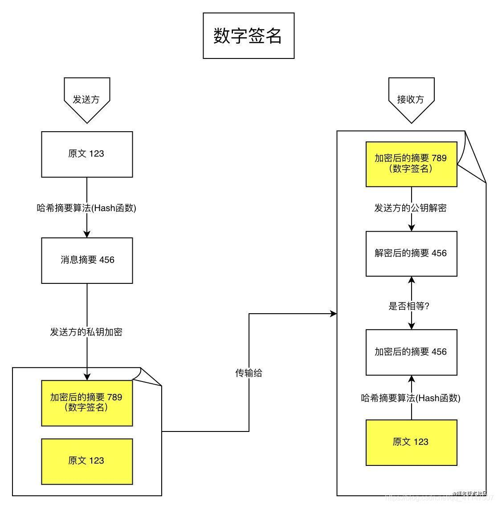
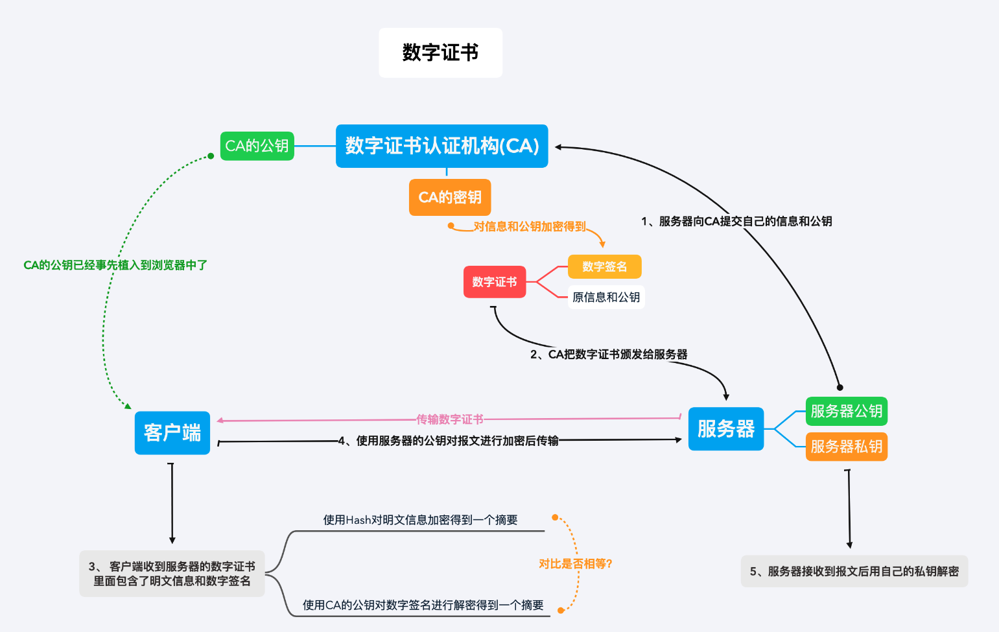

# 计算机网络之应用层-HTTP、HTPS、DNS

## HTTP 协议

HTTP 是一个在客户端和服务器之间传输文字、图片、音频、视频等超文本数据的约定和规范。默认使用 80 端口，它使用 TCP 作为传 输层协议，保证了数据传输的可靠性。

## HTTP 的特点？它有什么缺点？

> 特点： 端对端， 灵活可拓展，可靠， 无状态， 持久连接

- HTTP 协议是一种端对端的协议，也是一种请求/响应模式的协议。

- 灵活可扩展：一个是语义上的自由，只规定了基本格式，其它的各部分没有严格的限制；第二个它允许传输任意类型的数据对象，例如文本、图片、音频等，传输的类型由 Content-Type 加以标记。

- 可靠传输，HTTP 基于 TCP/IP，因此把这一特性继承了下来。

- 无状态，也就是说 HTTP 请求不具备保存之前发送过的请求或响应的功能，每一次请求都是独立无关的。

- 持久连接，HTTP1.1 以后默认采用的是持续的连接，持续连接下，TCP 连接默认不关闭，可以被多个请求复用，目前对于同一个域，大多数浏览器支持 同时建立 6 个持久连接。

> 缺点：可能被窃听,篡改,遭遇伪装,无状态,队头阻塞

- 明文传输(不加密)，内容可能被窃听。

- 无法验证报文的完整性，内容可能被篡改。

- 不验证通信方的身份，有可能遭遇伪装。

- 无状态，它是缺点也是优点吧，分不同的场景。

- 队头阻塞。HTTP2 多路复用解决问题

  - HTTP/2 实现了多路复用，在一个连接里，客户端和服务器都可以同时发送多个请求或回 应，而且不用按照顺序一一发送，这样就避免了"队头堵塞"的问题。

  - 根源源于二进制分针：报文格式如今被拆分成了一个个二进制的帧，用**Headers 帧**存放头部字段，**Data 帧**存放请求体数据。分帧之后，服务器看到的不再是一个个完整的 HTTP 请求报文，而是一堆乱序的二进制帧。这些二进制帧不存在先后关系，因此也就不会排队等待，也就没有了 HTTP 的队头阻塞问题。乱序的二进制帧到达后对方会将 Stream ID 相同的二进制帧组装成完整的**请求报文**和**响应报文**。

## HTTP 请求报文

HTTP 请求报文（响应报文）的第一行叫做请求行（响应行），后面跟的首部字段，首部后还可以跟一个实体主体。请求首部之后有一个空行，这个空行不能省略，它用来划分首部与实体。

请求行字段：方法字段、URL 字段和 HTTP 版本字段。

## 方法字段

一般有 GET、POST、HEAD、PUT 和 DELETE

- GET：获取资源，幂等操作 HEAD：获取报文首部，和 GET 很像但是不返回报文主体，幂等操作
- POST: 创建或更新资源，非幂等操作
- PUT: 创建或更新资源本身，幂等操作
- PATCH：对资源进行局部更新，非幂等操作
- DELETE：删除资源，和 PUT 功能相反，幂等操作
- OPTIONS：查询服务器端支持的 HTTP 方法种类
- CONNECT：建立连接隧道，用于代理服务器，幂等操作
- TRACE：追踪请求，查询发出去的请求是怎样被加工/篡改的，幂等操作。容易引发 XST 跨站追踪攻击。

## Post 和 Get 的区别？

（1）从应用场景上来说，GET 请求是一个幂等的请求，一般 Get 请求用于对服务器资源不会产生影响的场景，比如说请求一个网页。而 Post 不是一个幂等的请求，一般用于对服务器资源会产生影响的情景。比如注册用户这一类的操作。

（2）从缓存的角度，浏览器一般会对 Get 请求缓存，但很少对 Post 请求缓存。

（3）从发送的报文格式来说，Get 请求的报文中实体部分为空，Post 请求的报文中实体部分一般为向服务器发送的数据。

（4）从参数的角度上说，GET 一般放在 URL 上传递参数，POST 放在请求体里，更适合传递敏感信息。（还有就是 post 的参数传递支持更多的数据类型。GET 只能进行 URL 编码）

## HTTP 响应报文

响应行字段：版本号、状态码和原因短语

## HTTP 状态码

1xx: 表示目前是协议处理的中间状态，还需要后续操作。`101 Switching Protocols`

2xx: 表示成功状态。`200 OK` `204 No Content` `206 Partial Content`

3xx: 重定向状态，资源位置发生变动，需要重新请求。`301 Moved Permanently` `302 Found` `303 See Other` `304 Not Modefied` `307 Temprary Redirect`

> 302 是 http1.0 的协议状态码，在 http1.1 版本的时候为了细化 302 状态码又出来了两个 303 和 307。303 明确表示客户端应当采用 get 方法获取资源，他会把 POST 请求变为 GET 请求进行重定向。307 会遵照浏览器标准，不会从 post 变为 get。

4xx: 请求报文有误。`400 Bad Request` `401 Unauthorized` `403 Forbidden` `404 Not Found`

5xx: 服务器端发生错误。`500 Internal Server Error` `501 Not Implemented` `502 Bad GateWay` `503 Service Unavailable`

## HTTP 的部首

HTTP 的部首挺多的，都记下来没必要，我只挑了比较重点的列出来：

通用首部字段（General Header Fields）：请求报文和响应报文两方都会使用的首部

- Cache-Control  控制缓存
- Connection 连接管理、逐条首部
- Transfor-Encoding 报文主体的传输编码格式

请求首部字段（Reauest Header Fields）:客户端向服务器发送请求的报文时使用的首部

- Accept 客户端或者代理能够处理的媒体类型
- If-Match 比较实体标记（ETage）
- If-None-Match  比较实体标记（ETage）与 If-Match 相反
- If-Modified-Since  比较资源更新时间（Last-Modified）
- If-Unmodified-Since 比较资源更新时间（Last-Modified），与 If-Modified-Since 相反
- If-Rnages 资源未更新时发送实体 byte 的范围请求
- Range 实体的字节范围请求
- Authorization web 的认证信息
- Host 请求资源所在服务器
- User-Agent 客户端程序信息

响应首部字段（Response Header Fields）:从服务器向客户端响应时使用的字段

- Accept-Ranges 能接受的字节范围
- Location 令客户端重定向的 URI
- ETag 能够表示资源唯一资源的字符串
- Server 服务器的信息

实体首部字段（Entiy Header Fields）:针对请求报文和响应报文的实体部分使用首部

- Allow 资源可支持 http 请求的方法
- Last-Modified 资源最后的修改资源
- Expires 实体主体的过期资源

## HTTP/2 协议

> HTTP/2 的新特性:二进制协议、 多路复用、数据流、 头信息压缩、服务器推送

**二进制协议** HTTP/2 则是一个彻底的二进制协议，头信息和数据体都是二进制，并且统称为"帧"，可以分为头信息帧和数据帧。 帧的概念是它实现多路复用的基础。

**多路复用** HTTP/2 实现了多路复用，HTTP/2 仍然复用 TCP 连接，但是在一个连接里，客户端和服务器都可以同时发送多个请求或回 应，而且不用按照顺序一一发送，这样就避免了"队头堵塞"的问题。

**数据流** HTTP/2 将每个请求或回应的所有数据包，称为一个数据流。每 个数据流都有一个独一无二的编号。数据包发送的时候，都必须标记数据流 ID ，用来区分它属于哪个数据流。

**头信息压缩** HTTP/2 实现了头信息压缩，由于 HTTP 1.1 协议不带有状态，每次请求都必须附上所有信息。所以，请求的很多字段都是 重复的，比如 Cookie 和 User Agent ，一模一样的内容，每次请求都必须附带，这会浪费很多带宽，也影响速度。HTTP/2 对这一点做了优化，引入了头信息压缩机制。

**服务器推送** HTTP/2 允许服务器未经请求，主动向客户端发送资源，这叫做服务器推送。

# HTTPS 协议

其实也就是弥补了 HTTP 的缺点：

数据隐私性，内容经过加密；（加解密）

数据完整性，内容经过完整性校验；（数字签名）

身份认证，第三方无法伪装客户端/服务器的身份（数字证书）

## HTTP 与 HTTPS 的区别

HTTPS 标准端口 443，HTTP 是 80

HTTPS 在浏览器上会显示绿色的安全锁，而 HTTP 没有

弥补了 HTTP 的缺点，数据的隐私性、完整性、身份验证。也就是更加安全。

## 混合加密机制(HTTPS 采用的方式)

结合两种加密方式的优点，在交换密钥环节使用非对称加密方式，之后的建立通信交换报文阶段使用对称加密方式。

流程：发送密文的一方使用"对方的公钥"进行加密处理"对称的密钥"，然后对方接收到之后使用自己的私钥进行解密得到"对称的密钥"，这就达到了确保交换的密钥是安全的前提下使用对称加密方式进行通信。

## 数字签名、数字证书流程






## 主流 TLS1.2 版本 (ECDHE)的握手过程

```javascript
A：client_random、TSL版本号、加密套件列表->B
B：确认版本号后，server_random、server_params、需使用的加密套件、以及自己的证书->A
A：证书验证，成功则client_params ->B
A：与此同时，计算出一个pre_random，ECDHE(client_params, server_params) = per_random
A：将得到的三个随机数通过一个伪随机函数计算得出最终的secret，后续通信所要用的对称密钥,并发送收尾信息给B
B：服务器也会使用和客户端一样的方式生成secret，并且也会发送一个收尾消息给客户端。
AB：都收到收尾消息并验证成功后，握手就结束了。后面开始用这个secret对称密钥加密报文进行传输。

```

详细过程：

1. 客户端在第一次发送 HTTPS 请求的时候，会把 client_random、TSL 版本号、加密套件列表发送给服务器

2. 服务器在接收到之后确认 TSL 的版本号，同时发送 server_random、server_params、需要使用的加密套件、以及自己的证书给客户端

3. 客户端在收到这些信息之后，首先是会对服务器的证书进行验证(也就是题目 7)，若是验证成功则会传递一个 client_params 给服务器

4. 与此同时客户端会通过 ECDHE 算法计算出一个 pre_random，其中是传入了两个参数，一个是 client_params，还一个是 server_params。(也就是说：ECDHE(client_params, server_params) = per_random)

5. 这时候客户端就同时拥有了 client_random、server_random、pre_random，它会将这三个参数通过一个伪随机函数计算得出最终的 secret，这个 secret 就是它们后续通信所要用的对称密钥。

6. 而在客户端生成完 secret 之后，会给服务器发送一个收尾消息，告诉服务器之后都要用对称加密，且对称加密的算法是用第一次约定好的。

7. 服务器它在接收到刚刚传递过来的 client_params 之后，也会使用和客户端一样的方式生成 secret，并且也会发送一个收尾消息给客户端。

8. 当双方都收到收尾消息并验证成功之后，握手就结束了。后面开始用这个 secret 对称密钥加密报文进行传输。

## 描述 RSA 握手

1. 客户端首先向服务端发送一个 HTTPS 请求

2. 服务端会把事先配置好的公钥证书随着其它的信息返回给客户端

3. 客户端在收到服务端发来的证书之后进行验证，验证的过程参考数字证书验证，会得到服务端的信息以及它的公钥

4. 验证成功之后会用伪随机函数计算出一个加密所需要的对称密钥(secret)，并且用服务端的公钥加密这个对称密钥发送给服务端

5. 服务端再用自己的私钥解密刚刚的消息，得到里面的对称密钥。此时服务端和客户端都有了对称密钥。

6. 后面的传输都会用这个 secret 进行对称密钥加解密传输

> 与 TLS 握手的区别？最主要的：RSA 不具备向前安全性，ECDHE 有；一次破解并不影响历史信息的性质就是向前安全性。

## DNS

DNS 全称（Domain Name System）也就是域名系统，是一个分布式系统，由本地域名服务器、根服务器、顶级域名服务器和权威域名服务器四层组成，是将域名解析 IP 地址的一项互联网基础服务。

## DNS 解析过程

- 首先检查 DNS 缓存，如果缓存未命中，客户端需要向 本地域名服务器 发送查询请求报文。

- 客户端向 本地域名服务器 发送查询报文，本地域名服务器 首先检查自身缓存，如果存在记录则直接返回结果。未命中，则 本地域名服务器 向根域名服务器发送查询报文。

- 本地域名服务器 向根域名服务器发送查询报文，返回 .com 顶级域名服务器的地址（以www.baidu.com为例），未查到，则下一点。

- 本地域名服务器 向 .com 顶级域名服务器发送查询报文，返回 `baidu.com` 所在的权威域名服务器的地址。未查到，则下一点。

- 本地域名服务器 向 `baidu.com` 权威域名服务器发送查询报文，得到 ip 地址，存入自身缓存并返回给客户端

## DNS 缓存

一次完整的 DNS 查询过程需要访问多台 DNS 服务器才能得到最终的结果，会带来一定的时延。为了改善时延，DNS 服务并不是每次请求都要去访问 DNS 服务器，而是访问过一次后将 DNS 记录缓存在本地。

具体来说，DNS 服务是一个多级的缓存：浏览器缓存 -> 操作系统缓存 -> 路由器缓存 -> local DNS 缓存 -> DNS 查询。

## DNS 为什么要使用 UDP 作为传输层协议

这个问法其实不是很准确，因为并不是一定会使用 UDP，也有使用 TCP 的场景：

**1、在区域传输时使用 TCP 协议**

- 数据量：在进行区域传送时，需要传送的数据比简单的查询和应答报文的数据量要大得多了，而 UDP 报文段的最大长度为 512 字节，报文段过长时会被截断。
- 可靠性：使用 UDP 传输不可靠，TCP 协议可靠性更高。因为 UDP 是无连接的，无法确定哪几个 UDP 包是属于同一个 DNS 报文段的。

**2、在域名解析时使用 UDP 协议**

为了得到一个域名的 IP 地址，尤其是一些冷门网站，往往会向多个域名服务器查询，如果使用 TCP 协议，那么每次请求都会存在三次握手连接时延，这样使 DNS 服务变得很慢。
