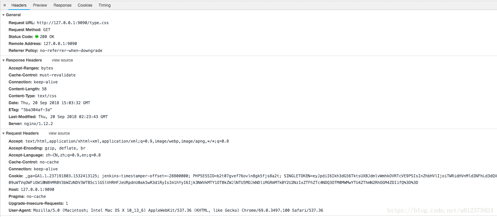
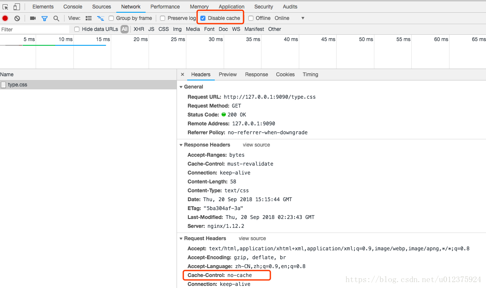
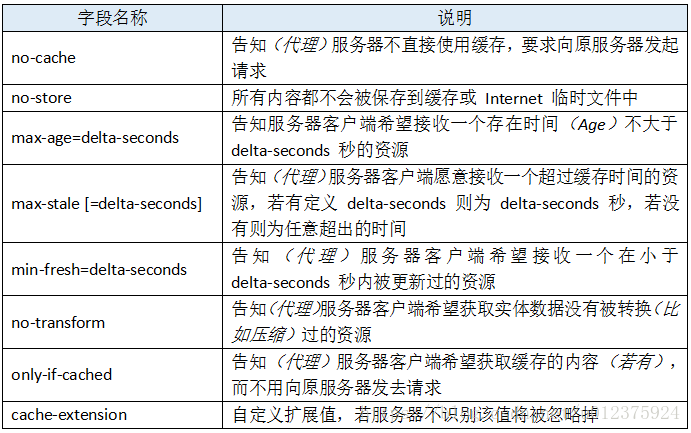
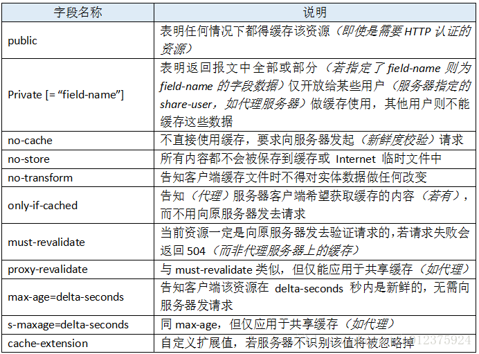
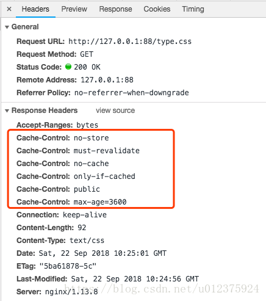
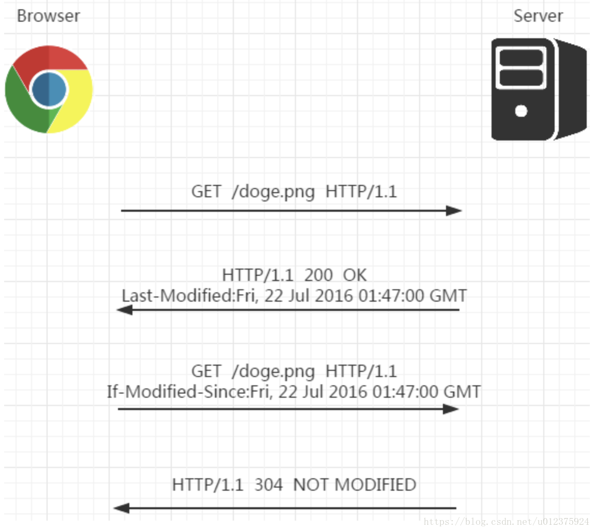
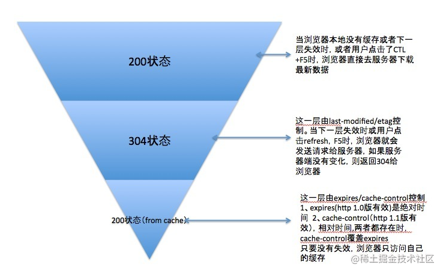
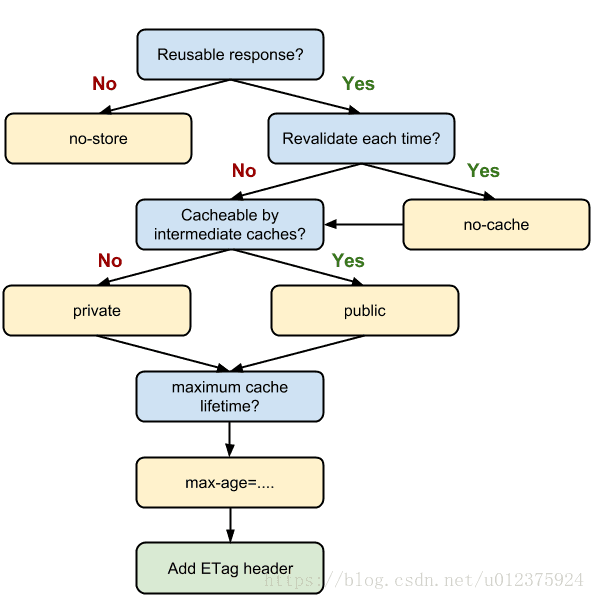
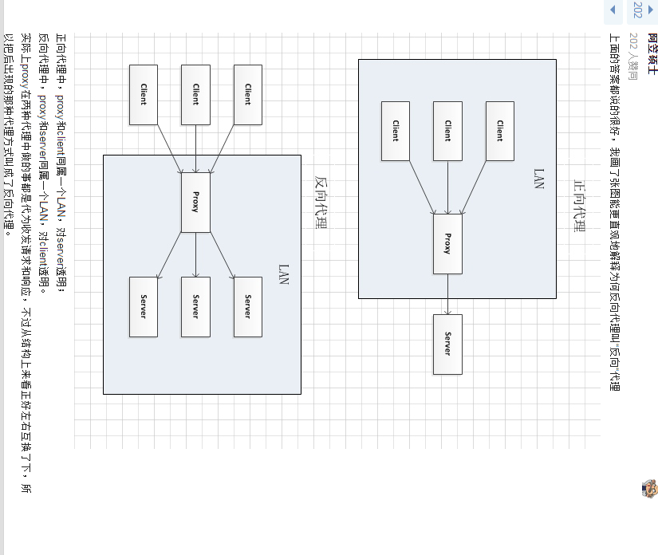

# http缓存 & 前端打包缓存控制

## 前言

我们用 http 访问时,会先发送一个请求,之后服务器返回一个应答,在 Chrome 的开发者工具(按 F12 或右击选择检查)中展现了整个过程：



第一部分 General 是概要,包含请求地址,请求方式,状态码,服务器地址以及 Referrer 策略。

第二部分是应答头部,是服务器返回的。

第三部分是请求头部,是客户端发送的。

:::tip 缓存控制和缓存校验
这次我们从两个角度来看看 http 的缓存： **缓存控制和缓存校验。**

**缓存控制：** 控制缓存的开关,用于标识请求或访问中是否开启了缓存,使用了哪种缓存方式。

**缓存校验：** 如何校验缓存,比如怎么定义缓存的有效期,怎么确保缓存是最新的。
:::

## 缓存控制

> 在 http 中,控制缓存开关的字段有两个：`Pragma` 和 `Cache-Control`。

### Pragma

Pragma 有两个字段 Pragma 和 Expires。

Pragma 的值为 no-cache 时,表示禁用缓存.

Expires 的值是一个 GMT 时间,表示该缓存的有效时间。

Pragma 是旧产物,已经逐步抛弃,有些网站为了向下兼容还保留了这两个字段。如果一个报文中同时出现 Pragma 和 Cache-Control 时,以 Pragma 为准。同时出现 Cache-Control 和 Expires 时,以 Cache-Control 为准。即优先级从高到低是 `Pragma -> Cache-Control -> Expires`

### Cache-Control

在介绍之前,先啰嗦两个容易忽视的地方：

- 符合缓存策略时,服务器不会发送新的资源,但不是说客户端和服务器就没有会话了,客户端还是会发请求到服务器的。
- `Cache-Control `除了在响应中使用,在请求中也可以使用。我们用开发者工具来模拟下请求时带上` Cache-Control`：`勾选` `Disable cache`,刷新页面,可以看到 `Request Headers` 中有个字段 `Cache-Control: no-cache`。



同时在 `Response Headers` 中也能到 `Cache-Control` 字段,它的值是 `must-revalidate`,这是服务端设置的。

#### 请求时 Cache-Control 可设值

在请求中使用 `Cache-Control` 时,它可选的值有：



#### 响应时 Cache-Control 可设值




##### no-store 优先级最高

在 Cache-Control 中,这些值可以自由组合,多个值如果冲突时,也是有优先级的,而 no-store 优先级最高。我们可以测试下：在 nginx 中做如下配置：

```shell
server {
    listen 88;
    root /opt/ms;
    index index.php index.html index.htm index.nginx-debian.html;
    location ~* ^.+\.(css|js|txt|xml|swf|wav)$ {
        add_header Cache-Control no-store;
        add_header Cache-Control max-age=3600;
        add_header Cache-Control public;
        add_header Cache-Control only-if-cached;
        add_header Cache-Control no-cache;
        add_header Cache-Control must-revalidate;
    }
}
```

在/opt/ms 下增加个文件 type.css,内容如下：

```css
a {
  color: #000000;
}
a:focus,
a:hover {
  text-decoration: none;
  color: #708090;
}
```

配置好之后,reload 下 nginx,在浏览器访问地址http://127.0.0.1:88/type.css,可以看到响应头部包含nginx配置中的字段：



重复刷新访问,会发现每次的状态码都是 200,原因是 no-store 的优先级最高,本地不保存,每次都需要服务器发送资源。

#### public 和 private 的选择

如果你用了 `CDN`,你需要关注下这个值。CDN 厂商一般会要求 `cache-control` 的值为 `public`,提升缓存命中率。如果你的缓存命中率很低,而访问量很大的话,可以看下是不是设置了`private`,`no-cache` 这类的值。如果定义了`max-age`,可以不用再定义 `public`,它们的意义是一样的。

#### 哪里会设置 Cache-Control

以 `LNMP` 的环境为例,一次响应经历的过程是：

1. `php-cgi` 解析代码并执行,将结果返回给 nginx,
2. 如果 `nginx` 前面有反向代理,则会经过一次反向代理服务器,

所以 `cache-control` 可能会在 `nginx`,`php-cgi`,`php` 代码,反向代理服务器,这些地方地方设置。在 `php.ini`中,有个参数是 `session.cache_limiter`,需要注意下。在 nginx 中有个很常见的配置：

```nginx
location ~* ^.+\.(ico|gif|jpg|jpeg|png)$ {
    expires 30d;
}
```

这个指令等同于 `cache-control: max-age=2592000`,同时你会在响应头部看到一个 `etag` 字段,这是由于 `nginx` 默认开启,如果要关闭可以增加个配置 `etag off`。这个 `etag` 就是我们接下要看的缓存校验字段。

## 缓存校验

在缓存中,我们需要一个机制来验证缓存是否有效。比如服务器的资源更新了,客户端需要及时刷新缓存；又或者客户端的资源过了有效期,但服务器上的资源还是旧的,此时并不需要重新发送。缓存校验就是用来解决这些问题的,在 http 1.1 中,我们主要关注下`Last-Modified` 和 `etag` 这两个字段。

### Last-Modified

服务端在返回资源时,会将该资源的最后更改时间通过`Last-Modified`字段返回给客户端。客户端下次请求时通过`If-Modified-Since`或者`If-Unmodified-Since`并带上`Last-Modified`,服务端检查该时间是否与服务器的最后修改时间一致：如果一致,则返回`304状态码`,不返回资源；如果不一致则返回`200状态码`和修改后的资源,并带上新的时间。



#### If-Modified-Since 和 If-Unmodified-Since 的区别

- **If-Modified-Since：** 告诉服务器如果时间一致,返回 `状态码304`
- **If-Unmodified-Since：** 告诉服务器如果时间不一致,返回 `状态码412`

#### etag

单纯的以修改时间来判断还是有缺陷,比如文件的最后修改时间变了,但内容没变。对于这样的情况,我们可以使用 `etag` 来处理。
`etag` 的方式是这样：服务器通过某个算法对资源进行计算,取得一串值(类似于文件的 md5 值),之后将该值通过 `etag` 返回给客户端,客户端下次请求时通过 `If-None-Match` 或 `If-Match` 带上该值,服务器对该值进行对比校验：如果一致则不要返回资源。

#### If-None-Match 和 If-Match 的区别

- **If-None-Match：** 告诉服务器如果一致,返回`状态码304`,不一致则返回资源
- **If-Match：** 告诉服务器如果不一致,返回`状态码412`

## 总结

- 缓存开关是： pragma, cache-control。
- 缓存校验有：Expires,Last-Modified,etag。
- 从状态码的角度来看,它们的关系如下图：



- cache-control 的各个值关系如下图



:::details  相关阅读
- [浅谈 http 中的 Cache-Control](https://blog.csdn.net/u012375924/article/details/82806617)
- [HTTP 412 状态码](https://blog.csdn.net/u010971572/article/details/119223542)
- [ajax 请求 304 解决方案](https://blog.csdn.net/qq_35393869/article/details/88907735)
- [HTTP 304 状态码的详细讲解](https://www.jianshu.com/p/11534ccb7fe6)
- [HTTP 304 状态码的详细讲解](https://blog.csdn.net/qq_37960324/article/details/83374855)
- [[IE bug] ajax 请求 304 解决方案](https://www.cnblogs.com/limingxi/p/3823016.html)
:::


## Nginx 反向代理和正向代理 

`Nginx`是一个高性能的 `HTTP` 和反向代理服务器,同时也提供邮件服务.

### 正向代理

正向代理类似一个跳板机,代理访问外部资源。

举个例子：

我是一个用户,我访问不了某网站,但是我能访问一个代理服务器,这个代理服务器呢,他能访问那个我不能访问的网站,于是我先连上代理服务器,告诉他我需要那个无法访问网站的内容,代理服务器去取回来,然后返回给我。从网站的角度,只在代理服务器来取内容的时候有一次记录,有时候并不知道是用户的请求,也隐藏了用户的资料,这取决于代理告不告诉网站。

> 客户端必须设置正向代理服务器,当然前提是要知道正向代理服务器的 IP 地址,还有代理程序的端口。

**正向代理的用途：**

- 访问原来无法访问的资源,如 google
- 可以做缓存,加速访问资源
- 对客户端访问授权,上网进行认证
- 代理可以记录用户访问记录（上网行为管理）,对外隐藏用户信息

### 反向代理

是指以代理服务器来接受 internet 上的连接请求,然后将请求转发给内部网络上的服务器,并将从服务器上得到的结果返回给 internet 上请求连接的客户端,此时代理服务器对外就表现为一个服务器。

**反向代理的作用：**

- 保证内网的安全,可以使用反向代理提供 WAF 功能,阻止 web 攻击
  - 大型网站,通常将反向代理作为公网访问地址,Web 服务器是内网。
- 负载均衡,通过反向代理服务器来优化网站的负载

### 正-反向代理的区别





:::tip  参考资料
[正向代理与反向代理【总结】](https://www.cnblogs.com/Anker/p/6056540.html)

[Nginx 下关于缓存控制字段 cache-control 的配置说明](https://segmentfault.com/a/1190000037487315)

[【狂神说】Nginx 最新教程通俗易懂,40 分钟搞定！](https://www.bilibili.com/video/BV1F5411J7vK/)

[NGINX 如何控制客户端缓存 | NGINX 基础培训课程（第三季） EP.1](https://www.bilibili.com/video/BV1iK411T73K/)
::::


## 前端打包缓存控制

:::tip  缓存的作用
 - 加快网页的访问速度
:::

#### 不合理的缓存会造成什么结果 ？

前端每次发版,浏览器存在缓存要强制刷新才能看到更新

####  有哪些资源会被缓存 ？

- 页面
- 图片
- css
- js

#### 打包时如何合理的清除资源缓存 ？

前端打包时,根据资源内容进行 `hash`,然后将这个 `hash` 值作为资源名称的一部分,那么有改动内容的资源,他的资源名称会变得不一样,没有任何内容改变的资源,他的资源名称就会始终一样。这样的话这些 `css`、`img`、`js` 就能合理的应用缓存了,资源改变了,就会获取新新文件的内容,资源没改变,如果有缓存就优先从缓存中获取。


#### index.html 文件如何清除缓存

SPA 应用一般只有一个静态页面`index.html`,你以为你 css,img,js 都合理的清除缓存就足够了？殊不知你的`index.html`也被浏览器缓存了,如果你不做特殊配置,每次发版之后,客户浏览器访问的`index.html`,实际都是浏览器缓存的`index.html`内容, 而`index.html`中记录的是静态资源`js,css,图片资源的请求地址`,这些资源可都是可以被缓存的,所以,即使你`css,图片,js资源`都存在最新数据,且资源的名称都和上个版本不同,但客户浏览器获取到的资源或者说看到的界面还是上个版本的。这就是因为`index.html`没有被清除缓存的结果。

#### 清除`index.html`文件的缓存

在`index.html`的 `meta` 标签中定义禁止浏览器缓存该 html 文件（所有需要禁止缓存的 html 资源,都可以加上这些`meta标签`, 用来告知浏览器不要缓存这个`html`）

```html
<head>
  <meta http-equiv="cache-control" content="no-cache,no-store, must-revalidate" />
  <meta http-equiv="pragma" content="no-cache" />
  <meta http-equiv="Expires" content="0" />
</head>
```

:::tip 参考资料
[【解决彻底】vue 前端发版后要刷新才能看到更新问题](https://www.jianshu.com/p/a5a32acbf205)
[处理 Vue 入口文件 index.html 被缓存的问题](https://juejin.cn/post/7035814324660600846)
:::


