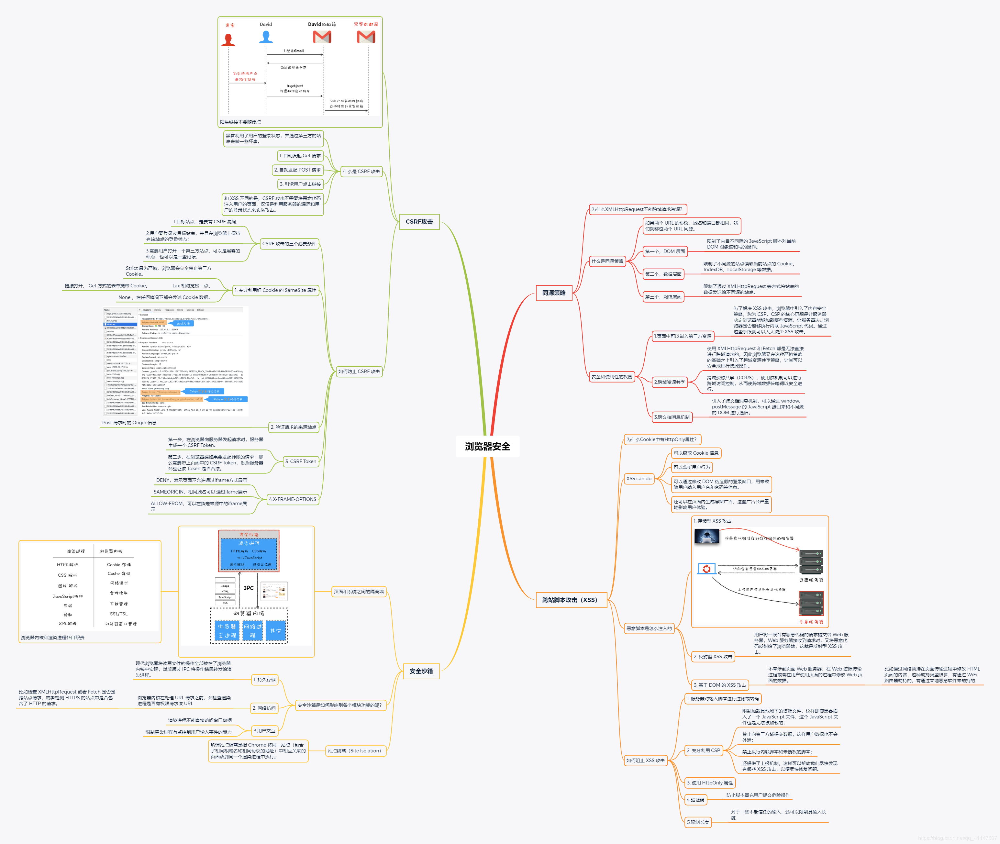
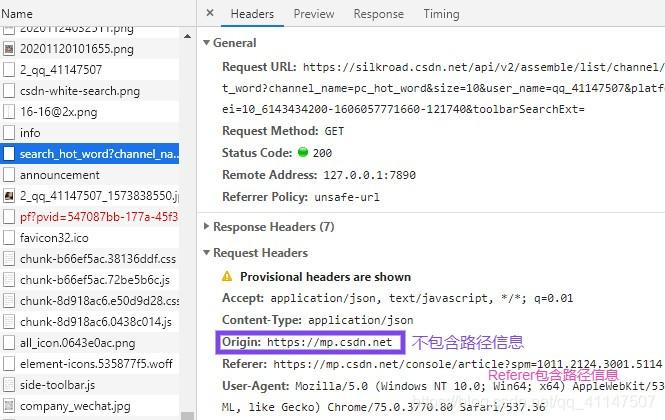
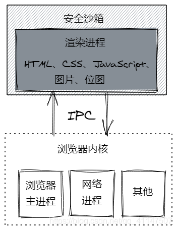

# 浏览器安全总结

通过这篇文章你可以了解到同源策略、跨站脚本攻击（xss）、跨域请求伪造（CSRF）以及安全沙箱相关知识；

以下是本文的思维导图：

## 同源策略

## 什么是同源策略

如果两个 URL 的协议、域名和端口都相同，我们就称这两个 URL 同源。两个不同的源之间若想要相互访问资源或者操作 DOM，那么会有一套基础的安全策略的制约，我们把这称为同源策略。

- DOM 层面：限制了来自不同源的 JavaScript 脚本对当前 DOM 对象读和写的操作。
- 数据层面：限制了不同源的站点读取当前站点的 Cookie、IndexDB、LocalStorage 等数据。
- 网络层面：限制了通过 XMLHttpRequest 等方式将站点的数据发送给不同源的站点。

## 安全和便利性的权衡

1. 页面中可以嵌入第三方资源。->XSS 攻击

- 为了解决 XSS 攻击，浏览器中引入了**内容安全策略**，称为 CSP。
- CSP 的**核心思想**是让服务器决定浏览器能够加载哪些资源，让服务器决定浏览器是否能够执行内联 JavaScript 代码。
- 通过这些手段就可以大大减少 XSS 攻击。

2. 跨域资源共享

- 使用 XMLHttpRequest 和 Fetch 都是无法直接进行跨域请求的，因此浏览器又在这种严格策略的基础之上引入了跨域资源共享策略，让其可以安全地进行跨域操作。

- **跨域资源共享（CORS）**，使用该机制可以进行跨域访问控制，从而使跨域数据传输得以安全进行。

3. 跨文档消息机制

- 两个不同源的 DOM 是不能互相操纵的，因此浏览器又实现了**跨文档消息机制**，可以通过 window.postMessage 的 JavaScript 接口来和不同源的 DOM 进行通信。

## 同源策略、CSP、CROS 之间的关系？

同源策略就是说通院的页面可以互相操作，但是不同源之间只能通过浏览器提供的手段来操作，比如：

- 读取数据和操作 DOM 要跨文档机制
- 跨域请求要用 CROS 机制
- 引用第三方资源要用 SCP

## 为什么 XMLHttpRequest 不能跨域请求资源？

- 存在同源策略，不同源的资源请求会被制止。
- 使用 XMLHttpRequest 是无法直接进行跨域请求的，因此浏览器又在这种严格策略的基础之上引入了跨域资源共享策略，让其可以安全地进行跨域操作。

## 跨站脚本攻击（XSS）

XSS 是一种跨站脚本攻击，他可以做到以下这些：

- 可以窃取 Cookie 信息
- 可以监听用户行为
- 可以通过修改 DOM 伪造假的登录窗口，用来欺骗用户输入用户名和密码等信息
- 还可以在页面内生成浮窗广告，这些广告会严重地影响用户体验

## 恶意脚本是怎么注入的？

- **存储型 XSS 攻击**：黑客将恶意代码储存到存在漏洞的服务器，浏览器访问含有恶意代码的页面，浏览器上传用户信息到而已服务器。
- **反射型 XSS 攻击**：用户将一段含有恶意代码的请求提交给 Web 服务器，Web 服务器接收到请求时，又将恶意代码反射给了浏览器端，这就是反射型 XSS 攻击。
- **基于 DOM 的 XSS 攻击**：不牵涉到页面 Web 服务器，在 Web 资源传输过程或者在用户使用页面的过程中修改 Web 页面的数据。
  比如通过网络劫持在页面传输过程中修改 HTML 页面的内容，这种劫持类型很多，有通过 WiFi 路由器劫持的，有通过本地恶意软件来劫持的。

## 如何阻止 XSS 攻击？

1. 服务器对输入脚本进行**过滤或转码**
2. 充分利用 **CSP**
   - 限制加载其他域下的资源文件，这样即使黑客插入了一个 JavaScript 文件，这个 JavaScript 文件也是无法被加载的；
   - 禁止向第三方域提交数据，这样用户数据也不会外泄；
   - 禁止执行内联脚本和未授权的脚本；
   - 还提供了上报机制，这样可以帮助我们尽快发现有哪些 XSS 攻击，以便尽快修复问题。
3. 使用 **HttpOnly** 属性
4. **验证码**
   - 防止脚本冒充用户提交危险操作
5. **限制长度**
   - 对于一些不受信任的输入，还可以限制其输入长度

## 跨域请求伪造（CSRF）攻击

黑客利用了用户的登录状态，并通过第三方的站点来做一些坏事（`陌生链接不要随便点`）。

1. 自动发起 Get 请求
2. 自动发起 POST 请求
3. 引诱用户点击链接

和 XSS 不同的是，CSRF 攻击不需要将恶意代码注入用户的页面，仅仅是利用服务器的漏洞和用户的登录状态来实施攻击。

## 如何防止 CSRF 攻击?

**CSRF 攻击的三个必要条件?** 1.目标站点一定要有 CSRF 漏洞； 2.用户要登录过目标站点，并且在浏览器上保持有该站点的登录状态； 3.需要用户打开一个第三方站点，可以是黑客的站点，也可以是一些论坛；

**1.充分利用好 Cookie 的 SameSite 属性**
SameSite 的三种属性：

- Strict 最为严格，浏览器会完全禁止第三方 Cookie。
- Lax 相对宽松一点。链接打开、 Get 方式的表单携带 Cookie。
- None ，在任何情况下都会发送 Cookie 数据。

**2. 验证请求的来源站点**
Post 请求时的 Origin 信息（以 CSDN 为例）

**3. CSRF Token**

- 第一步，在浏览器向服务器发起请求时，服务器生成一个 CSRF Token。
- 第二步，在浏览器端如果要发起转账的请求，那么需要带上页面中的 CSRF Token，然后服务器会验证该 Token 是否合法。

**4.X-FRAME-OPTIONS**

- DENY，表示页面不允许通过 iframe 方式展示
- SAMEORIGIN，相同域名可以·通过 ifame 展示
- ALLOW-FROM，可以在指定来源中的 iframe 展示

## 安全沙箱

是页面和系统之间的隔离墙

## 安全沙箱是如何影响到各个模块功能的呢？

**持久存储**
现代浏览器将读写文件的操作全部放在了浏览器内核中实现，然后通过 IPC 将操作结果转发给渲染进程。

**网络访问**
浏览器内核在处理 URL 请求之前，会检查渲染进程是否有权限请求该 URL。
比如检查 XMLHttpRequest 或者 Fetch 是否是跨站点请求，或者检测 HTTPS 的站点中是否包含了 HTTP 的请求。

**用户交互**

- 渲染进程不能直接访问窗口句柄。
- 限制渲染进程有监控到用户输入事件的能力

## 站点隔离（Site Isolation）

所谓站点隔离是指 Chrome 将同一站点（包含了相同根域名和相同协议的地址）中相互关联的页面放到同一个渲染进程中执行。

