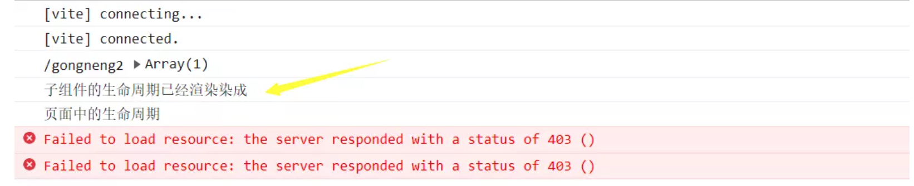

# vue监听子组件生命周期

## Vue2监听子组件的生命周期

### 1. 在子组件中的生命周期中抛出$emit

```vue
// father.vue
<Child @hook:mounted="doSomething" />

doSomething() {
   console.log('父组件监听到 mounted 钩子函数');
}

// Child.vue
mounted(){
   console.log('子组件触发 mounted 钩子函数');
}
```


但是如果这个组件是第三方的，我们可能无法直接修改代码？可以使用下面的方法：

### 2. hook钩子监听组件的生命周期

```vue
<script>
import TestCom from '@/components/test-com.vue'

export default {
  components: { TestCom },
  methods: {
    doSomething() { console.log('子组件的生命周期') }
  }
}
</script>

<template>
  <div>
    <TestCom @hook:mounted="doSomething" />
  </div>
</template>
```

:::tip **vue2组件加载顺序**
- 父组件先创建，然后子组件创建；子组件先挂载，然后父组件挂载，
- 即 `父beforeCreate`-> `父create` -> `子beforeCreate`-> `子created` -> `子mounted` -> `父mounted`
:::


## Vue3监听子组件的生命周期

在 `Vue3` 中，`hook`前缀已被更改为`vnode-`。而且这些事在`vue3`中在也可用于普通`HTML`元素，和在组件上的用法一样。

```vue
<script setup lang="ts">
import { markRaw, onMounted, reactive, ref } from 'vue'
import TestA from '@/components/TestA.vue'

onMounted(() => console.log('页面中的生命周期'))
const sonMounted = () => console.log('子组件的生命周期已经渲染染成')
</script>

<template>
  <TestA @vnode-mounted="sonMounted" />
</template>
```


