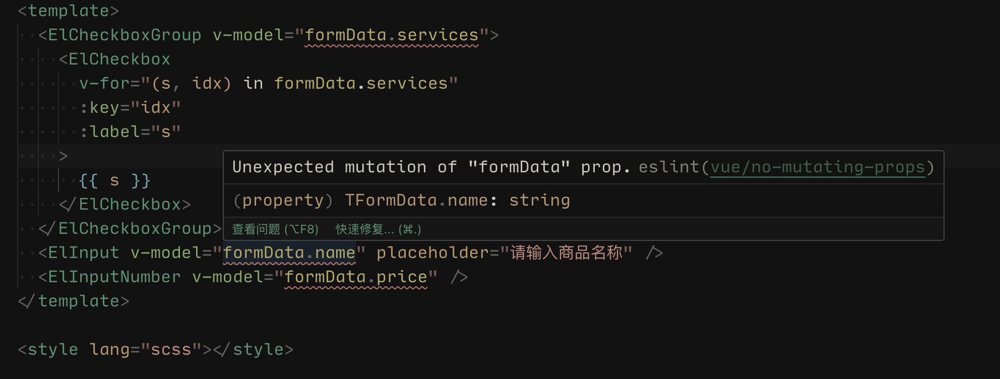
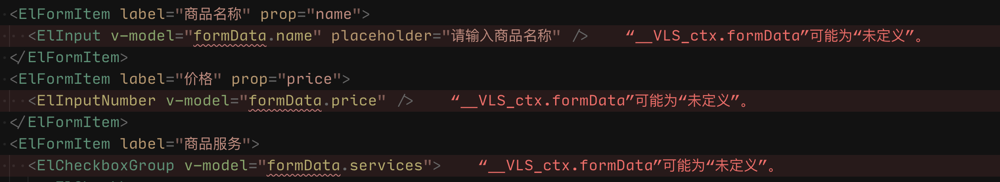
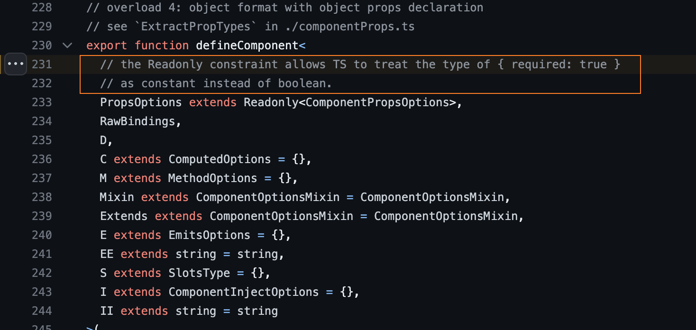

# vue 中的ts类型限制

## props 类型定义设置了必填，使用时仍然显示类型可能为 undefined

:::code-group

```vue [示例1]
<script setup lang="ts">
import type { PropType } from 'vue'

interface TFormData {
  name: string
  price: number
  services: string[]
}

const formProps = {
  formData: {
    type: Object as PropType<TFormData>,
    required: true,
  },
  submitText: {
    type: String,
    default: '提交',
  },
  loading: {
    type: Boolean,
    default: false,
  },
}
defineProps(formProps)
</script>

<template>
  <ElCheckboxGroup v-model="formData.services">
    <ElCheckbox
      v-for="(s, idx) in services"
      :key="idx"
      :label="s"
    >
      {{ s }}
    </ElCheckbox>
  </ElCheckboxGroup>
  <ElInput v-model="formData.name" placeholder="请输入商品名称" />
  <ElInputNumber v-model="formData.price" />
</template>
```

```ts [示例2]
const propsType = {
  age: {
    type: Number,
    required: true
  }
}

export default deineComponent({
  name: 'HelloWorld',
  props: PropsType,
  mounted() {
    this.age // 类型为number || undefined
  }
})
```
:::





:::tip **原因**
- `PropsOptions` 继承只读类型的`ComponentPropsOptions`, 
- 而`ts`中 `required:true`是被认为在这个对象上是必须的，所以会被消除掉。



 vue源代码 🔗
 - https://github.com/vuejs/core/blob/main/packages/runtime-core/src/apiDefineComponent.ts#L231
:::

### 解决方法：在定义 `props` 类型后加上 `as const` 断言

```ts
export const formProps = {
  formData: {
    type: Object as PropType<TFormData>,
    required: true,
  },
  submitText: {
    type: String,
    default: '提交',
  },
  loading: {
    type: Boolean,
    default: false,
  },
} as const

const props =  defineProps(formProps)
```

## 给自定义vue组件标注ts类型

我们需要为一个子组件添加一个模板 ref，以便调用它公开的方法。比如，我们有一个 MyModal 子组件，它有一个打开模态框的方法

```vue
<!-- MyModal.vue -->
<script setup lang="ts">
import { ref } from 'vue'

const isContentShown = ref(false)
const open = () => (isContentShown.value = true)

defineExpose({ open })
</script>
```

为了获取 `MyModal` 的类型，我们首先需要通过 `typeof` 得到其类型，再使用 `TypeScript` 内置的 `InstanceType` 工具类型来获取其实例类型：

```vue
<!-- Parent.vue -->
<script setup lang="ts">
import MyModal from './MyModal.vue'

const modal = ref<InstanceType<typeof MyModal> | null>(null)

const openModal = () => modal.value?.open()
</script>
```

:::tip 参考链接
- [如何为 Vue3 组件标注 TS 类型，看这个就够了！](https://juejin.cn/post/7129130323148800031#heading-19)
:::


## 为事件处理函数标注类型

在处理原生 `DOM` 事件时，应该给事件处理函数的参数正确地标注类型：

```vue
<script setup lang="ts">
const handleChange = (event) =>  {
  // 当没有类型标注时， `event` 被隐式地标注为 `any` 类型
  console.log(event.target.value)
}
</script>

<template>
  <input type="text" @change="handleChange">
</template>
```

- 上面的代码会在 `tsconfig.json` 中配置了 "strict": true 或 "noImplicitAny": true 时报出一个 TS 错误。
- 因此，我们要给`event`参数标注类型, 在使用时，可能还需要显式地强制转换 `event` 上的属性 

```vue
<script setup lang="ts">
const handleChange = (event: Event) =>  {
  console.log((event.target as HTMLInputElement).value)
}
</script>

<template>
  <input type="text" @change="handleChange">
</template>
```

