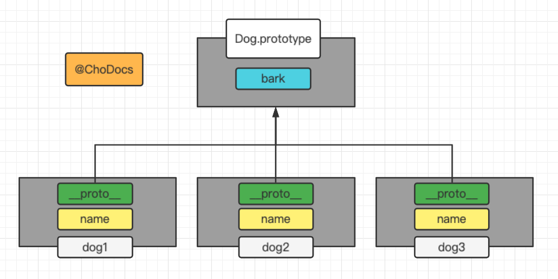
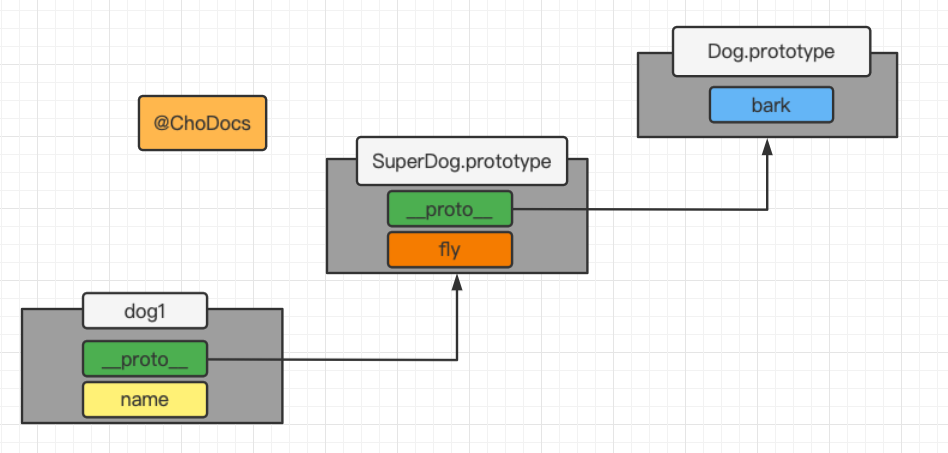

# 原型模式

本篇我们会介绍原型模式，提到原型这两个字，你一定会想到原型链相关的知识，没错，本篇文章或许能够让更好理解原型与原型链相关的知识。

> 使用原型模式可以在同一类型的许多对象之间共享属性，这样我们就可以避免重复定义方法和属性，从而减少所使用的内存量。

上述概念我们会在下文的内容以及 demo 演示中逐一介绍，说到原型，它其实也是 JavaScript 的原生对象，其它对象可以通过原型链访问它。

这里就提到了原型链，直接用文字难以表达清楚，我们来看看下方这个简单例子吧：

## Demo

我们通过 ES6 语法创建了一个名为 Dog 的 class 类，熟悉语法的同学应该知道，当我们 new 生成的实例即可共享这些属性与方法。

注意这里构造函数是如何包含 `name` 属性（下方代码高亮处），以及类本身是如何包含 `bark` 属性，这是语法上的规范。

当使用 ES6 类时，类本身定义的所有属性(在本例中为 `bark` )都会自动添加到原型中。

```js {3}
class Dog {
  constructor(name) {
    this.name = name
  }

  bark() {
    return 'Woof!'
  }
}

const dog1 = new Dog('ChoDog')
const dog2 = new Dog('DocsDog')
const dog3 = new Dog('Chocolate')
```

放在浏览器上打印一下数据，我们可以得到这样的结果：

```js {4}
console.log(Dog.prototype)
// constructor: ƒ Dog(name, breed) bark: ƒ bark()

// console.log(dog1.__proto__) 替换为下一行代码
console.log(Object.getPrototypeOf(dog1))
// constructor: ƒ Dog(name, breed) bark: ƒ bark()
```

上述代码中，我们打印了构造函数上的原型 `prototype` 属性以及实例上的 `__proto__` 属性。

> `__proto__` property has been deprecated as of ECMAScript 3.1 and shouldn’t be used in the code. Use Object.getPrototypeOf and Object.setPrototypeOf instead.

虽然 `__proto__` 被弃用，但还是可以使用，所以上述代码，我们用 `Object.getPrototypeOf` 来获取（因为 eslint 语法不让我通过，我又不想关闭，逃...）

在构造函数的任何实例上，`__proto__` 的值都是对构造函数原型的直接引用！

我们不妨比较一下看看原型以及原型链的关系，如下例子：

<iframe src="https://stackblitz.com/edit/prototype-pattern-dog-demo?devToolsHeight=33&embed=1&file=index.js"></iframe>

从最后一个 log 信息来看，每当我们试图访问对象上不直接存在的属性时（在这里是指访问 dog1 对象上 bark 属性，但是 dog1 并不存在这个属性），JavaScript 将沿着原型链一直找，查看该属性在原型链中是否可用，如果找到了即可直接使用。

### 图示



此处来总结一下：

> 原型模式在处理访问相同属性的对象时很有用，我们只需要将属性添加到原型中，而不用每次重复创建属性，因为所有实例都可以访问原型对象。

## 在原型中添加属性

那么所有实例都可以访问原型对象了，因此即使我们创建实例之后，也很容易地将属性添加到原型中。

狗除开汪汪叫之外，应该可以玩对吧，那我们就可以在 Dog 原型上添加 `play` 属性来试试，如下代码：

<iframe src='https://stackblitz.com/edit/prototype-pattern-dog-play?ctl=1&devToolsHeight=33&embed=1&file=index.js'></iframe>

::: details 示例源码

```js {15}
class Dog {
  constructor(name) {
    this.name = name
  }

  bark() {
    return 'Woof!'
  }
}

const dog1 = new Dog('ChoDog')
const dog2 = new Dog('DocsDog')
const dog3 = new Dog('Chocolate')

Dog.prototype.play = () => console.log('ChoDog is playing now!')

dog1.play()
```

:::

## 原型链

从原型链这个术语来看，它应该是有很多指向，到目前为止，我们只通过访问实例对象的 `__proto__` 来访问可用的一些属性，但是，可它是原型链诶！原型对象本身也有一个 `__proto__` 对象！

来看看如下代码，我们通过继承 Dog 创建了一个 SuperDog，这只 superdog 除了普通狗的行为，它还有特有的行为，`fly`！

```js {1,6}
class SuperDog extends Dog {
  constructor(name) {
    super(name)
  }

  fly() {
    return 'Flying!'
  }
}
```

### Demo

点开下方的 demo，我们会发现 superdog 可以访问 bark 方法，SuperDog 的原型对象的 `__proto__` 是指向的 `Dog.prototype`。

<iframe src='https://stackblitz.com/edit/prototype-pattern-dog-fly?ctl=1&devToolsHeight=33&embed=1&file=index.js'></iframe>

### 图示



结合图示，对于原型链的理解应该算是很清楚了：当我们试图访问对象上不直接可用的属性时，JavaScript 通过递归方式遍历 `__proto__` 指向的所有对象，沿着它来找到属性！

## 使用 Object.create

`Object.create` 方法能够让我们创建一个新的对象，然后它并没有任何属性，但是它可以访问原型链上的属性，来看看下方的示例：

### Demo

<iframe src='https://stackblitz.com/edit/prototype-pattern-object-create?ctl=1&devToolsHeight=33&embed=1&file=index.js'></iframe>

通过 `Object.create` 我们可以很方便地让新创建的对象，通过原型链遍历的方式来访问对象上的属性。

## 总结

原型模式使我们可以轻松地让对象访问和继承其他对象的属性。

由于原型链允许我们访问对象本身没有直接定义的属性，因此可以避免方法和属性的重复，从而减少内存使用量。
