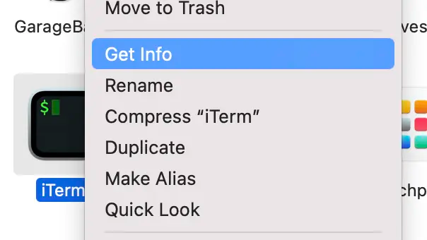
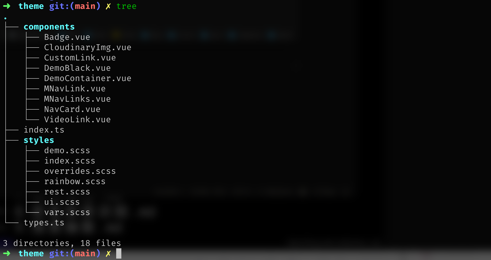
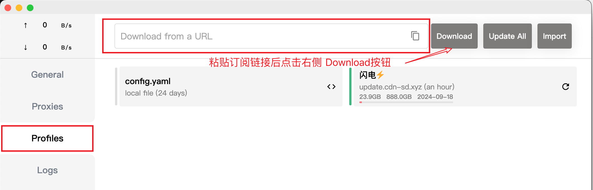
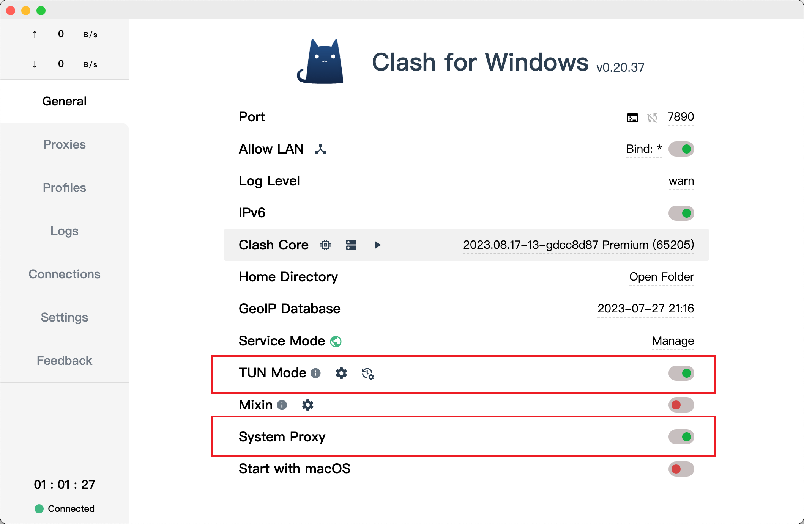
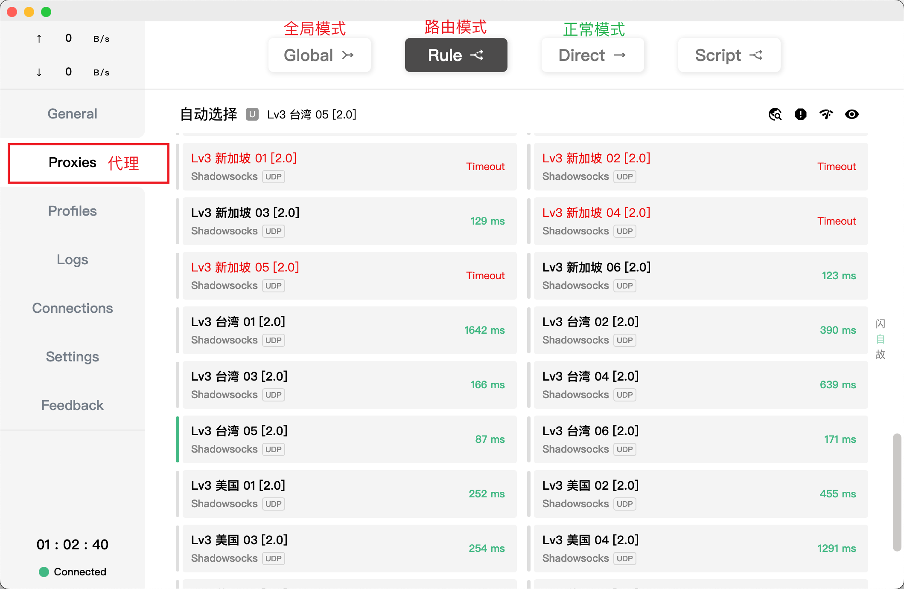
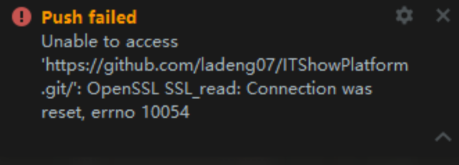
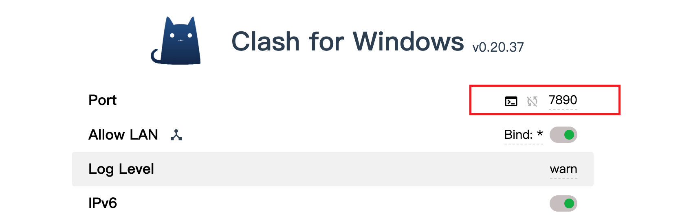
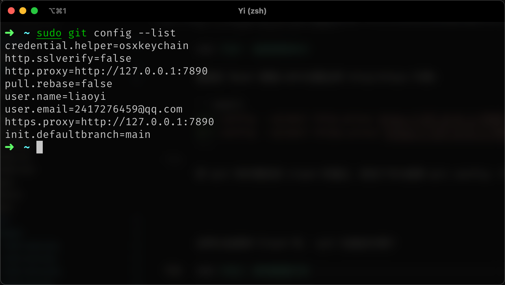

# Mac 前端开发环境

软件：
- [Chrome](https://www.google.cn/chrome/)
- [Arc 浏览器](https://arc.net/gift/33d039ba) UI和体验感超舒适的浏览器
- [iTerm2](https://iterm2.com/)
- [WebStrom](https://www.jetbrains.com/zh-cn/webstorm/download/#section=mac)
- [Sourcetree](https://www.sourcetreeapp.com/) 免费 Git 客户端
- [Clash for Windows](https://github.com/Fndroid/clash_for_windows_pkg) 🪜 Mac桌面版
<!-- - [ShadowsocksX-NG-R8](http://3.112.62.253:65534/shiyong/dy-mac.html) -->
- [Thor](https://github.com/gbammc/Thor/releases) 应用之间快速切换
- [SwitchHosts](https://github.com/oldj/SwitchHosts/releases) 管理 hosts 文件的应用
- [Carbon](https://carbon.now.sh/) Mac风格代码图片生
- [Hidden Bar](https://github.com/dwarvesf/hidden) 隐藏 macOS 菜单栏不常用的应用图
- [draw.io](https://github.com/excalidraw/excalidraw) draw.io 流程图绘制 (桌面版本)
- [excalidraw](https://github.com/revezone/revezone) excalidraw 素描手绘风格的流程图 (桌面版)


## 谷歌浏览器

国内下载地址：[https://www.google.cn/chrome/](https://www.google.cn/chrome/)

设置插件：[chrome://extensions/](chrome://extensions/)

### 暗黑模式切换

关闭 暗黑模式

```shell
defaults write com.google.Chrome NSRequiresAquaSystemAppearance -bool YES
# 重新启动 Chrome
```

打开 暗黑模式

```shell
defaults write com.google.Chrome NSRequiresAquaSystemAppearance -bool NO
# 重新启动 Chrome
```

## Xcode Command Line Tools

```sh
# 安装 Xcode Command Line Tools
xcode-select --install

# 删除 Xcode Command Line Tools
sudo rm -rf /Library/Developer/CommandLineTools
```

## Homebrew

Mac 的软件包管理工具，用于安装、卸载和管理各种软件，包括命令行工具、库和应用程序等

### 懒人一键安装(推荐)

```sh
/bin/bash -c "$(curl -fsSL https://gitee.com/ineo6/homebrew-install/raw/master/install.sh)"
```

::: details 其他安装方式 (巨坑！不推荐)
`MacBook Pro M2` 亲测环境变量无法自动写入，需要自己手动添加，新手勿踩坑!!!
``` shell
# 国内源完整版安装
/bin/zsh -c "$(curl -fsSL https://gitee.com/cunkai/HomebrewCN/raw/master/Homebrew.sh)"
# 极速安装（update 功能需要命令修复）
/bin/zsh -c "$(curl -fsSL https://gitee.com/cunkai/HomebrewCN/raw/master/Homebrew.sh)" speed
```
:::


:::tip 安装教程
- [Homebrew 中文网](https://brew.idayer.com/)
:::

### 常用命令

```sh
# 更新 Homebrew
brew update

# 安装指定的软件包
brew install <package>

# 卸载指定的软件包
brew uninstall <package>

# 搜索可用的软件包，并显示匹配的结果
brew search <query>

# 列出已安装的软件包
brew list

# 查看可以升级的软件包
brew outdated

# 升级所有软件包到最新版本
brew upgrade
# 升级指定的软件包到最新版本
brew upgrade <package>

# 查看指定软件包的信息，包括版本号、安装路径、依赖关系等
brew info <package>

# 清理 Homebrew 临时文件和旧版本的软件包
brew cleanup
# 查看可以清理的 Homebrew 临时文件和旧版本的软件包
brew cleanup -n
```

::: tip
- [Github](https://github.com/Homebrew)
- [软件官网](https://brew.sh/index_zh-cn)
:::

## iTerm2 

> Mac 上最好用的终端

1. 支持子窗口
2. 自动补全
3. 查看粘贴历史
4. 自定义配置项

```sh
# 查看所有的 shell
cat /etc/shells

# 查看当前窗口使用的 shell
echo $SHELL

# 查看系统用户默认的 shell
cat /etc/passwd | grep sh

# 切换系统默认 shell
chsh -s /bin/zsh
```

[Github](https://github.com/gnachman/iTerm2)
[软件官网](https://www.iterm2.com)

### iTerm2 常用快捷键

| 操作          | 含义                   |
| :------------ | :--------------------- |
| ⌘ + N         | 新建窗口               |
| ⌘ + T         | 新建 Tab               |
| ⌘ + W         | 关闭 Tab / 窗口        |
| ⌘ + ←         | 切换到上一个 Tab       |
| ⌘ + →         | 切换到下一个 Tab       |
| ⌘ + 数字      | 快速切换 Tab           |
| ⌘ + D         | 垂直分屏               |
| ⌘ + Shift + D | 水平分屏               |
| ⌘ + Enter     | 切换全屏               |
| ⌘ + F         | 查找                   |
| ⌘ + /         | 查看光标的位置         |
| Ctrl + P      | 上一条命令             |
| Ctrl + R      | 搜索命令历史           |
| Ctrl + L      | 清屏                   |
| Ctrl + U      | 清除当前行             |
| Ctrl + W      | 删除光标前面的一个单词 |
| Ctrl + K      | 删除光标后面的所有字符 |
| Ctrl + A      | 移动光标到行首         |
| Ctrl + E      | 移动光标到行尾         |

### iTerm2 配色方案

- [iTerm2-Color-Schemes](https://github.com/mbadolato/iTerm2-Color-Schemes)
- [iTerm2-Material-Design](https://github.com/MartinSeeler/iterm2-material-design)


## Oh-My-Zsh

github：[https://github.com/ohmyzsh/ohmyzsh](https://github.com/ohmyzsh/ohmyzsh)

curl：

```shell
sh -c "$(curl -fsSL https://raw.githubusercontent.com/ohmyzsh/ohmyzsh/master/tools/install.sh)"
```

wget:

```shell
sh -c "$(wget -O- https://raw.githubusercontent.com/ohmyzsh/ohmyzsh/master/tools/install.sh)"
```

### 终端代理

:::tip

首先得有梯子
:::

1、添加 zshrc 配置

```shell
# 查看当前 IP 
alias proxy-ip = "curl http://cip.cc"


# 开启代理方法
proxy-on() {
# 我的 Clash for Windows中port为7890
export http_proxy =http://127.0.0.1:7890
# 只代理 https 请求
export https_proxy=http://127.0.0.1:7890
# 代理所有请求
export ALL_PROXY=http://127.0.0.1:7890
  echo "HTTP Proxy on"
}

# 关闭代理方法
proxy-off() {
  unset http_proxy
  unset https_proxy
  unset ALL_PROXY
  echo "HTTP Proxy off"
}
```

2、重新加载 zsh 的配置

```shell
source ~/.zshrc
```

3、使用

查看当前 IP

```shell
proxy-ip
```

IP 信息

```shell
IP	: 101.69.249.90
地址	: 中国  浙江  杭州
运营商	: 联通

数据二	: 浙江省杭州市 | 联通

数据三	: 中国浙江杭州 | 联通

URL	: http://www.cip.cc/101.0.0.0
```

开启代理：

```shell
proxy-on
```

```shell
# 查看IP
proxy-ip

# IP 信息
IP	: 203.175.12.118
地址	: 不丹  不丹

数据二	: 香港 | 特别行政区

数据三	: 中国香港

URL	: http://www.cip.cc/203.175.12.118
```

关闭代理：

```shell
proxy-off
```

## Zsh 插件配置

::: tip

1、查看已经安装的插件

```shell
cd ~/.oh-my-zsh/plugins
```

2、如果已经安装，可以直接在 `plugins` 中添加

```shell
vim ~/.zshrc

# 再插件列表中添加
plugins=(git zsh-autosuggestions z ...other plugin)
```

3、重新加载 zsh 的配置

```shell
source ~/.zshrc
```

:::

参考：[zsh oh-my-zsh 插件推荐](https://hufangyun.com/2017/zsh-plugin/)

- 命令自动补全：[zsh-autosuggestions](https://github.com/zsh-users/zsh-autosuggestions/blob/master/INSTALL.md)
- 命令高亮检测：[zsh-syntax-highlighting](https://github.com/zsh-users/zsh-syntax-highlighting/blob/master/INSTALL.md)
- 目录间快速跳转,不用再一直 cd：[autojump](https://github.com/wting/autojump)
- 目录间快速跳转,不用再一直 cd：[Z](https://github.com/wting/autojump)

### 命令自动补全：zsh-autosuggestions

github：[zsh-autosuggestions](https://github.com/zsh-users/zsh-autosuggestions/blob/master/INSTALL.md)

1、clone 插件

```shell
git clone https://github.com/zsh-users/zsh-autosuggestions ${ZSH_CUSTOM:-~/.oh-my-zsh/custom}/plugins/zsh-autosuggestions
```

2、把插件称加入 oh-my-zsh 插件列表

```shell
# 打开 zsh 配置文件
open ~/.zshrc
or
vim ~/.zshrc

# 把插件名称加入插件列表
plugins=(git zsh-autosuggestions) 
```

3、重新加载 zsh 的配置

```shell
source ~/.zshrc
```

### Z 快速切换文件路径

1、默认安装oh my zsh时就已经安装了 z 插件，具体可以在以下目录看到

```shell
cd ~/.oh-my-zsh/plugins
```

2、只需要在(~/.zshrc)中的插件列表中添加

```shell
vim ~/.zshrc
# 再插件列表中添加
plugins=(其他插件 z)
```

3、重新加载 zsh 的配置

```shell
source ~/.zshrc
```

## nvm

Nvm 是一个管理 Node 版本的工具

github：[nvm](https://github.com/nvm-sh/nvm)

### 安装：

curl:

```shell
curl -o- https://raw.githubusercontent.com/nvm-sh/nvm/v0.39.0/install.sh | bash
```

wget:

```shell
wget -qO- https://raw.githubusercontent.com/nvm-sh/nvm/v0.39.0/install.sh | bash
```

Homebrew 安装 Nvm（不是很推荐，会有依赖 path 问题）

```shell
brew install nvm
```

### 常用的命令

#### 安装 node

```shell
# 安装最新版本 Node
nvm install node 

# 安装指定版本 Node
nvm install version

# 安装最新LTS(Long-term Support)版本Node
nvm install --lts
```

#### 查看 node

```shell
# 查看本地 Node 版本
nvm ls 

# 查看远程 Node 所有版本
nvm ls-remote
 
# 查看远程 Node 所有 LTS 版本
nvm ls-remote --lts 

# 查看当前使用 Node 版本
nvm current 

# 查看 node 安装位置
nvm which <version>
```

#### 使用 node

```shell
# 当前 shell 下使用某个 Node 版本
nvm use <version>

# 指定全局默认版本
nvm alias default <version> 
```

#### 删除

```shell
# 卸载指定的版本
nvm uninstall <version>

# 解除当前版本绑定
nvm deactivate` 
```

### 如何在 M1 下安装 v14 及以下的老版本 Node

> 安装 Node 的部分写的很简单，因为按这个步骤，一般不会出问题。
> 而当你用 nvm 尝试去安装 v14 及以下的 Node 版本时，大概率会报错
>
> 而我们在工作中恰恰又可能依赖 v14 及以下的 lts 版本。那么为什么会报错呢？
>
> 究其原因还是因为低版本的 node 并不是基于 arm64 架构的，所以不适配 M1 芯片。
> 在这里教大家两个方法，就能成功安装上低版本 Node。

#### 方法一

终端输入：

```shell
arch -x86_64 zsh
```

通过这个命令可以让 shell 运行在 Rosetta2 下。 之后你可以通过 `nvm install v12` 来安装低版本 Node。

在此之后，您可以不用在 Rosetta2 中就可以使用安装的可执行文件，也就是说，您可以将 Node v15与其他节点版本互换使用

#### 方法二

通过 Rosetta2 来启动终端，这样通过 Rosetta2 转译到 x86 架构中执行安装，也一样可以安装成功。

- 在 finder 中，点击应用程序，并在实用工具中找到终端 (Terminal)
- 右键终端，点击获取信息
- 选择 使用Rosetta 打开
- 重启终端，并执行 nvm install v12 命令




## npm 配置

### nrm 

`nrm`是一个`npm`源管理器，可以快速地在`npm`源间切换.

#### 安装

```shell
# 全局安装 nrm
npm install -g nrm
```


#### 查看可选的源 

```shell
➜  ~ nrm ls
* npm ---------- https://registry.npmjs.org/
  yarn --------- https://registry.yarnpkg.com/
  tencent ------ https://mirrors.cloud.tencent.com/npm/
  cnpm --------- https://r.cnpmjs.org/
  taobao ------- https://registry.npmmirror.com/
  npmMirror ---- https://skimdb.npmjs.com/registry/
```

- 其中，带*的是当前使用的源，上面的输出表明当前源是官方源。

#### 切换源

```shell
# 如果要切换到taobao源:
nrm use taobao
```

#### 增加源和删除源

```shell
# 你也可以增加定制的源，特别适用于添加企业内部的私有源：
nrm add <registry> <url> 其中reigstry为源名，url为源的路径。
# 示例
nrm add registry http://192.168.10.127:8081/repository/npm-public/

# 删除源
nrm del <registry> 删除对应的源
```

#### 测试源速度

```shell
# 测试npm源
nrm test npm 
# 测试taobao源
nrm test taobao
```


## git 配置

### git cz Commitizen 使用方法

参考：[优雅的提交你的 Git Commit Message](https://juejin.cn/post/6844903606815064077#heading-3)


## Fig

终端自动补全命令提示工具

- 支持近 300 多种 `CLI` 工具的补全提示，如 `cd git brew npm yarn`
- 支持插件
- 支持自定义补全规范

安装

```sh
brew install --cask fig
```

在 `vscode` 中使用，需修改 `editor.accessibilitySupport` 为 `"off"`

:::tip 参考链接
- [Github](https://github.com/withfig/autocomplete)
- [软件官网](https://fig.io/)
:::

## mas-cli

Mac App Store 命令行工具

安装

```sh
brew install mas  
```

**常用命令** 

```sh
# 搜索应用程序
mas search [query]

# 列出已经安装的应用程序
mas list

# 通过应用程序的 ID 进行安装，可以从 search 命令或者应用程序网页中获取
mas install [app-id]

# 升级已经安装的应用程序
mas upgrade

# 列出有更新可用的应用程序
mas outdated
```

[Github](https://github.com/mas-cli/mas)

## duti 设置默认应用程序

设置默认应用程序的命令行工具

```sh
brew install duti
```

常用命令

```sh
# 查看指定文件类型的默认应用程序
duti -x txt

# 更改文件类型的默认应用程序
duti -s com.apple.TextEdit .txt all
```

常用的默认应用程序设置

> 万恶的微信开发者工具修改了很多默认应用程序设置
>
> 有一说一：微信开发者工具只配用来预览，开发还是一边玩去

```sh
duti -s com.microsoft.VSCode .ts all
duti -s com.microsoft.VSCode .js all
duti -s com.microsoft.VSCode .json all
duti -s com.microsoft.VSCode .wxml all
duti -s com.microsoft.VSCode .wxss all
```

[Github](https://github.com/moretension/duti)


### tree 文件目录生成

`tree`命令的作用是以树状图形式列出目录的内容。
执行`tree`命令，它会以树状图的方式列出指定目录下的所有文件，包括目录里的文件，显示出指定目录的文件目录结构，常用于文档总结。


Mac环境安装tree命令 

```shell
brew install tree
```

使用

```shell

tree【选项】【目录】

tree -N # tree -N 可解决Mac环境，tree命令中文乱码问题 (转UTF-8)
```




除此之外我们还有其他的参数可以设置：

| 命令行              | 效果                                                         |
| ------------------- | ------------------------------------------------------------ |
| `tree -d`           | 只显示文件夹                                                 |
| `tree -D`           | 显示文件的最后修改时间                                       |
| `tree -L n`         | n表示显示项目的层级，n=3即只显示项目的三层结构               |
| `tree -I <pattern>` | `pattern`表示想要过滤的目录，例如` tree -I 'node_modules'`可以过滤掉`node_modules`这个文件夹 |

:::details 

参考链接 🔗
- https://blog.csdn.net/sinat_41093471/article/details/80322172
- https://geekzw.blog.csdn.net/article/details/108288899

```shell 完整命令参考
-a  # 显示所有文件和目录（默认选项）
-A	# 使用ASNI绘图字符显示树状图而非以ASCII字符组合
-C	# 在文件和目录清单加上色彩，便于区分这种类型
-d	# 显示目录名称而非内容(只列出目录，不列出文件)
-D	# 列出文件或目录的更改时间
-f	# 在每个文件或目录之前，显示完整的相对路径名称
-F	# 在执行文件，目录，Socket，符号连接，管道名称名称，各自加上“*”，“/”，“=”，“@”，“|”号
-g	# 列出文件或目录的所属群组名称，没有对应的名称时，则显示群组识别码
-i	# 不以阶梯状列出文件或目录名称
-I  # 不现实符合范本样式的文件或目录名称
-l	# 如遇到性质为符号连接的目录，直接列出该连接所指向的原始目录
-n	# 不在文件和目录清单上加上色彩
-N	# 直接列出文件和目录名称，包括控制字符
-p	# 列出权限标示
-P	# 只显示符合范本像是的文件或目录名称
-q	# 用“?”号取代控制字符，列出文件和目录名称
-s	# 列出文件或目录大小
-t	# 用文件和目录的更改时间排序
-u	# 列出文件或目录的拥有者名称，没有对应的名称时，则显示用户识别码
-x	# 将范围局限在现行的文件系统中，若指定目录下的某些子目录，其存放于另一个文件系统上，则将该子目录予以排除在寻找范围外
-L	# 分层级显示（tree -L 1 /etc/）
```
:::

##  clash for windows 

1. [下载安装 clash for windows](https://github.com/Fndroid/clash_for_windows_pkg/releases/) 

2. [汉化补丁下载](https://github.com/BoyceLig/Clash_Chinese_Patch/releases)

:::details Mac汉化步骤
- 依次打开–访达–应用程序–右键 Clash for Windows–显示包内容–Contents–Resources
- 替换 `app.asar` 文件即可。
:::

### 开启代理

导入订阅🔗
<br/>




<br/>

开启代理



<br/>

### 出站模式介绍

<br/>



<br/>

- `全局连接`: 无论国内外网站, 全部使用此软件加速访问. 缺点: 国内网站会变很慢或者无法访问。
- `规则判断`: 国内网站使用自己本地宽带, 国外网站使用此软件加速访问。 `国内国外网页来回切一定要用这个！！`
- `直接连接`: 和关闭代理没什么区别，选择这个就无法上外网了.


### 开clash后国内网站无法访问

最近换了🪜的订阅🔗,开启全局代理后，百度、掘金、csdn这些网站访问巨慢，知乎直接打不开，在网上翻了半天，都是说手动设置[绕过系统代理](https://docs.cfw.lbyczf.com/contents/bypass.html),尝试了一下，根本不起任何效果，其实最简单的方式就是上面提到的出站模式介绍，只要启用`Rule`即`规则判断`模式就好了。


### 开clash后Git依然超时的解决方法


**问题复现**




为了解决这个问题，我们一般想到的方法就是走一下代理，但是Clash开启之后，我们可以在网页端正常访问github，但是push还是不行。问题的根源是：普通的代理模式，流量都是走一个特定的端口，与服务器通信，但是git的流量不会走。所以我们需要手动绑定一下代理。

方法非常简单，这里以Clash为例，其他软件的配置也大差不差。

打开Clash，马上就可以看到它使用的代理端口，这里为7890



接下来，给git设置代理，方法如下：

#### 方法一 直接使用命令

直接在`Bash`里输入命令设置全局`http/https`代理:

```shell
git config --global http.proxy http://127.0.0.1:7890
git config --global https.proxy https://127.0.0.1:7890
```


把`git`的代理改成`clash`的端口，改完了可以使用`git config -l`查看配置



这样以后使用`Clash`时，`git`也能走代理了。

其他相关命令：

```shell
## 查看代理
git config --global http.proxy
git config --global https.proxy

## 取消代理
git config --global --unset http.proxy
git config --global --unset https.proxy

# 设置代理 
git config --global https.proxy 127.0.0.1:****
git config --global http.proxy 127.0.0.1:****
```

#### 方法二 修改配置文件

1. 打开配置文件:

```shell
vi ~/.gitconfig
```

2. 在文件末尾添加配置:

```shell
[http]

proxy = http://127.0.0.1:7890
 
[https]
 
proxy = https://127.0.0.1:7890
```

保存退出，重启一下终端。


参考链接 🔗
- [开clash后Git依然超时的解决方法](https://zhuanlan.zhihu.com/p/652905080)

