# TypeScript 基础知识

TypeScript 作为 JavaScript 语言的超集，它为 JavaScript 添加了可选择的类型标注，大大增强了代码的可读性和可维护性。

> 用 TypeScript 编写的文件以 .ts 为后缀；用 TypeScript 编写 React 时，以 .tsx 为后缀。

## 数据类型


| 类型	 | 示例 | 描述 |
| --- | --- | --- |
| number | `1`, `-33`, `2.5` | 任意数字 |
| string | `'hi'`,`"hello"`, ``hello World`` | 任意字符串 |
| boolean | `true`、`false` | 布尔值`true`或`false` |
| array | `[1 ,2 ,3 ]` | 任意JS数组 |
| object | `{ name: 'tom' }` | 任意的JS对象 |
| any | `*` | 任意类型 |
| 字面量 | 其本身 | 限制变量的值就是该字面量的值 |
| enum | `enum{ A,  B }` | 枚举，TS中新增类型 |
| void	空值 | 空值、`undefined` | 没有值（或`undefined`） |
| unknown | `*` | 类型安全的 `any` |
| never | 没有值 | 不能是任何值 |
| tuple | `[4,5]` 元组	 | TS新增类型，固定长度的数组 |


定义方式： 使用 `:`指定变量的类型，`:`前后有无空格都可以。


```ts
const inDone: boolean = true
// num (变量名) :number(元素类型) = 12 (初始值)
const num: number = 12
```


```typescript
// 布尔类型
let flag:boolean = false
// 数字
let total: number = 6
// 字符串
let name: string = "liaoyi"
// 使用模板字符串
let name: string = `Hello ${name}!`
// 未定义类型
let hasKnow: undefined = undefined
// 空值
let isNull: null = null
```


### boolean 

布尔类型就是简单的 `true / false` 值

```ts
const isFlag: boolean = true
```

### string 

```ts
let name: string = 'liaoyi'
name = 'liaoyi'
```

### number 

和 `JavaScript` 一样，`TypeScript` 里的所有数字都是浮点数。这些浮点数的类型是 `number`。除了支持十进制和十六进制字面量，`TypeScript` 还支持 `ES6` 中引入的二进制和八进制字面量。

```ts
const decLiteral: number = 20
const hexLiteral: number = 0x14
const binaryLiteral: number = 0b10100
const octalLiteral: number = 0o24
```

### bigint 

`bigint` 类型表示一个任意精度的整数，它可以用来处理超出 `JavaScript` `number` 类型范围的整数

```ts
const big: bigint = 19961996n
```

### symbol

`symbol` 类型表示独一无二的值，其必须通过 `Symbol` 函数生成，常用于创建对象属性的唯一标识符

```ts
let sym: symbol = Symbol('liaoyi')
sym = Symbol('liaoyi') // OK
sym = 'liaoyi' // Error
```

### object 

`object` 类型表示非原始类型，也就是除 `boolean` `string` `number` `bigint` `symbol` `null` `undefined` 之外的类型。

使用 `object` 类型，就可以更好的表示像 `Object.create` 这样的 `API`

```ts
declare function create(o: object | null): void

create({ prop: 0 }) // OK
create(null) // OK

create(42) // Error
create('string') // Error
create(false) // Error
create(undefined) // Error
```

### 特殊类型

除以上被提到的一些原始类型外，在 `TypeScript` 中，还存在一些特殊的类型

- `any` 任意值
- `void` 空值
- `null`
- `undefined`

#### `any` 任意值

`any` 是一个特殊的类型，当一个值是 `any` 类型的时候，`TypeScript` 将不会对其进行类型检查

```ts
/* 你可以任意操作你的变量 TypeScript 不会抛出相关的提示 */
const value: any = 1
free = { name: 'liaoyi' }
free.log()
free = 'liaoyi'
```

:::warning 注意点
无论是开发者指定或是由 `TypeScript` 隐式推断出的 `any` 类型，都会导致 `TypeScript` 失去准确的类型推断能力，这可能会导致遗漏一些运行时错误，违背了使用 `TypeScript` 的初衷
:::

#### `void` 空值

`JavaScript` 没有空值（Void）的概念，在 `TypeScript` 中，可以用 `void` 表示没有任何返回值的函数

```ts
function sayHello(): void {
  console.log('Hello, world')
}
```

也可以定义一个 `void` 类型的变量，不过这样的变量并没有什么意义，因为你只能为它赋予 `undefined` 和 `null`

```ts
const value: void = undefined
```

#### `null` 和 `undefined`

在 `TypeScript` 中，可以使用 `null` 和 `undefined` 来定义这两个原始数据类型

```ts
const u: undefined = undefined
const n: null = null
```

默认情况下 `null` 和 `undefined` 是所有类型的子类型。就是说你可以把 `null` 和 `undefined` 赋值给 `number` 类型的变量。

当编译选项指定了 `--strictNullChecks`（开启严格空值检查模式）时，`null` 和 `undefined` 只允许赋值给自己或 `any` 类型的变量，这能避免很多常见的问题

#### `unknown` 未知类型

`unknown` 类型用于描述一个我们还不知道其类型的变量

就像所有类型都可以被归为 `any`，所有类型也都可以被归为 `unknown`。这使得 `unknown` 成为 `TypeScript` 类型系统的另一种顶级类型

```ts
let notSure: unknown = 4
notSure = 'maybe a string instead'
notSure = false // 也可以是个 boolean
```

:::tip `unknown` 和 `any`
相比于 `any` 类型不会对变量进行任何检查，对于 `unknown` 类型的变量在执行大多数操作时必须进行相应的检查，因此 `unknown` 类型相对更加严格
:::

#### `never`

`never` 类型表示的是那些永不存在的值的类型，常用于一个从来不会有返回值的函数，或者一个总是会抛出错误的函数

```ts
// 不会有返回值
function infiniteLoop(): never {
  while (true) {
    // do something
  }
}

// 总是会抛出错误的函数
function error(message: string): never {
  throw new Error(message)
}
```

`never` 类型仅能被赋值给另外一个 `never` 类型


:::tip

- 在为变量赋值明确的值时，建议尽量使用 **类型注解** 的方式
- 对于函数返回值，始终显示指明返回类型是个更好的习惯

:::

### 字面量类型

字面量类型是一种特殊的类型，表示一个固定的值

**字符串字面量类型**：

```ts
type Name = 'liaoyi' | 'liaoyi1996' | 'liaoyi'
```

**数字字面量类型**：

```ts
type Age = 18 | 19 | 20
```

**布尔字面量类型**：

```ts
type IsLoggedIn = true
```

使用字面量类型可以在编译时进行更严格的类型检查，避免因为传入了不正确的值导致运行时出错。同时字面量类型还可以用于定义联合类型、交叉类型等高级类型，提高代码的可读性和可维护性


### 联合类型
同时设置多种类型
```typescript
let age: number | string = '22'
age = 34

interface IUser {
  name: string;
  age: string;
  smoking: string;
}
interface IUser1 {
  name: string;
  age: number;
}

// 此时的user 有IUser和IUser1共有属性: name, age
// 并且 age 的类型为 string | number

let user: IUser | IUser1 = {
    name: 'liaoyi',
    age: '4234',
    smoking: '31232'
}
```
### 任意类型
```typescript
let name:any = 'linYi'
name = 007
name = false
name = ['🎉','👀', '✨']
```

### 类型推论
> 在TS中，声明变量但是没有定义类型，会自动给我们推测出一个类型，这就是类型推论。

1. 当推断类型后，我们将不能赋值给其他类型：

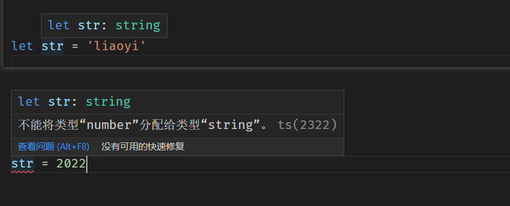

2. 如果声明变量时未定义类型也没有赋值，会推断成any类型可以进行任何操作

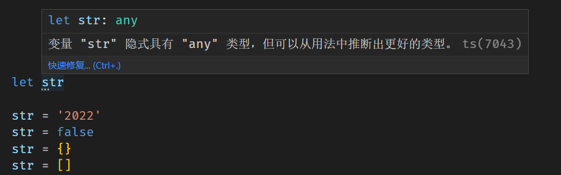


###  类型别名 type
> type 关键字用于给一个类型定义一个名字，多用于联合类型。

  写法： type 别名 = 类型(原始类型、联合类型、元组…)举个例子：
```typescript
// 定义类型别名
type Name = string;
// 定义函数别名
type NameResolver = () => string;
// 定义联合类型别名
type NameOrResolver = Name | NameResolver | number;

// 定义值的别名
type Value = boolean | 0 | 1 | '0' | '1'

function getName(n: NameOrResolver): Name {
  if (typeof n === 'string') {
    return n;
  } else {
    return n();
  }
}

let name:Name = '我是liaoyi'
let nameResolver:NameResolver = () => 'Hello 2023!'

let sex:NameOrResolver = '男'
let sex2:NameOrResolver = 1
let sex2:NameOrResolver =  ()=> '男'

// 变量value的值，只能是上面Value中定义的值
let value: Value = true


```
> 起别名不会新建一个类型，它是创建了一个新名字来引用那个类型。比如上面例子，Name 和 string 其实是一样的类型。通常来说给 原始类型 起别名没有特别用处，更多的用于 联合类型 。如下例子：

```typescript
type Field = string | number
let field: Field

field = 'first'
field = 1

```

类型别名有时和接口很像，但是可以作用于 原始值，联合类型，元组以及其它任何你需要手写的类型。

类型别名与接口刚接触时可能会混淆，举个例子：
```typescript
type Field = {
  num: number;
  str: string;
}

interface inter {
  num: number;
  str: string;
}

```
虽然长得很像，但是类型别名是可以使用泛型的 ：
```typescript
type Container<T> = {
  value: T
}

let container: Container<string> = {
  // 此时 value 的类型是根据传递的类型参数决定的
  value: 'str'
}

// 也可以使用类型别名来在属性里引用自己
type Content<T> = {
  value: T;
  children?: Content<T>
}

let content: Content<string> = {
  value: 'str',
  children: {
    value: 'str2'
  }
}


```

### 
### 自定义类型
我们可以使用字面量去指定变量的类型，通过字面量和`**|**`可以确定变量的取值范围。
```typescript
// 通过字面量和|可以确定变量的取值范围
let color: 'red' | 'blue' | 'black';
let num: 33 | 44 | 55 | 66;

// 自定义类型
type myType = 'sing' | 'dance' | 'rap' | 'basketball'
let a:myType = 'sing'
```

### 交叉类型
:::info
交叉类似表示需要满足多个类型的条件,使用 & 符号。
:::
```typescript
interface Colorful {
  color: string
}

interface IRun {
  running: () => void
}

type NewType = Colorful & IRun

const obj: NewType = {
  color: 'red',
  running: function() {
    
  }
}

```

---

### 数组类型
数组的定义有两种方式：

1. 可以在`元素类型`后面接上`[]`，表示由此类型元素组成的一个数组：
```typescript
let list: number[] = [1, 2, 3]
let emogiList: string[] = ['😊', '😂', '🤣']

let tagList: (number | string )[] = [22, 66, 89]

tagList = ['Rap', 'Sing', 'Dance', 8787, 857]
```

2. 使用数组泛型，`Array<元素类型>`
```typescript
let list: Array<number> = [1, 2, 3]

let userList: Array<number | string> = ['liaoyi', 22, 'javaScript']
```

定义多维数组
```typescript
 // 定义一个只能是数字类型的二维数组
let list:number[][] = [ [1, 2, 3], [4, 5, ,6], [7, 8]]  
 // 定义一个只能是数字、字符串类型的二维数组
let list1:number | string [][][] = [[['45', 34, 'Hello']]]

// 使用泛型定义
let list3:Array<Array<number | string >> = [ [1,3,7,'2022'],['九月','二十二']]

```

### 元组 Tuple

元组（Tuple）类型表示一个固定长度的数组，并且已知每项所对应的类型

当对元组类型的数据进行 **越界访问** 或 **分配错误的类型值** 时，`TypeScript` 将报错提示

```ts
const tuple: [string, number] = ['liaoyi', 18]

console.log(tuple[2]) // Error
tuple[0] = 666 // Error
```


### enum 枚举类型
> 枚举（enum），它是一种可以将多个常量分组为一个并附加一系列值的类型，使用枚举定义的常量称为枚举器列表，默认情况下，枚举器从零开始按顺序编号，使用枚举  通过 enum 关键字定义我们的枚举。

例如：  红绿蓝 Red = 0 Green = 1  Blue = 2 分别代表红色0 绿色为1 蓝色为2
```typescript

enum Types{
    Red = 0,
    Green = 1,
    Blue = 2
}

//默认就是从 0 开始的，可以不写值
enum Types {
    Red,
    Green,
    Blue
}
```
#### 增长枚举
:::info
如下代码，我们定义了一个数字枚举，MON使用初始化为 1 ， 其他的成员会从1开始自动增长。换句话说，Week.MON 的值为1，TUE 为 2， WED 为 3
:::
```typescript
enum Week{
    MON = 1,
    TUE,
    WED,
    THU,
    FRI,
    STA,
    SUN
}
```
#### 字符串枚举
> 在一个字符串枚举中，每个成员都必须用字符串字面量，或另一个字符换枚举成员进行初始化。

```typescript
enum Week{
    MON = '星期一',
    TUE = '星期二',
    WED = '星期三',
    THU = '星期四',
    FRI = '星期五',
    STA = '星期六',
    SUN = '星期天',
}
```
> 因为字符串枚举没有自增长的行为，字符串枚举可以很好的序列化。换句话说，如果你正在调试并且必须要读一个数字枚举的运行时的值，这个值通常是很难读的(它并不能表达有用的信息)，字符串枚举允许你提供一个运行时有意义的并且可读的值，独立于枚举成员的名字。

#### 接口枚举
我们有如下例子： 定义一个枚举Types，定义一个接口A ，他有一个属性red，值为 Types.yyds，声明对象的时候，要遵循这个规则。
```typescript
enum Types{
    yyds,
    dddd
}
interface A {
    red: Types.yyds
}
 
let obj:A = {
    res: Types.yyds,
    red: 1  // 应为Types.yyds是数字枚举，所以这里可以直接给初始值为1
}
```
#### const 枚举
:::info
在某些情况下，为了避免在额外生成的代码和额外的非直接的对枚举成员的访问，我们可以使用 const 定义枚举，因为const 枚举会被定义为常量（普通声明的枚举编译完后是个对象）。注意 ：let 和 var 都是不允许的声明枚举。
:::
我们先看看常规定义一个枚举后编译的代码：
```typescript
enum Week2{
    MON = '星期一',
    TUE = '星期二',
    WED = '星期三',
    THU = '星期四',
    FRI = '星期五',
    STA = '星期六',
    SUN = '星期天',
}

let code: string = '星期一'
if (code === Week2.MON) {
    // Do something
}
```
编译后的代码：
```typescript
var Week2;
(function (Week2) {
    Week2["MON"] = "\u661F\u671F\u4E00";
    Week2["TUE"] = "\u661F\u671F\u4E8C";
    Week2["WED"] = "\u661F\u671F\u4E09";
    Week2["THU"] = "\u661F\u671F\u56DB";
    Week2["FRI"] = "\u661F\u671F\u4E94";
    Week2["STA"] = "\u661F\u671F\u516D";
    Week2["SUN"] = "\u661F\u671F\u5929";
})(Week2 || (Week2 = {}));
var code = '星期一';
if (code === Week2.MON) {
    // Do something
}

```

**定义一个const 枚举**
```typescript
const enum Week2{
    MON = '星期一',
    TUE = '星期二',
    WED = '星期三',
    THU = '星期四',
    FRI = '星期五',
    STA = '星期六',
    SUN = '星期天',
}

let code: string = '星期一'
if (code === Week2.MON) {
    // Do something
}
```
const 编译后的 js 代码
```typescript
var code = '星期一';
if (code === "\u661F\u671F\u4E00" /* MON */) {
    // Do something
}

```

#### 反向映射-枚举值获取
> 正向映射（name->value），反向映射（value -> name）

```typescript
enum Types {
  success,
  error
}

let success:number = Types.success  // 获取value值
let key = Types[success]    // 反向映射: 通过value读取key值

console.log(success) 		 // 0

console.log(key)			   // success
console.log(Types[0])    // success
console.log(Types['1'])  // error
```
> 注意: ts编译时不会为字符串枚举成员生成反向映射，所以字符型无法使用反向映射。


#### 异构枚举
枚举可以混合字符串和数字枚举成员
```typescript
enum Types{
    No = 'No',
    Yes = 1
}
```
**异构枚举常见错误**
```typescript
enum Person{
  name = "aaa",
  age = 3 * 6  // error
}
```
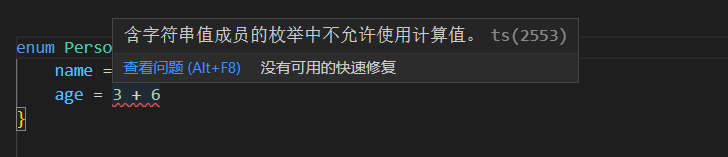

:::warning
注意：当枚举对象中存在有value是字符串的枚举成员的时候，不能将其他枚举成员的value设置为计算值。
:::

**判断是否是枚举成员表达式的方法**当满足以下5个条件中的任一个，那么就是枚举成员表达式：

1. 一个枚举表达式字面量（主要是 字符串或数字 字面量；
2. 一个对之前定义的常量枚举成员的引用
3. 带括号的常量枚举表达式
4. 一元运算符 ++、 --其中任一个应用在了常量枚举表达式
5. 常量枚举表达式是二元运算符 + 、-、*、/、%、<<、>>、&、｜、^的操作对象
:::warning
注意： 如果求值后值为NaN或Infinity，那么会在编译阶段报错！
:::

```typescript
// 常量例子
enum Obj{
  index, //枚举表达式字面量
  index1 = index, //引用常量枚举成员
  age = 2 << 1, //枚举表达式字面量参与二元运算符
  num = 30 | 2,
  num1 = 10 + 29
}

// 计算值例子
enum Obj2 {
  nameLen = 'aaa'.length, //不满足上面任何条件，那么是计算值
  num = Math.random() * 100
}

```

#### 提取枚举值的key或value变为字面量类型 
```jsx
// 假设我一个枚举
enum ENUM_TYPE {
  ALL = 'all',
  SOME = 'some',
  LITTLE = 'little'
}

// 获取枚举的 value
type IValue = `${ENUM_TYPE}`  // 'all' | 'some' | 'little'

// 获取枚举的 key
type IKey = keyof typeof ENUM_TYPE  // 'ALL' | 'SOME' | 'LITTLE'
```

要把一个对象的所有键、值组合成一个联合类型，需要三步骤：

- 定义一个只读对象
- 使用 keyof typeof 得到对象的所有键类型
- 使用键去得到联合类型

```jsx
// 👇️ const obj: {readonly name: "Tom"; readonly country: "Chile";}
const obj = {
  name: 'Tom',
  country: 'Chile',
} as const

// 👇️ type UValues = "Tom" | "Chile"
type UValues = typeof obj[keyof typeof obj]

// 👇️ type UKeys = "name" | "country"
type UKeys = keyof typeof obj

```

### 元组类型  
> 元组（tuple）是固定数量的不同类型的元素的组合。

:::info

- 元组与集合的不同之处在于，元组中的元素类型可以是不同的，而且数量固定。
- 元组的好处在于可以把多个元素作为一个单元传递。
- 如果一个方法需要返回多个值，可以把这个值作为元组返回，而不需要创建额外的类来表示。
:::

比如我们有如下一个数组，数组中有姓名、职业和年龄，代码如下：
```typescript
const woman: (string | number)[] = ["pinpang", "teacher", 28];
```
虽然已经添加了代码注解(指定类型)，但是这并不能很好的限制，比如我们把把数组中的位置调换一下，TS依然不会报错。
```typescript
const woman: (string | number)[] = ["pinpang", 28, "teacher"]
```
这时候我们需要一个更强大的类型，来解决这个问题，这就是元组:
```typescript
// 元组和数组类似，但是类型注解时会不一样
const woman: [string, string, number] = ["dajiao", "teacher", 28]

```
这时候我们就把数组中的每个元素类型的位置给固定住了，这就叫做元组。

**元组的使用场景**
:::tips
开发者我们其实不经常使用元组，因为如果要使用元组，完全可以使用对象的形式来代替。）
:::
有一种数据源CSV文件,这种文件提供的就是用逗号隔开的，如果要严谨的编程就需要用到元组了：
```typescript
"dajiao", "teacher", 28;
"liuying", "teacher", 18;
"cuihua", "teacher", 25;

```
如果要接受读取文件后返回的数据，你就可以使用元组了：
```typescript
const csvArr: [string, string, number][] = [
  ["dajiao", "teacher", 28],
  ["liuying", "teacher", 18],
  ["cuihua", "teacher", 25],
]

```

---

### 索引类型 | 签名
> Ts中的可索引类型类似于其他编程语言中的字典（key-value形式），例如 user[10]或user["Tom"]，应该从字典的角度去学习，这样更合理。与使用接口描述函数差不多，我们也可以用接口来定义可索引类型。

:::warning
由于 Object 类型太过不精确，所有在写ts的时候，一般使用 索引签名 或 Record<>泛型来描述一个普通对象。
:::

可索引类型具有一个索引签名，它描述了对象索引的类型，还有相应的索引返回值类型。
```typescript
/*  为什么下面的 Object 可以是数字和字符串？
  	因为会被包装成对象 (如： 调用number方法或字符串方法)
	*/
const num:Object = 123
const str:Object = 'Hello'


interface StringArray {
  [index: number]: string;   
}

let userArray: StringArray;
userArray = ["Bob", "Fred"];

let user: string = userArray[0];

/*  使用Record泛型传入两个类型: 第一个是key的类型，第二个是value的值 */
type A = Record<string, number> 

// A2写法等同于上面的 type A = Record<string, number> 
type A2 = {
  [k: string ]: number
}

/* 注意: 索引类型的key可以为 number string symbol 类型 */

```

```typescript
interface StringArray {
  [index: number]: string //索引签名
}

let fronTend: StringArray;

fronTend = {
  1: "HTML",
  2: "CSS",
  3: "JavaScript"
}

console.log(fronTend['2'],fronTend[1]) // CSS HTML


interface LanguageBirth {
  [name: string]: number
  Java: number
}

const language: LanguageBirth = {
  "Java": 1995,
  "JavaScript": 1996,
  "C": 1972
}

```
:::warning
上面例子里，我们定义了 StringArray 接口，它具有一个索引签名`[index: number]: string`。这个索引签名表示了当用number去索引StringArray时会得到string类型的返回值。
:::

### never 类型
> 声明为 never 类型 表示永远不存在的值。

never 类型可以用来表示会抛出异常或根本不会有返回值的函数表达式或箭头函数表达式的返回值类型；被永不为真的类型保护所约束时的变量也可用 never 来表示。

```typescript
// 返回never的函数必须存在无法达到的终点
 
// 因为必定抛出异常，所以 error 将不会有返回值
function error(message: string): never {
    throw new Error(message);
}
 
// 因为存在死循环，所以 loop 将不会有返回值
function loop(): never {
    while (true) {
    }
}
```
#### never 与 void 的区别 

- void类型只是没有返回值,但本身不会出错
- never 只会抛出异常且没有返回值
```typescript
  //void类型只是没有返回值 但本身不会出错
  function Void():void {
      console.log();
  }

  // 只会抛出异常没有返回值
  function Never():never {
  	throw new Error('aaa')
  }
```

never 类型的一个应用场景：
```typescript
interface A {
    type: "foo"
}
 
interface B {
    type: "bar"
}
type All = A | B ;
function handleValue(val: All) {
    switch (val.type) {
        case 'foo':
            break;
        case 'bar':
            break
        default:
            //兜底逻辑 一般是不会进入这儿如果进来了就是程序异常了
            const exhaustiveCheck:never = val;
            break
    }
}
```
> 比如新来了一个同事, 他新增了一个C接口，我们必须手动找到所有 switch 代码并处理，否则将有可能引入 BUG 。而且这将是一个“隐蔽型”的BUG，如果回归面不够广，很难发现此类BUG ! 那 TS 有没有办法帮助我们在类型检查阶段发现这个问题呢？

```typescript
interface A {
    type: "foo"
}
 
interface B {
    type: "bar"
}
interface C {
    type: "bizz"
}

type All = A | B | C

function handleValue(val: All) {
    switch (val.type) {
        case 'foo':
            break;
        case 'bar':
            break
        default:
            //兜底逻辑 一般是不会进入这儿如果进来了就是程序异常了
            const exhaustiveCheck: never = val
            break
    }
}
```
> 由于任何类型都不能赋值给 never 类型的变量，所以当存在进入 default 分支的可能性时，TS的类型检查会及时帮我们发现这个问题。


### 类型断言
> 在某种情况下我们可能明确知道这个值的类型，但是ts的静态检测不是想要的类型，此时我们可以使用类型断言来断定这个值的类型。

```typescript
const arr = [ 1,'Hello 2023!',true]

// 此时数组下标1 定义虽然是字符串类型，可是缺不能使用length属性
arr[1].length  // 类型'string | number | boolean ' 上不存在属性length

// 使用类型断言解决此问题
(arr[1] as string).length  // 第一种断言方式
<string>arr[1].length // 第二种断言方式，请牢记不要和泛型搞混

```
 ！注意：到目前为止，共写过两次 `<>`语法：

- Array<类型>： 数组泛型
- <类型>value :   类型断言

### unknown
> 定义数据类型的时候，我们可能提前不知道该类型，此时我们可以先设置为 unknown类型，unknown 类型无法调用属性和方法，这时我们会搭配类型断言实用。

- unknown 类型的值不能直接赋值给其他变量
- unknown 类型无法直接调用属性和方法，搭配断言；
```typescript
// 对于赋值时 any 特性一致
let value: unknown
value = 1 | '1' | true | [] | {} | Symbol() | null | new Person()

// 反过来 unknown 就只能接受 unknown 和 any 类型
let value1: string = value; // 不能将类型“unknown”分配给类型“string”。
let value2: unknown = value
let value3: any = value

let u: unknown;
u.toFixed() // Error 类型“unknown”上不存在属性“toFixed”

// 类型收窄 (保护) 
if (typeof u === 'object') {
  u.toFixed()
}

// 类型的值不能直接赋值给其他变量

let unknowVal: unknow
unknowVal = 'Hello World!'
let strVal: string =  'str'

strval = unknowVal // TS2322: Type 'unknown' is not assignable to type 'string'. 

```

### 对象类型 | 接口
> 在面向对象语言中，接口** (interfaces)** 是一个非常重要的概念，它是对行为的抽象，接口可以用于对 [ 对象的形状 (Shape) ] 进行描述。

- 在Ts中我们通常使用接口，对对象的类型进行约束，使其遵循规范。
- 接口首字母一般为大写 `**I**`, 在我们日常开发中，接口的使用频率也是最高的。
#### 接口的定义 
```typescript
// 定义一个接口 对对象类型进行约束
interface IPerson  {
  name: string;
  age: number;
}

let tom: IPerson = {
  name: 'Tom',
  age: 18
}

console.log(tom)  // { name: 'Tom', age: 18 }


//  error 定义变量比接口少了会报错
// let joy: IPerson = { name: 'Joy'} 

let joy: IPerson = {
  name: 'Joy',
  age: 26
  // sex: '男'  //  error 定义变量比接口多了也会报错
}


```
#### 可选属性
```typescript
interface IPerson2  {
  name: string;    // 确定属性
  age: number;     // 确定属性
  sex?: string;    // 可选属性 (表示sex为可选属性，在使用时可以不定义sex变量)
}

```
#### 只读属性
:::info
可以在属性名前用 readonly 来指定只读属性。一旦赋值后再也不能被改变了。
:::
```typescript
interface IPerson {
  readonly id: number
  name: string
  age: number
  sex?: string
}

let person2: IPerson = {
  id: 2,
  name: 'tom',
  age: 20
}
person2.id = 2 // error
```
#### 任意属性
> 一个接口允许有任意的属性，开发时一般只添加一个任意属性。需要注意的是，一但定义了任意属性，那么确定属性和可选属性必须是它的子属性 。

```typescript
interface IUserInfo  {
  name: string;
  age: number;
  sex?: string;
  [propName: string]: any; // 任意属性 
}
// 上面的接口中: 确定属性和可选属性只有 string 和 number
// 所以任意属性的类型必须包含string、number这两种类型，否则会报错。

let user: IUserInfo = {
  name: 'linYi',
  age: 22,
  sex: '男',
  action(){
    console.log('Hello World!')
	}
}

// 定义了任意类型后,我们在使用接口时继续添加变量
let user1: IUserInfo = {
  name: 'linYi',
  age: 22,
  sex: '男',
  action(){
    console.log('Hello World!')
  },
  department: '研发部',
  rank: 'p4'
}

user.action() // Hello World!

```
:::warning
`[propName: string]: any` 中的 propName定义的变量名 : string 表示这个变量值(key值)为字符串类型，后面的any表示value值可以为任何类型。
:::
#### 接口继承
> 一个接口可以继承另一个接口或者多个接口。

```typescript
interface Level {
  level: number
}

// 继承单个接口
interface Person extends Level  {
  name: string
  eating: () => void  // 这里不用写 {}
}

interface Animal {
  running: () => void
}

// 继承多个接口
interface Student extends Person, Animal {
  sno: number
}

const stu: Student = {
  sno: 110,
  level: 4,
  name: 'Pan',
  eating: function () {},
  running: function (): void {}
}
```

接口合并- 两个同名的接口将会被合并
```typescript
interface Iuser {
  name: string;
}

interface Iuser  {
  age: number;
  sex: number;
}

let tom: IPerson = {
  name: 'Tom',
  age: 18,
  sex: 1,  // 不写会报错,两个同名的接口会被合并
}
```

---

### type 和 interface 区别？

1. `type` 可以描述所有数据类型 (多种类型用&链接) ， `interface` 只描述对象

```typescript
type A = Array<string> & { sex: number } & User

interface User {
  name: string
  age: number
}

```

2. type 只是个别名，interface 才是类型声明  (具体体现在类型提示上)
3. type 不可重新赋值， (类似于使用const定义常量)，所以缺点就是不可扩展
```typescript
type User = {  name: string, age: number }
type User = { sex: number }   // error 不能重新赋值
```

4. interface 同名会自动合并，且可以可以拓展( extends 继承) 
```typescript
// 接口合并
interface IA  { title: string , state: boolean }
interface IA  { time: string }

// 接口继承
interface IB  extends IA {}

// 比如引入第三方包时拓展某个接口的参数
declare module 'vue' {
    export interface ComponentCustomProperties {
        $filters: Filter
    }
}

// 拓展string方法
declare global {
  interface String{
    padZero( length : number ) :string
  }
}

// 拓展aoios 
import { AxiosRequestConfig } from 'axios'
declare module 'axios' {
    export interface AxiosRequestConfig {
      _autoLoading?: boolean
      _mock?: string
    }
}

```

### 函数
> 在TS中我们定义一个函数，需要定义函数的 输入类型** **和 输出类型** **。

- 输入类型： 定义传入参数的类型
- 输出类型： 函数返回值的类型，如果返回值是数组，应该先定义数组类型。
```typescript
const fn1 = (n1: number, n2: number): number => {
    return n1 + n2
}

const fn2 = (s1:string, s2:string):string[] => {
   return [s1,s2]
}

fn1(45, 99)   // 144
fn2('Hello', 'World') // [ 'Hello', 'World' ]

```
#### 没有返回值的情况
当一个函数只是用来处理逻辑而没有返回值时，我们可以使用 void ，它代表无返回值。
```typescript
const submit = (formDate:string[]):void => {
    if (formDate) {  // Do something }
}
```
#### 可选传入参数和默认值

- 可选参数  参数名?: 参数类型
```typescript
const telForMat = (phone: number | string, type?: boolean): string => {
    let num: string = String(phone)
    if (type) {
        return ` ${num.substring(0,1)}****${num.substring(10)}`
    } else {
        return `${num.substring(0,3)}****${num.substring(7)}` 
    }
}

telForMat(13246566476)   // 132****6476
telForMat('13246566476',true)  //  1****6

```

- 默认值  参数名: 参数类型  = 默认值
```typescript
const fn1 = (n1: number = 0, n2: number): number => {
    return n1 + n2
}
fn1(12)  // 12
```

#### TS中的 arguments 
```typescript
// function 写法
function getArr(...args:any) {
   // arguments 就是所有传入参数的集合
   console.log(arguments)  // [Arguments] {'0': 4, '1': 5, '2': 6}
  
   // 报错 类数组arguments没有以下属性: pop,push,concat,join及..
   // let arr: number[] = arguments  // 说明 arguments 是一个类数组

   // 使用TS提供的关键字 IArguments 接口
   let arr: IArguments = arguments
}

getArr(4,5,6) 

```

#### 函数重载
:::info
函数重载的出现是多个方法名相同，而传入参数类型不同，返回的类型可以相同也可以不相同。如果参数类型不同，则操作函数参数类型应该设置为any。当然参数不同时你可以将不同的参数设置为可选。
:::
##### 参数不同的函数重载
```typescript
function print(info: string): void;
// 如果传入两个string类型的参数，都需要打印下来，我们的函数声明可以是这样：
function print(info: string, message: string): void;

// 在更宽泛的范围，我们用可选参数来实现重载
function print(info: string, message ?: string) {
    let printValue: string = info;
    if(message){
        printValue += message;
    }
    console.log(printValue)
}


```
##### 参数个数相同，类型不同
```typescript
// function print(info: string): void;
// function print(num: number): void;

// 可以使用联合类型重载
function print(message: string | number) {
    console.log(message)
}

```
##### 参数类型顺序不同
```typescript
function disp(n1:number,s1:string):void;
function disp(s:string,n:number):void;
```

##### 参数类型与参数数量不同
```typescript
function disp(s1:string):void; 
function disp(n1:number,s1:string):void; 
 
function disp(x:any,y?:any):void { 
    console.log(x); 
    console.log(y); 
} 
disp("abc") 
disp(1,"xyz");

```

---

### 泛型
> 泛型 (Generics) ,指的是在定义函数、接口、类的时候，不预先指定具体类型，而是在使用的时候再指定具体的类型。

#### 函数泛型
举个例子：封装一个函数，传入两个参数，把这两个参数组成一个数组并且返回：
```typescript
const fn2 = (s1:string, s2:string):string[] => {
   return [s1,s2]
}
```
上面代码虽然实现了，但是不适用于其他类型，比如string、boolean等类型，我们想到的可能是使用 `**any**`
```typescript
const fn2 = (s1:any, s2:any):any[] => {
   return [s1,s2]
}
```
:::warning
虽然any可以解决问题，但是定义为any的时候，我们其实已经丢失了类型信息，比如我们传入的是一个number，那么我们希望返回的可不是any类型，而是number类型。
:::
所以，我们需要在函数中可以捕获到参数的类型是number，并且同时使用它来作为返回值的类型，我们需要在这里使用一种特性的变量 - 类型变量（type variable），它作用于类型，而不是值：
```typescript
// function 写法
function fn5<Type>(s1:Type, s2:Type):Type[] {
   return [s1,s2]
}

// 箭头函数写法
const fn5 = <Type>(s1:Type, s2:Type): Type[] => {
    return [s1,s2]
}

```
我们可以使用两种方式来调用它：

1. 通过 `<类型>` 的方式将类型传递给函数；
2. 通过 类型推导 ( type argument inference) 自动推导出我们传入变量的类型
```typescript
fn5<string>('Hello','2022 !')
fn5<number>(12,20)

// 在这里会推导出它们是字面量类型的，因为字面量类型对于我们的函数也是适用的。
fn5('Hello','2022 !')
fn5(12,20)
```

:::warning
从上面的例子一中我们可以看到，泛型的语法为函数名字后面跟一个<参数名> 参数名可以随便写，例如上面写了Type，我们可以把 Type当中一个占位符，它表示的是类型变量，当我们调用函数的时候把参数的对应的类型传进去就可以了 （也就是动态类型）。
:::

#### 传入多个类型
**如果有多个类型怎么写呢？**我们也可以使用不同的泛型参数名，只要在数量上和使用方式上能对应上就可以。
```typescript
function Sub<T,U>(a:T,b:U):Array<T | U> {
    const params:Array<T|U> = [a,b]
    return params
}
 
Sub<Boolean,number>(false,1)

const fn8 = <T,E>(a1:T, a2:E): object => {
    return {a1,a2}
}

function foo<T, E>(al: T, a2: E) { }
```

**常见泛型**
:::info
平时在开发中我们可能会看到一些常用的名称：T：Type 的缩写，类型K、V：key和value的缩写，键值对E：Element的缩写，元素O：Object的缩写，对象
:::

#### 泛型默认类型
> 使用泛型时也可以给其指定默认类型，当调用时没有指定类型就会使用默认类型。

```typescript
function identity<T = string, U = number>(value: T, message: U): T {
  console.log(message);
  return value;
}
identity('', 2);
```

#### 泛型类型别名
> 使用 type 的方式进行泛型声明


```typescript
// 泛型函数类型的两种定义方式,两者等价
type enType<T, U> = (value: T, message: U) => T
type enType1<T, U> = { (value: T, message: U): T }

// 使用泛型
let identity: enType1<string, number> =  (value, message) => {
  return value;
}

// 对象泛型的声明方式
type userType<T> = { name: T; age: number }

// 使用泛型
let user: userType<string> = { name: 'zhangsan', age: 24 }
```

#### 泛型接口
声明接口的时候，在名字后面加一个<参数>，使用的时候传递类型。
```typescript
interface MyInter<T> {
   (arg: T): T
}
 
function fn<T>(arg: T): T {
   return arg
}
 
let result: MyInter<number> = fn
 
result(123)

```
使用上一般会有两种情况，一种是接口使用泛型，一级一级的向下传递类型；第二种则是单独给某个属性定义泛型。只有调用该属性时才去指定类型。
```typescript
// 第一种方式 (推荐) 
interface IUser<T, U> {
  name: T;
  eat(food: U): U;
}

const user: IUser<string, string> = {
  name: 'zhangsan',
  eat(value) {
    return value;
  }
};
console.log(user.eat('xxx'));

// 第二种方式 注意：在内部使用泛型 仅限于方法。
interface IPerson {
  name: string;
  eat: <T>(food: T) => T;
}
const person: IPerson = {
  name: 'zhangsan',
  eat(value) {
    // 此时会碰到问题，value失去了类型提示。但是又不能指定类型
    return value;
  }
};
console.log(person.eat<number>(1314))
```

上面的使用泛型描述了对象，下面我们用接口来描述函数：
```typescript
// 第一种方式
interface IPerson {
  <T>(name: T): T
}

// 此时会碰到问题，鼠标移入value 失去了类型提示。但是又不能指定类型
const person: IPerson = (value) => value
person<string>('zhangsan')

// 第二种方式 推荐
interface IUser<T> {
  (name: T): T;
}
const user: IUser<string> = (value) => value
user('zhangsan')
```
#### 
#### 泛型继承
```typescript
interface MyInter{
  length: number;
}

function test<T extends MyInter>(arg: T): number{
  return arg.length;
}


interface Inter{
  label: number
}

function f3<T extends Inter>(a:T):number {
  return a.label
}

f3({label:6})
```

#### 泛型类
声明方法跟函数类似名称后面定义<类型>, 使用的时候确定类型new Submit<类型>()
```typescript
class Submit<T>{
   // 定义一个数组
   list: T[] = []; 
   // 定义一个方法
   add (a:T):T[] {  
      return [a]
   }
}
 
let s = new Submit<number>()
s.list = [10001,20002,30003]
s.add(2023)
 
let str = new Submit<string>()
str.list = ['Aplple','Banana','Grape']
str.add('Hello 2023 !')
```
### 泛型类类型
当我们使用接口去描述一个类的时候，可能会出现下面问题：
```typescript
interface IConstructor {
  new (): void
}

class User {
  public name!: string
  public age!: number
}

function createInstanceFactory(instance: IConstructor) {
  return new instance()
}

// 把鼠标放到 instance 上面发现是 void 类型 ，很明显不合理
const instance = createInstanceFactory(User)
```
通过泛型可以使这个工厂函数更加完美:
```typescript

// 注意： 当在函数参数中书写类类型的时候需要 { new (): T } 写法
function createInstanceFactory<T>(instance: { new (): T }): T {
  return new instance()
}

// 此时我们的 instance 就是一个有类型的实例了
const instance = createInstanceFactory<User>(User)

```
### 泛型约束 ✨
> 有时候我们需要操作泛型参数，但事实上参数的类型只有在调用的时候才会传入。这也就造成了我们在传入之前操作会出现一些错误。


比如我们想定义了一个返回length属性的方法, 但是，有的数据类型是没有length属性的 :
```typescript
function getLength<T>(arg: T): T {
  return arg.length  // error!
}
```
编辑器会提升报错，类型“T”上不存在属性“length”。


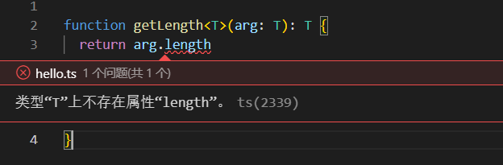


这个时候我们需要使用泛型对这个方法进行约束, 让其具有length属性的类型，代码如下：
```typescript
interface Len{
  length: number
}

function getLength<T extends Len>(arg: T) {
 return arg.length
}

getLength('3123123')
getLength(['Hello','2023'])
 
```
如果需要约束多个条件 `<T extends Type1, Type2, ...> `
> 注意： 这里再次出现 extends 关键字，此处表示泛型必须包含某种类型，从而在调用时约束了传入的类型。


### typeof ｜ 类型推导

> 在ts中，typeof 不仅可以用来判断类型，也可以推导出类型。
> 

`keyof` 操作符用于获取对象所有属性键的字面量组合而成的联合类型，其类似于 JavaScript 中的 `Object.keys()`，它们的共同点都是获取属性键的集合，只不过 `keyof T` 得到的结果是一个联合类型，而 `Object.keys()` 得到的是一个数组

```typescript
class User {}
const obj = { name: 'zhangsan', age: 24 }

// type strType = typeof '' //  注意不要想着简写,这是个错误语法

type UserType = typeof User   // 构造函数类型
type objType = typeof obj    // { name: string, age: number }
type strType = typeof obj.name    // string 

```
### keyof ｜ 索引类型查询操作符

> keyof 操作符会迭代被操作对象，取出其中的 key 作为字面量联合类型。查找的方式会进入原型，但是被 static protected private 修饰的属性或者方法不会被查找。

```typescript
class Person {
  name!: string
  protected age!: number
  private smoking!: string
  static sex: string
  eat() {}
}

type UserT = keyof Person  // 'name' | 'eat'
type objT =  keyof { name: string; age: number }; // 'name' | 'age'
type strT =  keyof string; // 'toString' | 'charAt' | ...
type numT =  keyof number; // 'toString' | 'toFixed' | ...
type boolT = keyof boolean; // 'valueOf'

```

比如我们想定义了一个通过传入key获取对象value的方法:
```typescript
// 定义一个方法，获取对象的value
function prop<T>(obj: T, key:any) {
  return obj[key]
}

let userInfo = { name: 'liaoyi', age: 22, sex: 1 , job: 'Web Development' }

prop(userInfo, 'name')  // liaoyi
prop(userInfo, 'job')   // Web Development
prop(userInfo, 'phone') // undefined

```
上例中，userInfo对象中没有定义phone，所以我们传入一个不存在的key时，代码不会报错，为了避免这种情况发生，ts提供了 keyof ，我们可以**使用 keyof 约束对象**：
```typescript
// K extends keyof T : 使用keyof分割T (T就是我们传入的对象)
function prop<T,K extends keyof T>(obj: T, key:K) {
  return obj[key]
}

let userInfo = { name: 'liaoyi', age: 22, sex: 1 , job: 'Web Development' }

prop(userInfo, 'name')  // liaoyi
prop(userInfo, 'job')   // Web Development

prop(userInfo, 'phone') // 此时编写的时候就会报错发现找不到
```
:::warning
上例代码中：使用了TS泛型和泛型约束。首先定义了T类型并使用extends关键字继承object类型的子类型，然后使用keyof操作符获取T类型的所有键，它的返回类型是联合类型，最后利用extends关键字约束K类型必须为keyof T联合类型的子类型。
:::

- `K extends keyof T` :  使用keyof分割 T (T就是我们传入的对象)，它会分割所有key值
- 分割完成之后，K 就会变成联合类型：

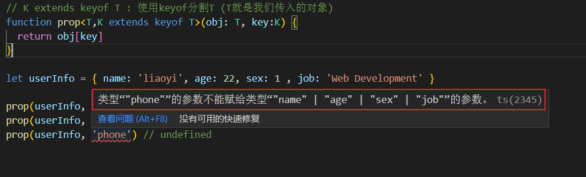

###  in ｜ 映射类型

> 用于遍历已经定义好的类型，从而得到需要的新类型。

`in` 操作符右侧跟随一个联合类型，表示逐一遍历该联合类型的所有字面量，类似于 JavaScript 中的 `for...in`，通常结合 `keyof` 用于创建索引签名的映射类型。

如下面代码： 如果我们想把 User 变成可以变成可选类型，重写一次显然不合适：
```typescript
interface User {
  name: string
  age: number
}
```
此时可以使用 `in` 操作符来将 User 变成可选类型:
```typescript
// 此处可以按照 for...in 遍历
type UserReadonly<T> = {
  [P in keyof T]?: T[P]   // 变为可选
  // readonly [P in keyof T]: T[P]  // 变为只读属性
}

let p1: UserReadonly<User> = {
    name: 'liaoyi'
}
```

根据 `keyof` 和 `in` 的特点，我们可以撰写一些辅助工具，这里用 `MReadonly` 举 🌰
```typescript
type MReadonly<T> = {
  readonly [P in keyof T]: T[P]
}
type Person = {
  name: string
  age: number
}

type result = MReadonly<Person>
// { readonly name: string; readonly age: number; }
```

`[P in keyof T]` 表示遍历 T 中的每一个属性键，每次遍历时属性键取名为 `P`，这和 JavaScript 中的 `for in` 非常类似
```typescript
// TypeScript 中的迭代
P in keyof T

// JavaScript 中的迭代
for (let key in obj)
```

### extends 中的有条件类型

`extends` 关键词一般有两种用法：**条件类型**和**类型约束**

#### 条件类型

**条件类型**类似于 JavaScript 中的三元表达式

```typescript
type IsBoolean<T> = T extends boolean ? true : false
type IsArray<T> = T extends { length: number } ? true : false

type Res1 = IsBoolean<string>   // false
type Res2 = IsBoolean<true>     // true
type Res3 = IsBoolean<true>     // false
type Res4 = IsArray<[1, 2]>     // true
```

我们先来思考一个问题，`T extends U ? X : Y` 从语法的格式来看，能不能按照三元表达式来理解呢？答案是肯定可以的。
```typescript
type typeName<T> = T extends string ? 'string' : T extends number ? 'number' : never

type T0 = typeName<string> // string
type T1 = typeName<null>   // never

// 分布式条件类型
/* 'string' | 'number' 内部类似于迭代了这个联合类型逐个解析最终变成联合类型。 */
type T2 = typeName<string | number> 

let str3:T2 = 'number' // 这里只能是字符串 "string" 或 字符串 "number"

```
我们尝试去比较两个联合类型：
```typescript
type typeName<T, U> = T extends U ? T : never;

type unioType = typeName<'a' | 'b' | 'd', 'a' | 'b' | 'c'>  // 'a' | 'b'

/** 为什么是 'a' | 'b' 联合类型 ?
   - 表达式 T 存在于 U 返回 T
   - 把 T 进行迭代 'a' 和 'b' 分别存在于 U ,直接返回 d 不存在也就不处理了
*/
```
再比如我们想要获取一个接口类型中的函数名，属性名？
```typescript
interface IUser {
  name: string
  age: number
  eat(): void
}

type FnPropertys<T> = {
  [K in keyof T]: T[K] extends Function ? K : never
}[keyof T]

type T0 = FnPropertys<IUser> // 'eat' 字面量类型

/* 如何理解得到的是 'eat' ?

	{ [K in keyof T]: T[K] extends Function ? K : never } 这是一个对象
 
  [K in keyof T]:  K 必须是 name age eat 之一

  T[K] extends Function ? K : never 取值必须是 Function 类型
  
	// 经过运算得到一下类型。
  type T0 = { name: never; age: never; eat: 'eat' }

	// 第四步解析  索引取值
	type T1 = T0[keyof T0]  // 'eat' 字面量类型
*/
```
#### 分布式条件类型
在条件类型中有一个特别需要注意的东西就是：**分布式条件类型**（对联合类型应用 extends 时，会遍历联合类型成员并一一应用该条件类型）
```typescript
// 内置工具：交集
type Extract<T, U> = T extends U ? T : never
type type1 = 'name' | 'age'
type type2 = 'name' | 'address' | 'sex'

type test = Extract<type1, type2>
// 结果为 'name'
```
**代码详解**：

- T extends U ? T : never：因为 T 是一个联合类型，所以这里适用于分布式条件类型的概念。根据其概念，在实际的过程中会把 T 类型中的每一个子类型进行迭代
```typescript
'name' | 'age' extends 'name' | 'address' | 'sex' ? T : never
// 第一次迭代得到 'name'
'name' extends 'name' | 'address' | 'sex' ? 'name' : never
// 第二次迭代得到 never
'age' extends 'name' | 'address' | 'sex' : never
```

- 在迭代完成之后，会把每次迭代的结果组合成一个新的联合类型（根据 `never` 类型的特点，最后的结果会剔除掉 `never`）
```typescript
type result = 'name' | never
// 实际为 type result = 'name'
```

### infer ｜ 推断类型

> 有条件类型中允许出现 `infer` 推断类型。它会引入一个待推断的变量，这个推断类型可以在有条件类型中的 true 分支中被引用，允许出现多个同类型变量的 `infer`。


以 `ReturnType<T>` 为例来获取函数返回类型
```typescript
type ReturnType<T> = T extends (...args: any) => infer R ? R : any

const add = (a: number, b: number): number => a + b

type Result = ReturnType<typeof add>
// Result: number
```

- 声明泛型变量 `T` 表示一个函数类型
- 声明占位变量 `R`，此时并不确定函数具体返回类型
- 若 `T` 类型为函数类型，则根据函数类型上下文推导出 `R` 具体类型并返回，否则则返回 any 类型
- 在上述例子中，`add` 即为返回 `number` 类型的函数，由此推断出 `R` 为 `number`

假设我们要获取一个函数的参数类型, 可以这样做:
```typescript
type Ptype<T> = T extends (arg: infer P) => void ? P : never
type Ft = Ptype<(arg: string) => void>   // string

// 如果要获取返回值类型
type Rtype<T> = T extends (...arg: any[]) => infer R ? R : 'Hello 2023!'
type Fd = Rtype<12> // 'Hello 2023!'
```
当 infer 被放到 **协变 **的位置上，同一个变量上存在多个类型会被推断为联合类型:
```typescript
type CovariantType<T> = T extends { a: infer K; b: infer K } ? K : never
type T0 = CovariantType<{ a: string; b: number }>; // string | number
```
> 协变： TS 类型兼容的一个话题名词，还有 逆变，双向协变，不变 。
> 参考链接： [快速理解 ts 的逆变、协变、双向协变、不变](https://zhuanlan.zhihu.com/p/500762226)


### 类型保护 (收窄) 🔥
> 类型收窄就是区分TS类型, 在静态类型检查的过程中，收窄变量的类型，达到预期的目标。

- JavaScript 方法 typeof 、instanceof、isArray
- TypeScript 方法 in 、is 、x.kind、使用断言

#### typeof 类型保护
```typescript
// 使用 typeof 区分类型
// 把类型确定为 string 或者 number 方便后续操作
const fn1 = (a: number | string) => {
  if (typeof a === 'number') {
    a.toFixed(2)
  } else if (typeof a === 'string') {
    parseFloat(a).toFixed(2)
  } else {
    throw new Error('Never do this')
  }
}
fn1('88.88')
```
具体体现编写代码的时候会有类型提示:

当我们使用了  if(typeof a === 'number') {} 时,ts帮我们推断出来了a的类型为 number:

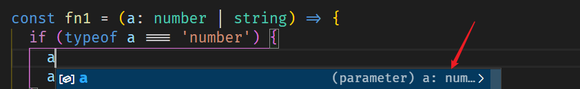


并且只能调用 number 相关方法:


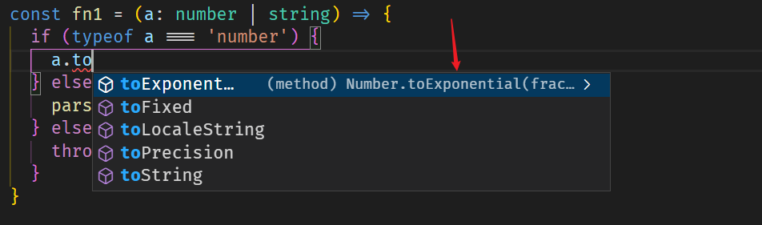

> typeof  的缺点是只能判断下面几种类型, 因为null 、数组对象、普通对象、日期对象返回的都是object ,无法做到更细致的区分。

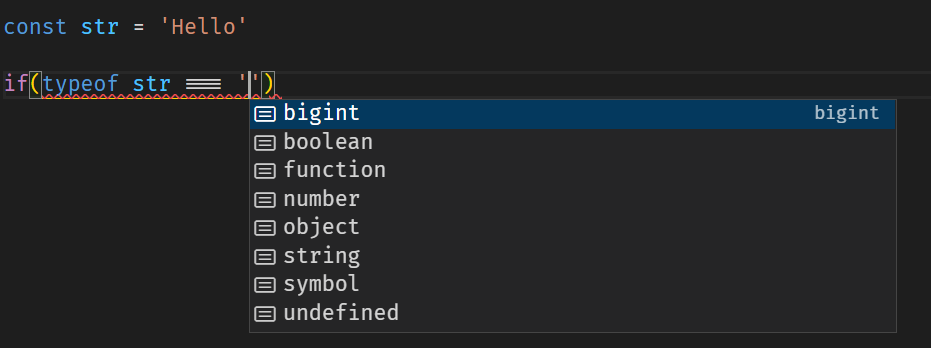


#### instanceof 类型保护

```typescript
const fn2 = (a: Date[] | Date) => {
  if (a instanceof Date) {
    a.toISOString()
  } else if (a instanceof Array) {
    a[0].toISOString()
  } else {
    throw new Error('Never do this')
  }
}

fn2(new Date())
```
> instanceof 的局限性，不支持string、number、boolean 等基本类型的判断，更不支持TS独有的类型。

比如下面代码，我们无法使用typeof 和 instanceof 来区分其类型：
```typescript
type Person = { name: string , age : number }
type Animal = { info: string }

const fn3 = (a:Person | Animal ) => {
  // if(type of Person)      // error
  // if(a instanceof Array)  //error type不能用作value
}
```
#### in 类型保护

- 判断一个值或者key是否存在于另一个变量中，只适用于部分普通对象。
```typescript
type Person = { name: string , age : number }
type Animal = { info: string }

const fn3 = (a: Person | Person[] | Animal) => {
  if ('name' in a) {
    a //Person
  } else if ('info' in a) {
    a   // Animal
  }else{
    a // Person[]
  }
}

const arr = [1,'Hello world',false]

if(1 in arr){
  console.log('success')
}
  
```
#### 使用 js 中判断类型的函数来区分
```typescript
const fn3 = (a: string | string[]) => {
  if (Array.isArray(a)) {
    a.join('\n').toString()
  } else if (typeof a === 'string') {
    parseFloat(a).toFixed(2)
  } else {
    throw new Error('Never do this')
  }
}
```

其实 typescript 在能进行逻辑收窄的情况下一直在尽力帮我们去实现：


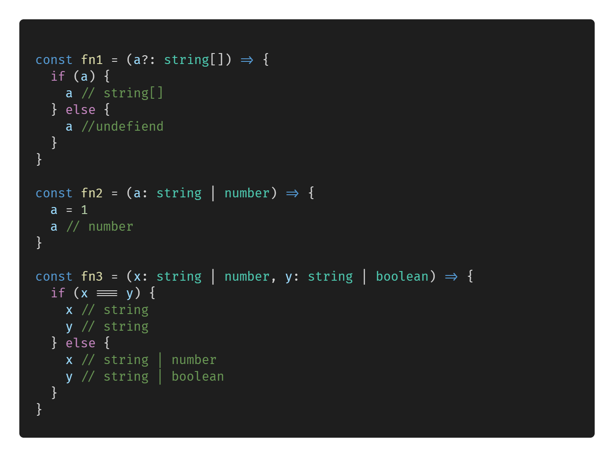


上面的几种方法中，我们一直在使用 JavaScript 的逻辑判断的!

#### 自定义保护类型 is 
> 特定的格式，需要体现在函数的返回值中。注意`is` 前面的参数必须来源于函数的参数

```typescript
type Rect = { height: number; width: number }
type Circle = { center: [number, number]; redius: number }

const whatShape = (a: Rect | Circle) => {
  if (isRect(a)) {  // 判断 a 是不是Rect类型
    a // Rect
  } else {
    a // Circle
  }
}

/* 注意这里必须使用function方式定义  */
// 这里的 a is Rect 意思是( a 是不是 Rect类型 ) 
function isRect(a: Rect | Circle): a is Rect {
  // 如果有高和宽，就是 Rect 类型
  return 'height' in a && 'width' in a
}

function isCircle(a: Rect | Circle): a is Circle {
  return 'center' in a && 'redius' in a && a.center instanceof Array
  // Array.isArray(a.center)
}

```
####  可辨别联合 x.kind
> 添加一个同名、可辨别、简单类型的 key 用于类型区分。

```typescript
type Circle = { kind: 'circle'; center: [number, number] }
type Square = { kind: 'square'; sideLength: number }
type Shape = Circle | Square | string | number

const whatShape = (a: Shape) => {
  if (typeof a === 'string') {
    a // string
  } else if (typeof a === 'number') {
    a // number
  } else if (a.kind === 'circle') {
    a // Circle
  } else {
    a // Square
  }
}

whatShape({ kind: 'circle', center: [20, 20] })
```

### TS 内置工具类型🔥
#### Record
> 将对象所有属性的值转换为T(需要的类型)，用 `Record<K extends keyof any,T>`

```typescript
/**
 * Construct a type with a set of properties K of type T
 * 构造一个具有一组 T 类型的属性 K 的类型
 */
type Record<K extends keyof any, T> = {
  [P in K]: T
}

/* keyof any 这里比较容易引起误解，他的返回类型是三种类型之一。  */
```

```typescript
type Property = 'user1' | 'user2'

//  使用Record 构造一个 key 为 string | number | symbol 类型，value 为指定类型的对象
type User = Record<Property, string>

const a1: User = {
  user1: 'liaoyi',
  user2: 'wangwu'
}


```

#### Readonly
> Readonly 把数组或者对象属性设置为只读。

```typescript
/**
 * Make all properties in T readonly
 * 将 T 中的所有属性设为只读
 */
type Readonly<T> = {
  readonly [P in keyof T]: T[P]
}
```
示例：
```typescript
interface Person {
  name: string
  age: number
  gender?: 'male' | 'female'
}


const a2: Readonly<Person> = {
  name: 'liaoyi',
  age: 22,
  gender: 'female'
}

// a2.age = 'lilei'  // error 无法为 age 赋值，因为它是只读属性。
```
:::warning
Readonly 是一个工具类型，也可以使用断言来代替它的工作 as const 表示该变量为一个只读变量。
:::
```typescript
const user = { name: 'liaoyi', age: 22 } as const // 只读对象
const users = ["ly", 'zs'] as const; // readonly ["ly", "zs"]
const name = '2023' as const  // 对于值类型而言这个变量的类型就是这个值

/* const 断言只能用于引用枚举成员、字符串、数字、布尔值、数组或对象文本  */
let n = null as const  // Error 
```

#### Required 
> Required 将类型的所有属性变为必选

```typescript
/**
 * Make all properties in T required
 * 使 T 中的所有属性成为必需
 */
type Required<T> = {
  [P in keyof T]-?: T[P]
}

/* -? 表示移除可选属性  */
```
示例：
```typescript
// 我们定义了一个参数都是可选的接口
interface Animals {
  name?: string
  age?: number
  habit?: string[]
}


// 使用 Required 变为必选
const pig: Required<Animals> = {
  name: 'pig',
  age: 5,
  habit: ['eat', 'sleep']
}
```

#### Partial
> 将所有属性转换为可选属性

```typescript
/**
 * Make all properties in T optional
 * 将 T 中的所有属性设为可选
 */
type Partial<T> = {
  [P in keyof T]?: T[P]
}

/* 
	通过 keyof T 获取 T 的字面量联合类型
  通过 in 遍历这个类型让 P 变成 T 的 key
  通过 T[P] 取出原来 T 中的 value
  ?: 表示可选属性
*/
```
示例： 
```typescript
interface Power {
  department: string
  leader: string
  pageList: string[]
}
//  直接这么写会报错: 缺少类型'Power'中的以下属性: leader, pageList
// const u: Power ={ department: 'Web' }

const u: Partial<Power> = {
  department: 'Web'
}
```

#### Extract
> 从一个联合类型中提取某一些类型，刚好合 Exclude 相反，用 `Extract<T,U>,`表示从T中提取 U

```typescript
/**
 * Extract from T those types that are assignable to U
 * 从 T 中提取可分配给 U 的那些类型
 */
type Extract<T, U> = T extends U ? T : never;

```
使用：
```typescript
type U = Extract<string | number | (() => void) | boolean, Function>

const fn: U = () => {
  console.log('xxxxx')
}

```

#### Exclude
> Exclude用于移除类型中的某些类型, `Exclude<T,U>`,表示从T中移除U

```typescript
/**
 * Exclude from T those types that are assignable to U
 * 从 T 中排除那些可分配给 U 的类型
 */
type Exclude<T, U> = T extends U ? never : T

```
使用：
```typescript
type F1 = string | number | Function
type U1 = Exclude<string | number | (() => void) | boolean, F1> // boolean
const flag: U1 = false
```

#### Pick 
> Pick 从一个对象中取出一些属性构造一个新的对象

```typescript
/**
 * From T, pick a set of properties whose keys are in the union K
 * 从 T 中选择一组属性，其键在并集 K 中
 */
type Pick<T, K extends keyof T> = {
  [P in K]: T[P]
}

```
使用：
```typescript
type User1 = {
  name: string
  age: number
  sex: number
}
type MyPick = Pick<User1, 'name' | 'age'>


const p: MyPick = {
  name: 'zhangsan',
  age: 23
}
```

#### Omit
> Omit 可以从类型中移除一些属性，刚好与 Pick 相反，`Omit<T,K>`, 从T中取出除去K的其他所有属性

```typescript
/**
 * Construct a type with the properties of T except for those in type K.
 * 构造一个具有 T 的属性的类型，除了类型 K 中的那些。
 */
type Omit<T, K extends keyof any> = Pick<T, Exclude<keyof T, K>>

```
示例：
```typescript
type myOmit = Omit<User1, 'name' | 'sex'>

const p2: myOmit = {
  age: 19
}


interface IUser {
  name: string;
  age: number;
  sex: string;
}

// 1，先计算 Exlcude 的返回类型
type ExcludeType = Exclude<keyof IUser, 'name'>; // 'sex' | 'age'
// 2，再计算 Pick 的返回类型
type PickType = Pick<IUser, ExcludeType>; // { sex: string, age: number }

// 3，综合使用验算
type OmitUser = Omit<Iuser, 'name'>; // { sex: string, age: number }
```
#### NonNullable
> NonNullable 用于去除类型中的 null 和 undefined

```typescript
type Un = NonNullable<string[] | undefined | null>
const p3: Un = ['hello', '2023']
```

#### Parameters
> Parameters 用于获取函数中的所有参数，返回一个元组类型

```typescript
type Up = Parameters<(a: number, b: string) => void> // [number,string]
const arr: Up = [12, 'Hello']
```

#### RerurnType
> RerurnType 用于获取函数的返回值类型 


```typescript
type Func = (value: string) => string
const str2: ReturnType<Func> = '666'
```

### 内置对象
> JavaScript 中有很对内置对象，他们可以直接在TS 中当做定义好了的类型。

#### ECMAScript 内置对象

Boolean、 Number、string、RegExp、Date、Error


```typescript
let b:Boolean = new Boolean()

let n: Number = new Number(true)

let s: Stirng = new String('这是字符串')

let d: Date = new Date()
let time: number = d.getTime()

let r: RegExp = /^1/

let e: Error = new Error('error!')

```
#### DOM和BOM内置对象

Document、HTMLElement、Event、Nodelist等


```typescript
let body: HTMLElement = document.body;

let allDiv: NodeList = document.querySelectorAll('div');

//读取div 这种需要类型断言 或者加个判断应为读不到返回null
let div:HTMLElement = document.querySelector('div') as HTMLDivElement

document.addEventListener('click', function (e: MouseEvent) {
    
})

//dom元素的映射表
```


##### DOM元素的映射表
```typescript
interface HTMLElementTagNameMap {
    "a": HTMLAnchorElement;
    "abbr": HTMLElement;
    "address": HTMLElement;
    "applet": HTMLAppletElement;
    "area": HTMLAreaElement;
    "article": HTMLElement;
    "aside": HTMLElement;
    "audio": HTMLAudioElement;
    "b": HTMLElement;
    "base": HTMLBaseElement;
    "bdi": HTMLElement;
    "bdo": HTMLElement;
    "blockquote": HTMLQuoteElement;
    "body": HTMLBodyElement;
    "br": HTMLBRElement;
    "button": HTMLButtonElement;
    "canvas": HTMLCanvasElement;
    "caption": HTMLTableCaptionElement;
    "cite": HTMLElement;
    "code": HTMLElement;
    "col": HTMLTableColElement;
    "colgroup": HTMLTableColElement;
    "data": HTMLDataElement;
    "datalist": HTMLDataListElement;
    "dd": HTMLElement;
    "del": HTMLModElement;
    "details": HTMLDetailsElement;
    "dfn": HTMLElement;
    "dialog": HTMLDialogElement;
    "dir": HTMLDirectoryElement;
    "div": HTMLDivElement;
    "dl": HTMLDListElement;
    "dt": HTMLElement;
    "em": HTMLElement;
    "embed": HTMLEmbedElement;
    "fieldset": HTMLFieldSetElement;
    "figcaption": HTMLElement;
    "figure": HTMLElement;
    "font": HTMLFontElement;
    "footer": HTMLElement;
    "form": HTMLFormElement;
    "frame": HTMLFrameElement;
    "frameset": HTMLFrameSetElement;
    "h1": HTMLHeadingElement;
    "h2": HTMLHeadingElement;
    "h3": HTMLHeadingElement;
    "h4": HTMLHeadingElement;
    "h5": HTMLHeadingElement;
    "h6": HTMLHeadingElement;
    "head": HTMLHeadElement;
    "header": HTMLElement;
    "hgroup": HTMLElement;
    "hr": HTMLHRElement;
    "html": HTMLHtmlElement;
    "i": HTMLElement;
    "iframe": HTMLIFrameElement;
    "img": HTMLImageElement;
    "input": HTMLInputElement;
    "ins": HTMLModElement;
    "kbd": HTMLElement;
    "label": HTMLLabelElement;
    "legend": HTMLLegendElement;
    "li": HTMLLIElement;
    "link": HTMLLinkElement;
    "main": HTMLElement;
    "map": HTMLMapElement;
    "mark": HTMLElement;
    "marquee": HTMLMarqueeElement;
    "menu": HTMLMenuElement;
    "meta": HTMLMetaElement;
    "meter": HTMLMeterElement;
    "nav": HTMLElement;
    "noscript": HTMLElement;
    "object": HTMLObjectElement;
    "ol": HTMLOListElement;
    "optgroup": HTMLOptGroupElement;
    "option": HTMLOptionElement;
    "output": HTMLOutputElement;
    "p": HTMLParagraphElement;
    "param": HTMLParamElement;
    "picture": HTMLPictureElement;
    "pre": HTMLPreElement;
    "progress": HTMLProgressElement;
    "q": HTMLQuoteElement;
    "rp": HTMLElement;
    "rt": HTMLElement;
    "ruby": HTMLElement;
    "s": HTMLElement;
    "samp": HTMLElement;
    "script": HTMLScriptElement;
    "section": HTMLElement;
    "select": HTMLSelectElement;
    "slot": HTMLSlotElement;
    "small": HTMLElement;
    "source": HTMLSourceElement;
    "span": HTMLSpanElement;
    "strong": HTMLElement;
    "style": HTMLStyleElement;
    "sub": HTMLElement;
    "summary": HTMLElement;
    "sup": HTMLElement;
    "table": HTMLTableElement;
    "tbody": HTMLTableSectionElement;
    "td": HTMLTableDataCellElement;
    "template": HTMLTemplateElement;
    "textarea": HTMLTextAreaElement;
    "tfoot": HTMLTableSectionElement;
    "th": HTMLTableHeaderCellElement;
    "thead": HTMLTableSectionElement;
    "time": HTMLTimeElement;
    "title": HTMLTitleElement;
    "tr": HTMLTableRowElement;
    "track": HTMLTrackElement;
    "u": HTMLElement;
    "ul": HTMLUListElement;
    "var": HTMLElement;
    "video": HTMLVideoElement;
    "wbr": HTMLElement;
}
```

#### 定义 Promise
如果我们不指定返回的类型，TS是推断不出来返回的是什么类型的


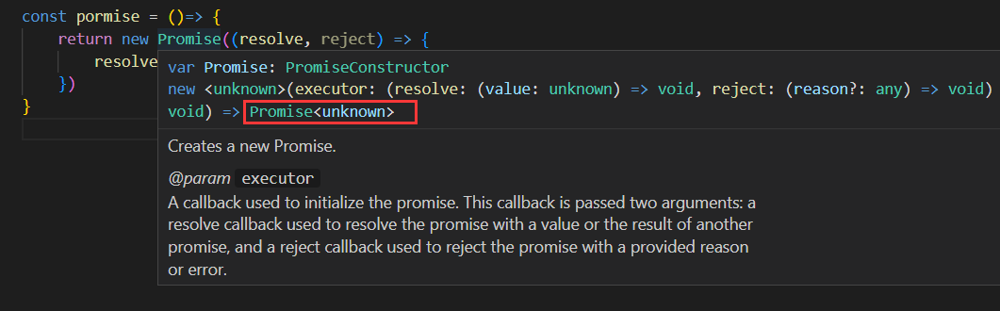


指定返回类型

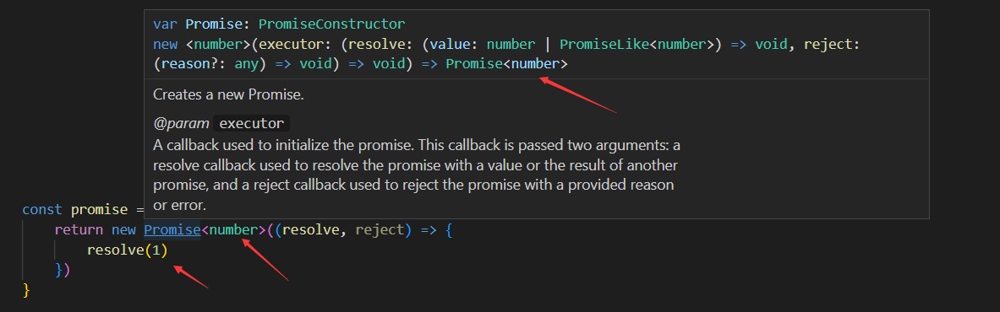

```typescript
// 函数定义返回promise 语法规则：Promise<T>类型

const promise = ():Promise<number> => {
    return new Promise<number>((resolve, reject) => {
        resolve(1)
    })
}

promise().then(res=>{
    console.log(res)
})
```
 
### Class类
在ES6中我们定义一个类
```typescript
// 定义类
Class Person {
    constructor (){ }
 		run(){}
}
// 实例化
new Person() 
```
:::warning
在TS中是不允许直接在constructor定义变量的，需要在constructor上面先声明，在TS中如果定义了变量，不用，也会报错，我们通常是给个默认值或者进行赋值。
:::

```typescript
class Person {
  name: string;
  age: number;
	sub: boolean
  // sub: boolean = false
  
  constructor (name: string , age: number, sub:boolean){
  	this.name = name
    this.age = age
    // 如果定义了变量，不用，会报错
    this.sub = sub
  }
  run (){}
}
```
#### 类的修饰符
:::info
类的修饰符有三个，分别是  public、 private、 protected 。
:::

- `public` ：公共的，如果不写，默认就是public，定义的变量内部外部都可以访问；
- `private`：私有的，私有属性只能在内部和子类中访问，私有方法是不被继承的，也不能override；
- `protected`：受保护的，代表定义的变量私有的，只能在类和其子类中调用（可以被继承），通过this调用，不能在外部访问；
```typescript
class Rect{
  
    public a:number = 1; // public 公有的
    protected b:string = "a"; // protected 受保护的
    private c:boolean = false; // private  私有的

  	protected name: string
 		private age: number
    sub: boolean
    
    // 定义了一个公有的静态属性,静态只读属性 相当于常量
    public static readonly EVENT_ID:string="event_id";
  
    constructor( name: string, age: number, sub: boolean){
      this.name = name
      this.age = age
      this.sub = sub
    }
  
    public play():void {
      console.log(this.a)
      console.log(this.b)
      console.log(this.c)
    }
  
    private move():number {
        return this.a;
    }
    protected moveTo():void{
        console.log("ccc");
    }
}

//实例化的对象只能调用public定义的内容
var rect = new Rect()
rect.play()   // 1 a false
rect.move()		// 报错, 因为move是private定义的
rect.moveTo() // 报错, 因为moveTo是受保护的

//class Circle继承于Rect
class Circle extends Rect{
    constructor(){
        super('liaoyi',22, true)
        this.name  // error！ 私有属性 无法被访问继承
    }
    run():void {
        console.log(this.a)
        console.log(this.b)
        //报错，因为在Rect中定义c属性是私有的，这个c属性只能用于Rect类中
        // console.log(this.c)  // 私有属性在其他类中无法调用
    }
  
  	//报错！ 父类中有该类的私有方法，私有方法是不被继承的，也不能override
    /*private move():number {  return this.a } */
  
    protected moveTo():void{
    	super.moveTo(); // 调用父类的moveTo方法
        // 因为父类中有这个方法，因此在这里我们可以继承，也可以override
        // 如果在子类中定义的方法和父类的方法相同，在TS一概认为是override 覆盖
    }
}

```
:::warning

- 如果在子类中定义的方法和父类的方法相同，在TS中一概认为是override。
- 如果父类中定义了一个私有方法，则在子类中不能再出现该私有方法。
:::
####  static 静态属性和静态方法

- static 定义的属性，不可以通过 this 去访问，只能通过类型调用
- static 静态函数，不能通过this去调用，可以通过类型去调用
:::warning
注意： 如果两个函数都是static 静态的，可以通过this互相调用。
:::

```typescript
class Person {
    public name: string
    private age: number
    protected some: any
    // 定义静态属性
    static nb: string = '123'
    constructor (name: string, ages: number, some: any){
        this.name = name
        this.age = ages
        this.some = some
        // this.run()  // 错误！ 无法访问静态方法
    }
    // 定义静态函数
    static run (){
      console.log(this.nb) // 可以访问静态属性
      // this.age  //错误！ 无法访问，此时的this指向已经改变
      return this.eat()  // 静态方法之间可以通过this互相调用
    }
    static eat(){
        return 'aaaaa'
    }
}

let p = new Person('liaoyi',22, true)
p.nb  // '123'
p.run()  // '123' 'aaaaa'
```
#### 使用 interface 约束类
> 在TS中使用接口定义类，使用关键字 implements 后面跟 interface的名字，多个就用逗号隔开，继承还是用extends。


```typescript
interface PersonClass {
  // 定义一个run函数返回一个布尔值
  get(type: boolean): boolean 
}

interface PersonClass2 {
  set(): void,
  asd: string
}

class A {
  name: string,
  constructor(name: string){
    this.name = '123'
  }
}

// 定义一个 Person 类，继承 A，使用 implements 关联 PersonClass 和 PersonClass2 接口
class Person extends A implements PersonClass, PersonClass2 {
  asd: string
  constructor(){
    super()
    this.asd = '123'
  }
  get(type: boolean){
    return type
  }
  set(){}
}
```
#### 抽象类
:::warning
应用场景:  如果你写的类实例化之后毫无用处，此时我们可以把它定义为抽象类;或者你也可以把他作为一个基类 -> 通过继承一个派生类去实现基类的一些方法。
:::
```typescript
// 下面这段代码会报错，抽象类无法被实例化
abstract class A {
    public name: string
}
new A() // err! 抽象类无法被实例化
```
:::warning
比如我们在A类定义了 getName 抽象方法，但未实现，我们B类实现了A定义的抽象方法，如不实现就不报错，我们定义的抽象方法必须在派生类实现。
:::
```typescript
abstract class A {
    name: string
    constructor (name: string){
        this.name = name
    }
    setName(name:string): string{
        return this.name
    }
    // 这里的抽象方法不能写逻辑
    abstract getName(): string
   
}

// 应为B类继承了A，所以B是一个抽象类
class B extends A {
    constractor(){
        super('liaoyi')
    }
    // 如果不实现 getName 抽象方法会报错
    getName(): string {
        return this.name
    }
}
 
let b = new B()  // B 类虽然继承了A类,但是额可以被实例化

console.log(b.setName('张全蛋'))  // 张全蛋
console.log(b.getName())  // liaoyi
```

### symbol 类型
> Symbol 属于原生类型，可以传递参做为唯一标识 只支持 string 和 number类型的参数。symbol类型的值是通过Symbol构造函数创建的。


```typescript
let sym1 = Symbol();
let sym2 = Symbol("key"); // 可选的字符串key


const s1 = Symbol()
const s2 = Symbol()

// Symbol 的值是惟一的！
// s1 === s2 =>false


// 使用Symbol类型作为用作对象属性的键
let sym = Symbol();
 
let obj = {
    [sym]: "value"
};
 
console.log(obj[sym]); // "value"
```

注意： 使用symbol定义的属性，是不能通过如下方式遍历拿到的：
```typescript
const symbol1 = Symbol('666')
const symbol2 = Symbol('777')
const obj1= {
   [symbol1]: 'liaoyi',
   [symbol2]: 'Hello 2023',
   age: 22,
   sex: '男'
}
// 1 for in 遍历
for (const key in obj1) {
   // 注意在console看key,是不是没有遍历到symbol1
   console.log(key)
}
// 2 Object.keys 遍历
Object.keys(obj1)
console.log(Object.keys(obj1))
// 3 getOwnPropertyNames
console.log(Object.getOwnPropertyNames(obj1))
// 4 JSON.stringfy
console.log(JSON.stringify(obj1))
```

我们可以使用下面方法拿到：
```typescript
// 1 拿到具体的symbol属性,对象中有几个就会拿到几个
Object.getOwnPropertySymbols(obj1)
console.log(Object.getOwnPropertySymbols(obj1))

// 2 es6 的 Reflect 拿到对象的所有属性
Reflect.ownKeys(obj1)
console.log(Reflect.ownKeys(obj1))
```

#### 迭代器和生成器
> 支持遍历大部分类型迭代器 arr nodeList argumetns set map 等

#### 迭代器 Symbol.iterator 
> Symbol.iterator 迭代器定义在我们经常使用的类型里，如arr、nodeList、argumetns、set、map等。

查看迭代器：
- 数组

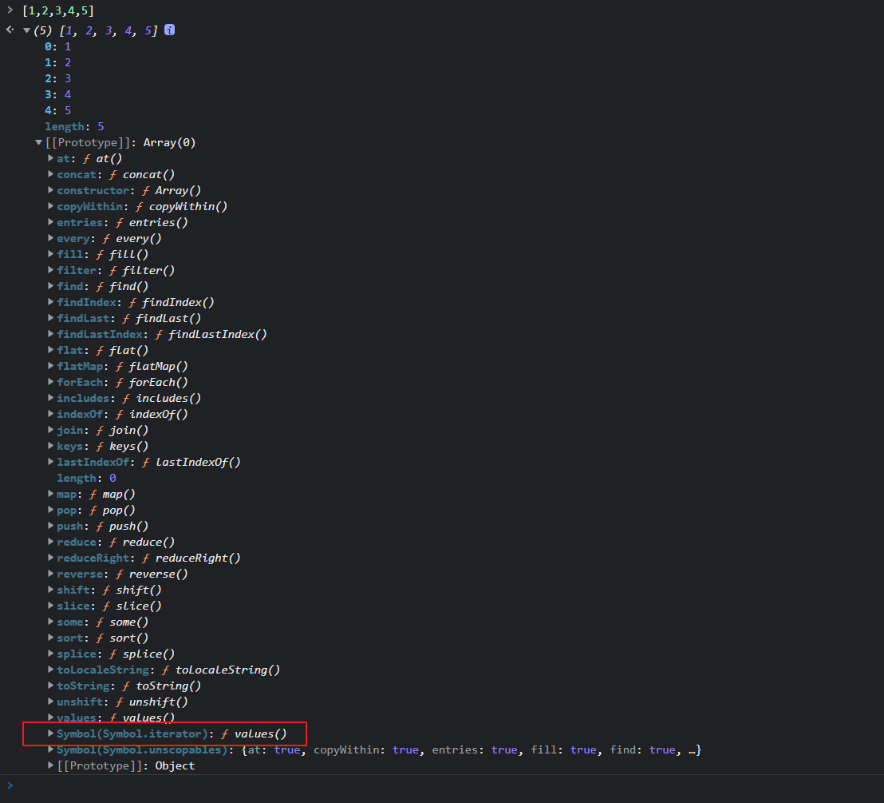

- arguments

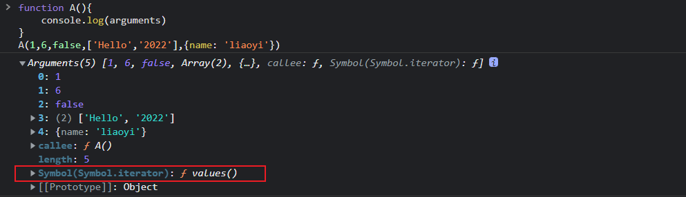

- nodeList

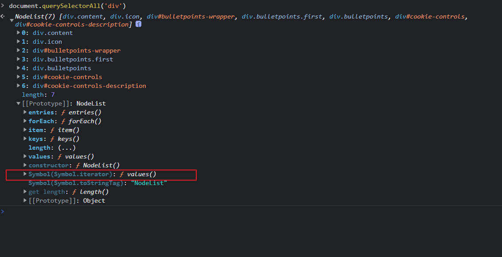

Map 和 Set

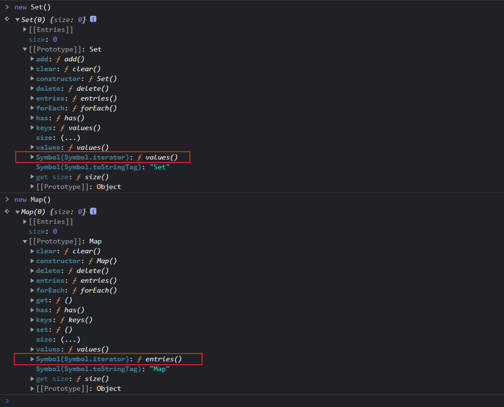

```typescript
let arr: Array<number> = [3, 4, 5, 6]

let it:Iterator<number> = arr[Symbol.iterator]()


// next() 方法从头开始遍历，每次调用会从上一次next()结束位置开始遍历
console.log(it.next());  //{ value: 3, done: false }
console.log(it.next());  //{ value: 4, done: false }
console.log(it.next());  //{ value: 5, done: false }
console.log(it.next());  //{ value: 6, done: false }
console.log(it.next());  //{ value: undefined, done: true }

```
案例：
```typescript
interface Item {
    age: number,
    name: string
}
 
const array: Array<Item> = [{ age: 123, name: "1" }, { age: 123, name: "2" }, { age: 123, name: "3" }]
 
type mapTypes = string | number
const map:Map<mapTypes,mapTypes> = new Map()
 
map.set('1','奥特曼')
map.set('2','张全蛋')
 
const obj = {
    aaa:123,
    bbb:456
}
 
let set:Set<number> = new Set([1,2,3,4,5,6])

// let it:Iterator<Item> = array[Symbol.iterator]()
const gen = (erg:any): void => {
    let it: Iterator<any> = erg[Symbol.iterator]()
    let next:any= { done: false }
    while (!next.done) {
        next =  it.next()
        if (!next.done) {
            console.log(next.value)
        }
    }
}
gen(array)  
gen(map)
gen(set)
gen(obj)  // 错误！ 对象上没有iterator，所以不支持迭代器

```
#### 生成器 for of 
```typescript
interface Item {
    age: number,
    name: string
}
 
const array: Array<Item> = [{ age: 123, name: "1" }, { age: 123, name: "2" }, { age: 123, name: "3" }]
 
type mapTypes = string | number
const map:Map<mapTypes,mapTypes> = new Map()
 
map.set('1','奥特曼')
map.set('2','张全蛋')

 
let set:Set<number> = new Set([1,2,3,4,5,6])

for(let item of set){
  console.log(item)
}

// 1 2 3 4 5 6
```


---

### namespace 命名空间
在JavaScript中，我们为了避免创建的变量不会泄露至全局变量中，会这么写：
```typescript
// Js 没有命名空间的规定，因此我们必须使用 IIFE(立即调用函数表达式)来实现命名空间：

(function(obj){
    obj.age = 18;
})(obj || obj = {})
 
```
TS中提供了namespace 避免这个问题出现：
```typescript
// 使用namespace关键字声明TS命名空间
namespace Shape {
  // 在命名空间内可定义任意变量,仅能在命名空间下可见
    const pi = Math.PI
    // 如果要使命名空间内的变量全局可见,需要使用export关键字导出（暴露）
    export function cricle(r: number){
        return pi * r ** 2
    }
}
 
 
namespace Timer {
     export const Time: number = 1000
     export const fn = <T>(arg: T): T => {
        return arg
    }
    fn(Time)
}

// 命名空间的使用: 直接使用命名空间名称进行访问即可
Timer.Time
Shape.Time
```
#### 嵌套命名空间
```typescript
namespace Utils  {
    export namespace Itools {
      // 命名空间内的类默认私有
        export class Vue {
            parameters: string
            constructor(parameters: string) {
                this.parameters = parameters
            }
        }
    }
}

let v = Utils.Itools.Vue
new v('1')
```
#### 多文件命名空间
utils.ts
```typescript
namespace Utils {
    export interface IAnimal {
        name: string;
        say(): void;
    }
}
```
animal.ts
```typescript
// 使用三斜线指令导入TS文件: /// <reference path="引用文件的相对路径">

/// <reference path="utils.ts" />
 
export namespace Animal {
    export class Dog implements Utils.IAnimal{
        name: string;
        constructor(theName: string) {
            this.name = theName;
        }
        say() {
            console.log(`${this.name}: 汪汪汪`)
        }
    }
}
```
index.ts
```typescript
import { Animal } from './animal';

const he = new Animal.Dog('Jack');
he.say(); // Jack: 汪汪汪
 
```

#### 命名空间的成员别名
```typescript


namespace Shape  {
    export namespace B {
        export const num = 1
    }
}

// 如上,在访问命名空间的成员时,需要加上命名空间的名称,如Shape
// 为了简便,也可以为命名空间成员设置别名,直接访问
import X = Shape.B.num
 
console.log(X);


// 合并命名空间 
namespace A  {
  export const age = 22
}

namespace A  {
  export const name = 'liaoyi'
}

// 重名的命名空间会合并
console.log(A.age,A.name)
```
#### 命名空间实现原理

:::tip
- 命名空间被编译成了一个立即执行函数,函数创建了一个闭包
- 在闭包中的私有成员,就是未导出成员
- 导出成员会被挂载在一个全局变量下
:::

### tsconfig.json 配置文件 ✨

打开文件目录使用终端命令新建一个空的index.ts 文件

```
>  echo '' > index.ts  
# 初始化 tsconfig.json 文件
> tsc -init 
```

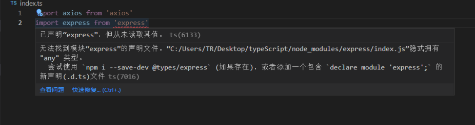


常用配置

| include | 指定编译文件默认是编译当前目录下所有的ts文件 |
| --- | --- |
| exclude | 指定排除的文件 |
| target | 指定编译js 的版本例如es5  es6 |
| allowJS | 是否允许编译js文件 |
| removeComments | 是否在编译过程中删除文件中的注释 |
| rootDir | 编译文件的目录 |
| outDir | 输出的目录 |
| sourceMap | 代码源文件 |
| strict | 严格模式 |
| module | 默认CommonJS  可选es6模式 amd  umd 等 |


配置详解
```typescript
"compilerOptions": {
  "incremental": true, // TS编译器在第一次编译之后会生成一个存储编译信息的文件，第二次编译会在第一次的基础上进行增量编译，可以提高编译的速度
  "tsBuildInfoFile": "./buildFile", // 增量编译文件的存储位置
  "diagnostics": true, // 打印诊断信息 
  "target": "ES5", // 目标语言的版本
  "module": "CommonJS", // 生成代码的模板标准
  "outFile": "./app.js", // 将多个相互依赖的文件生成一个文件，可以用在AMD模块中，即开启时应设置"module": "AMD",
  "lib": ["DOM", "ES2015", "ScriptHost", "ES2019.Array"], // TS需要引用的库，即声明文件，es5 默认引用dom、es5、scripthost,如需要使用es的高级版本特性，通常都需要配置，如es8的数组新特性需要引入"ES2019.Array",
  "allowJS": true, // 允许编译器编译JS，JSX文件
  "checkJs": true, // 允许在JS文件中报错，通常与allowJS一起使用
  "outDir": "./dist", // 指定输出目录
  "rootDir": "./", // 指定输出文件目录(用于输出)，用于控制输出目录结构
  "declaration": true, // 生成声明文件，开启后会自动生成声明文件
  "declarationDir": "./file", // 指定生成声明文件存放目录
  "emitDeclarationOnly": true, // 只生成声明文件，而不会生成js文件
  "sourceMap": true, // 生成目标文件的sourceMap文件
  "inlineSourceMap": true, // 生成目标文件的inline SourceMap，inline SourceMap会包含在生成的js文件中
  "declarationMap": true, // 为声明文件生成sourceMap
  "typeRoots": [], // 声明文件目录，默认时node_modules/@types
  "types": [], // 加载的声明文件包
  "removeComments":true, // 删除注释 
  "noEmit": true, // 不输出文件,即编译后不会生成任何js文件
  "noEmitOnError": true, // 发送错误时不输出任何文件
  "noEmitHelpers": true, // 不生成helper函数，减小体积，需要额外安装，常配合importHelpers一起使用
  "importHelpers": true, // 通过tslib引入helper函数，文件必须是模块
  "downlevelIteration": true, // 降级遍历器实现，如果目标源是es3/5，那么遍历器会有降级的实现
  "strict": true, // 开启所有严格的类型检查
  "alwaysStrict": true, // 在代码中注入'use strict'
  "noImplicitAny": true, // 不允许隐式的any类型
  "strictNullChecks": true, // 不允许把null、undefined赋值给其他类型的变量
  "strictFunctionTypes": true, // 不允许函数参数双向协变
  "strictPropertyInitialization": true, // 类的实例属性必须初始化
  "strictBindCallApply": true, // 严格的bind/call/apply检查
  "noImplicitThis": true, // 不允许this有隐式的any类型
  "noUnusedLocals": true, // 检查只声明、未使用的局部变量(只提示不报错)
  "noUnusedParameters": true, // 检查未使用的函数参数(只提示不报错)
  "noFallthroughCasesInSwitch": true, // 防止switch语句贯穿(即如果没有break语句后面不会执行)
  "noImplicitReturns": true, //每个分支都会有返回值
  "esModuleInterop": true, // 允许export=导出，由import from 导入
  "allowUmdGlobalAccess": true, // 允许在模块中全局变量的方式访问umd模块
  "moduleResolution": "node", // 模块解析策略，ts默认用node的解析策略，即相对的方式导入
  "baseUrl": "./", // 解析非相对模块的基地址，默认是当前目录
  "paths": { // 路径映射，相对于baseUrl
    // 如使用jq时不想使用默认版本，而需要手动指定版本，可进行如下配置
    "jquery": ["node_modules/jquery/dist/jquery.min.js"]
  },
  "rootDirs": ["src","out"], // 将多个目录放在一个虚拟目录下，用于运行时，即编译后引入文件的位置可能发生变化，这也设置可以虚拟src和out在同一个目录下，不用再去改变路径也不会报错
  "listEmittedFiles": true, // 打印输出文件
  "listFiles": true, // 打印编译的文件(包括引用的声明文件)
  "skipLibCheck": true  //是否忽略所有的声明文件（*.d.ts）类型检查
}
 
// 指定一个匹配列表（属于自动指定该路径下的所有ts相关文件）
"include": [
   "src/**/*"
],
// 指定一个排除列表（include的反向操作）
 "exclude": [
   "demo.ts"
],
// 指定哪些文件使用该配置（属于手动一个个指定文件）
 "files": [
   "demo.ts"
]
```

### 声明文件 d.ts
:::info
当使用第三方库时，我们需要引用它的声明文件，才能获得对应的代码补全、接口提示等功能。
:::
```typescript
declare var  // 声明全局变量
declare function  // 声明全局方法
declare class    //  声明全局类
declare enum     // 声明全局枚举类型
declare namespace  // 声明（含有子属性的）全局对象
interface 和 type   // 声明全局类型
/// <reference />   // 三斜线指令 导入ts文件
```
例如: 我们安装express 后导入时报错 :


发现 express 报错了, 我们需要去下载他的声明文件
```typescript
npm install @types/node -D
```
但是我们也下载了 axios ,但是axios 并没有报错,我们可以查看一下node_modules文件,去找一下axios 的package json文件可以发现:


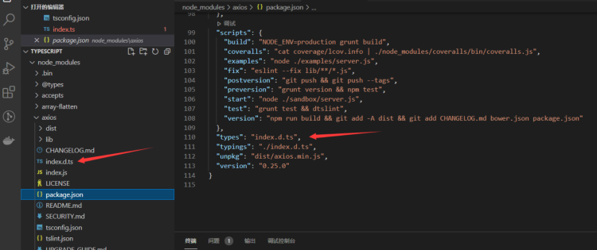

:::info
发现axios已经指定了声明文件,所以没有报错可以直接用,它通过语法declare 暴露我们声明的axios 对象`declare const axios: AxiosStatic;`
:::

- 声明文件参考链接: [type声明文件npm库](https://www.npmjs.com/~types?activeTab=packages)


