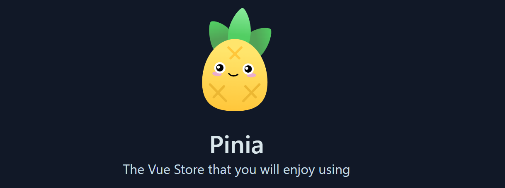
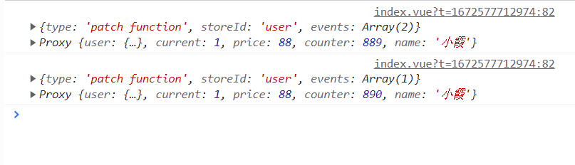
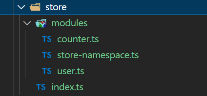
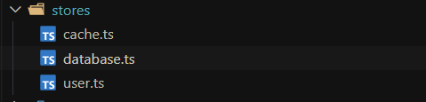

### Pinia 特点

- 完整的 TypeScript 支持
- 轻量，压缩后的体积只有1kb左右
- 去除 mutations，只有 state，getters，actions
- actions 支持同步和异步
- 代码扁平化没有模块嵌套，只有 store 的概念，store 之间可以自由使用，每一个store都是独立的
- 无需手动添加 store，store 一旦创建便会自动添加
- 支持Vue3 和 Vue2

> Pinia官网  [Pinia](https://pinia.vuejs.org/)

### 安装使用

1. 安装 Pinia `npm add pinia`
2. 在vue3项目注册使用 :

```typescript
import { createApp } from 'vue'
import App from './App.vue'
import { createPinia } from 'pinia'
 
const store = createPinia()
let app = createApp(App)
 
app.use(store)
app.mount('#app')
```
vue2 中注册使用方式:
```typescript
import { createPinia, PiniaVuePlugin } from 'pinia'
 
Vue.use(PiniaVuePlugin)
const pinia = createPinia()
 
new Vue({
  el: '#app',
  pinia
})
```

### 初始化仓库 store

在根目录新建一个 `store` 文件夹,然后在这个文件下新建 ` index.ts` 文件
因为存储 Pinia 是 `defineStore` hooks，并且它需要一个唯一的名称，作为第一个参数传递 , 我们可以把这个唯一的 name 抽离出去。
新建文件 `store-namespace.ts` 文件，窄导出定义一个自定义 `enum` 统一管理仓库名

```typescript
export const enum Names {
  USER = 'user'
}
```

#### 定于仓库：


```typescript
// 导入 Pinia 初始化 hooks
import { defineStore } from 'pinia'
// 导入 定义store仓库名枚举对象
import { Names } from './store-namespace'

export const userStore = defineStore(Names.USER, {
  state: () => ({
    todos: [],
    filter: 'all',
    nextId: 0,
    current: 1,
    name: 'liaoyi'
  }),
  // 类似于computed 可以帮我们去修饰我们的值
  getters: {},
  // 可以操作异步和同步,提交更改 state
  actions: {}
})
```


#### 页面使用：


```typescript
<template>
  <div>
    <h3>Pinia {{ store.name }}</h3>
  </div>
</template>

<script setup lang="ts">
import { userStore } from '@/stores/user'

const store = userStore()
</script>
```


### 修改 state 值的五种方式

#### 1. 直接修改
> 在 Pinia 中，state 是允许直接修改值的 例如 current++


```typescript
<template>
  <div>
    <h3>Pinia {{ user.name }}</h3>
    <button @click="changeStoreVal">修改state值</button>
  </div>
</template>

<script setup lang="ts">
import { userStore } from '@/stores/user'
const user = userStore()

const changeStoreVal = () => {
  user.current++
}

</script>
```


#### 2. $patch 修改
> 在 store 实例上有一个 `$patch`方法，可以批量修改多个值


```typescript
<template>
  <div>
    <h3>Pinia {{ user.name }} {{ user.current }}</h3>
    <button @click="changeStoreVal">修改state值</button>
  </div>
</template>

<script setup lang="ts">
import { userStore } from '@/stores/user'
const user = userStore()

const changeStoreVal = () => {
  user.$patch({
    current: 999,
    name: 'xiaqi'
  })
}
</script>
```

#### 3. $patch 函数形式修改
>  $patch 可以接收一个工厂函数，在这个函数里可以拿到state，可以自定义修改逻辑，推荐使用函数形式修改值。

```typescript

const changeStoreVal = () => {
    store.$patch((state)=>{
       state.current++;
       state.name = 'xiaqi'
    })
}
```

#### 4. $state 原始对象修改整个实例


> 我们还可以通过`$state`原始对象来替换 store 的整个状态，缺点就是必须修改整个对象的所有属性。

```typescript
import { userStore } from '@/stores/user'
const user = userStore()

const changeStoreVal = () => {
  user.$state = {
       current:10,
       age:30
   } 
}
```

#### 5. 通过 actions 修改
> 需要先在 store 仓库中的  中定义方法，在actions 中直接使用 this 就可以指到state里面的值。

在 actions 中定义方法：
```typescript
// 导入 Pinia 初始化 hooks
import { defineStore } from 'pinia'
// 导入 定义store仓库名枚举对象
import { Names } from './store-namespace'

export const userStore = defineStore(Names.USER, {
  state: () => ({
    todos: [],
    filter: 'all',
    nextId: 0,
    current: 1,
    name: 'liaoyi'
  }),
  // 类似于computed 可以帮我们去修饰我们的值
  getters: {},
  // 可以操作异步和同步,提交更改 state
  actions: {
    setName() {
      this.name = '李想'
    },
    /* 接收参数后修改  */
    setTodoList(arr){
      this.todos = arr.value
    }
  }
})
```

使用：


```typescript
import { userStore } from '@/stores/user'

const user = userStore()

/* 直接通过 user 实例调用 actions定义好的方法即可  */
const changeStoreVal = () => {
  user.setName()
}
```

当然我们在调用 actions 方法的时候，也可以传递参数：

```typescript
const todo = ref([
  { time: '2022-11-23', info: '买菜' },
  { time: '2022-11-24', info: '剪头发' }
])

const changeStoreVal = () => {
  store.setTodoList(todo)
}
```

### 解构 store 丢失响应式问题


在Pinia中是不允许直接解构值的，这样数据会失去响应式：


```vue
<script setup lang="ts">
import { userStore } from '@/stores/user'
  
const user = userStore()
const { name, current } = store
  
function changeStoreVal() {
  user.$patch({
    current: 999,
    name: 'xiaqi'
  })
}
</script>

<template>
  <div>Pinia 原始数据(未解构) : {{ store.name }} - {{ store.current }}</div>
  <div class="py-3">
    Pinia 解构数据 : {{ name }} - {{ current }}
  </div>
  <el-button @click="changeStoreVal">
    修改state值
  </el-button>
</template>
```


上面代码中，我们在页面分别使用了 state原数据 和解构后的数据， 定义了一个方法修state值，点击按钮后，可以看到，页面的变化， 解构完之后的数据不会变，而源数据是会变的，那么我们有没有上面办法解决这个问题呢？


#### 使用 storeToRefs 解决

```vue
<script setup lang="ts">
import { storeToRefs } from 'pinia'
import { userStore } from '@/stores/user'
  
const user = userStore()
  
/* storeToRefs 会把丢失响应式的数据变成一个 refs 对象 */
const { name, current } = storeToRefs(user)
  
function changeStoreVal() {
  user.$patch({
    current: 999,
    name: 'xiaqi'
  })
}
</script>

<template>
  <div>Pinia 原始数据(未解构) : {{ store.name }} - {{ store.current }}</div>
  <div class="py-3">
    Pinia 解构数据 : {{ name }} - {{ current }}
  </div>
  <el-button @click="changeStoreVal">
    修改state值
  </el-button>
</template>
```


storeToRefs 源码：


```typescript
/*
  其原理跟 toRefs 一样，就是给里面的数据包裹一层toref, 
   通过toRaw使store变回原始数据防止重复代理，然后循环 store ，
   通过 isRef isReactive 判断， 
   如果是响应式对象直接拷贝一份给refs对象，
   然后将其原始对象包裹toRef使其变为响应式对象
 */
function storeToRefs(store) {
   if (isVue2) {
    // @ts-expect-error: toRefs include methods and others
    return toRefs(store);
  }
  else {
    store = toRaw(store);
    const refs = {};
    for (const key in store) {
      const value = store[key];
      if (isRef(value) || isReactive(value)) {
        // @ts-expect-error: the key is state or getter
        refs[key] = toRef(store, key);
      }
    }
    return refs;
  }
}
```


### actions 支持同步异步


#### 1. 同步 直接调用即可

定义 actions

```typescript
import { defineStore } from 'pinia'
import { Names } from './store-namespace'

export const userStore = defineStore(Names.USER, {
  state: () => ({
    counter: 888
  }),
  actions: {
    addCounter() {
      this.counter++
    },
    randomizeCounter() {
      this.counter = Math.round(100 * Math.random())
    }
  }
})
```

使用：


```vue
<script setup lang="ts">
import { storeToRefs } from 'pinia'
import { userStore } from '@/stores/user'
  
const store = userStore()

function changeStoreVal() {
  	store.randomizeCounter()
}
</script>

<template>
  <div class="py-2">
    Pinia : {{ store.counter }}
  </div>
  <el-button @click="changeStoreVal">
    current值随机
  </el-button>
  
  <!-- 也可以直接在页面调用  -->
  <el-button @click="store.addCounter">
    + 1
  </el-button>
</template>
```

#### 2. actions 执行异步方法


```typescript
import { defineStore } from 'pinia'
import { Names } from './store-namespace'

type User = {
  name: string
  age: number
}

const Login = (): Promise<User> => {
  return new Promise((resolve) => {
    setTimeout(() => {
      resolve({
        name: 'liaoyi',
        age: 12
      })
    }, 1200)
  })
}

export const userStore = defineStore(Names.USER, {
  state: () => ({
    user: <User>{},
    name: 'liaoyi'
  }),
  
  actions: {
    async getLoginInfo() {
      const res = await Login()
      this.user = res
    }
  }
})
```


页面使用：


```vue
<script setup lang="ts">
import { userStore } from '@/stores/user'

const store = userStore()
</script>

<template>
  <div>{{ store.user }}</div>
  <el-button @click="store.getLoginInfo">
    获取登录信息
  </el-button>
</template>
```


#### store 内部互相调用 actions 

```typescript
import { defineStore } from 'pinia'
import { Names } from './store-namespace'

type User = {
  name: string
  age: number
}

const Login = (): Promise<User> => {
  return new Promise((resolve) => {
    setTimeout(() => {
      resolve({
        name: '李想',
        age: 18
      })
    }, 1200)
  })
}

export const userStore = defineStore(Names.USER, {
  state: () => ({
    user: <User>{},
    name: '廖一'
  }),
  
  actions: {
    async getLoginInfo() {
      const res = await Login()
      this.user = res
      this.setName(res.name)
    },
    setName(name) {
      this.name = name
    },
  }
})
```

### getters 
> 类似于computed 数据修饰并且有缓存,用于按需获取数据，注意，在getters对象中，如果使用箭头函数，则无法使用this, 此时this指向已经改变指向undefined。这时候我们可以直接使用 state 。


```typescript
import { defineStore } from 'pinia'
import { Names } from './store-namespace'

export const userStore = defineStore(Names.USER, {
  state: () => ({
    price: 88,
    counter: 888,
    name: 'wangergou'
  }),
  // 类似于computed 可以帮我们去修饰我们的值
  getters: {
    newName() {
      return `Web ${this.name}`
    },
    newPrice: (state) => `$${state.price}`,
    /* 当然也可以相互调用 */
    newInfo(){
      return `Web ${this.newName}--${this.newPrice}`
    }
  }
})
```


使用:

```typescript
<template>
	 <div>{{ store.newName }} {{ store.newPrice }}</div>
   <el-button @click="store.getLoginInfo">获取登录信息</el-button>
</template>

 <script setup lang="ts">
  import { userStore } from '@/stores/user'
	const store = userStore()
</script>
```


### Pinia 其它 API


#### $reset

> 重置store到他的初始状态

我们在 store 中定义了counter，初始值未 888，在actions 中定义了一个 addCounter 方法，每次点击 counter 值加一:

```typescript
import { defineStore } from 'pinia'
import { Names } from './store-namespace'

export const userStore = defineStore(Names.USER, {
  state: () => ({
    price: 88,
    counter: 888,
    name: 'wangergou'
  }),
  actions: {
    addCounter() {
      this.counter ++
    },
  }
})
```

组件中：

```vue
<script setup lang="ts">
import { userStore } from '@/stores/user'

const store = userStore()
</script>

<template>
  <div>{{ store.counter }}</div>
  <el-button @click="store.addCounter">
    +1
  </el-button>
  <!-- 注意这里在template直接使用 $reset() 需要加()	 -->
  <el-button @click="store.$reset()">
    重置state
  </el-button>
</template>
```
我们把 counter 加到 900后点击 重置按钮，调用$reset()，将会把state所有值,重置回原始状态。


#### $subscribe 订阅 state 调用

> 用于订阅state的改变，类似于Vuex 的 abscribe ，只要有 state 的变化就会触发这个函数。


```vue
<script setup lang="ts">
import { storeToRefs } from 'pinia'
import { userStore } from '@/stores/user'
  
const store = userStore()

store.$subscribe((args, state)=>{
  console.log(args, state)
})
  
function changeStoreVal() {
  	store.$patch((state) => {
    state.counter++
    state.name = '小霞'
  })
}
</script>

<template>
  <div class="py-2">
    Pinia : {{ store.counter }} {{ store.name }}
  </div>
  <el-button @click="changeStoreVal">
    + 1
  </el-button>
</template>
```

每次点击按钮会触发两次，因为在changeStoreVal 方法中我们，同时改变了 state 中的两个值：




第二个参数： 如果你的组件卸载之后还想继续调用请设置第二个参数

```js
store.$subscribe((args, state)=>{
  console.log(args, state)
}, {
  detached:true
})
```

#### $onAction 订阅 actions 调用


> 只要有actions被调用就会走这个函数

```js
store.$onAction((args)=>{
  console.log(args)
})
```

### Pinia 模块化 

#### 第一种方式



在store 文件夹新增 modules 文件，用于存放不同模块的仓库:
新建user.ts
```js
import { defineStore } from 'pinia'

const useUserStore = defineStore('user', {
  state: () => ({
    token: '',
    userInfo: {},
    count: 9
  }),
  getters: {
    double() {
      return this.count * 2
    },
  }
})

export default useUserStore
```

新建 counter.js 文件：

```js
import { defineStore } from 'pinia'

const useCounterStore = defineStore('counter', {
  state: () => {
    return {
      name: 'ly',
      age: 24,
    }
  },
})
```

新建 index.ts 后导入模块：

```js
import { userStore } from './modules/user'
import { useCounterStore } from './modules/counter'


// 统一导出useStore方法
export default function useStore() {
  return {
    user: userStore(),
    counter: useCounterStore()
  }
}
```

页面中使用：

```vue
<script setup lang="ts">
import { storeToRefs } from 'pinia'
import useStore from './store'

const { counter } = useStore()

// 使用storeToRefs可以保证解构出来的数据也是响应式的
const { count, double } = storeToRefs(counter)
</script>
```


#### 第二种方式 (推荐，减轻心智负担)



cache.ts

```js
import { defineStore } from 'pinia'
import { cacheOne, getCacheList, getCloudProviderList } from '@/api/cache'

import type {
  CacheByIdParams,
  CloudProviderItem,
  ICacheListItem,
  ICacheOneRes,
  ItokenItem
} from '#/cache'


interface IcacheStore {
  serviceList: ICacheListItem[]
  regionList: CloudProviderItem[]
  oneCache: ICacheOneRes
}

export const useCacheStore = defineStore({
  id: 'cacheStore',
  state: (): IcacheStore => ({
    serviceList: [],
    regionList: [],
    oneCache: {} as ICacheOneRes
  }),
  actions: {
    async setCacheList(loadding: boolean) {
      const { list } = await getCacheList(loadding)
      this.serviceList = list
      return list
    },
    async setCloudProviderList() {
      const { list } = await getCloudProviderList()
      this.regionList = list
    },
    async setOneCache(params: CacheByIdParams) {
      const res = await cacheOne(params)
      this.oneCache = res
    }
  }
})
```

user.ts

```js
import { defineStore } from 'pinia'
import type { IUserInfo, IUsers } from '#/user'
import { getUsers, userInfo  } from '@/api/auth'

interface User {
  info: null | IUserInfo
  usersNum: IUsers
}

export const userStore = defineStore({
  id: 'user',
  // 开启持久化存储
  persist: {
    key: 'user',
    storage: localStorage
  },
  state: (): User => ({
    info: {} as null | IUserInfo,
    usersNum: {} as IUsers
  }),
  actions: {
    async getUserInfo() {
      const res = await userInfo()
      this.info = res
    },
    async usersNumber() {
      const res = await getUsers()
      this.usersNum = res
      return res
    }
  }
})
```

使用：

```vue
<script setup lang="ts">
/* 用于解构 store */
import { storeToRefs } from 'pinia'

import { userStore } from '@/stores/user'
import { cacheStore } from '@/stores/cache'

const store = userStore()
const cache = cacheStore()

const { info } = storeToRefs(store)

cache.setCacheList()
</script>

<template>
  <div class="mt-6 sm:mt-10">
    <div cy-id="redis-db-list" class="grid gap-6 sm:grid-cols-2 sm:gap-8">
      <div
        v-for="item in cache.serviceList" 
        :key="item.id"
        class="flex flex-col rounded-lg border border-gray-200 shadow-sm"
        :class="{ 'cursor-not-allowed': item.status === '-10' }"
      >
        <header
          class="p-4 sm:p-6 sm:pt-6 sm:pb-6"
          :class="{ 'pointer-events-none  opacity-70': item.status === '-10' }"
        >
          <h3 class="text-lg cursor-pointer" @click="toDetail(item)">
            {{ item.name }}
          </h3>
          <span class="mt-1.5 flex items-center gap-1.5 opacity-50">
            <span>{{ $t("redis.regional") }}</span> {{ item.cloudProvider }}
            <span />{{ item.region }}
          </span>
          <div class="mt-1.5 flex items-center justify-between gap-1.5">
            <span class="flex-1 opacity-50">状态</span>
            {{ statusObj[item.status] }}
          </div>
        </header>
      </div>
    </div>
  </div>
</template>
```
