 Vue3简介 💭

- 2020年9月18日，Vue.js发布3.0版本，代号：One Piece（海贼王）

- 耗时2年多、[2600+次提交](https://github.com/vuejs/vue-next/graphs/commit-activity)、[30+个RFC](https://github.com/vuejs/rfcs/tree/master/active-rfcs)、[600+次PR](https://github.com/vuejs/vue-next/pulls?q=is%3Apr+is%3Amerged+-author%3Aapp%2Fdependabot-preview+)、[99位贡献者](https://github.com/vuejs/vue-next/graphs/contributors)
- github上的tags地址：[https://github.com/vuejs/vue-next/releases/tag/v3.0.0](https://github.com/vuejs/vue-next/releases/tag/v3.0.0)

---

## Vue3新特性 


### Performance

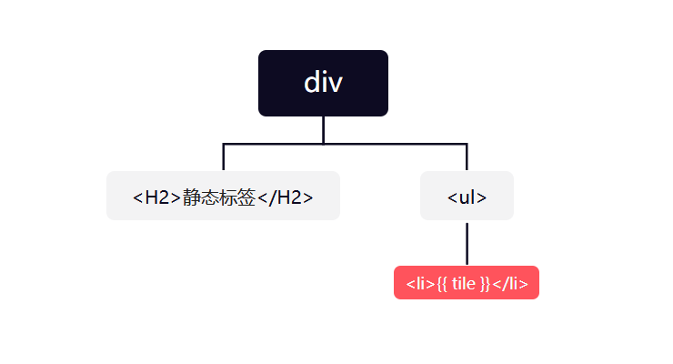


::: tip 说明
在vue2中，DOM Diff过程中【虚拟DOM转换为真实DOM】，如果视图更新(比如新增了一个节点)，会全部进行对比，包括静态的dom节点。**而在vue3中会跳过静态节点**。
:::


- update性能提高1.3~2倍
- SSR速度提高了2~3倍

### Tree shaking

- 打包时，可以将无用模块“剪辑”，仅打包需要的。

## Proxy 

- Proxy 参考链接： [MDN Proxy 直达](https://developer.mozilla.org/zh-CN/docs/Web/JavaScript/Reference/Global_Objects/Proxy)
- 响应式原理不再基于 [Object.defineProperty](https://developer.mozilla.org/zh-CN/docs/Web/JavaScript/Reference/Global_Objects/Object/defineProperty)
### Vue2 中的数据劫持
实现原理：Vue2是基于Object.defineProperty实现数据劫持的（get/set）

- 需要给对象中的每一个属性分别遍历做劫持，对于后期新增的属性是没有做劫持的，vue2中可以基于`$set`实现新增属性的劫持。

- 数组类型：对于数组中的每一项没有做劫持，vue2中重写了数组7个方法，后期通过这7个方法修改数组中的某一项，才会让视图重新渲染。 


前置知识点：

::: details forEach 特性：
1. 优先遍历数字属性 
2. 无法遍历Symbol类型的私有属性
3. 会把私有以及公有中所有可枚举的都遍历「性能比较差」
:::

::: details 获取对象中所有属性-包括私有属性

- ES5 写法
```javascript
  /* 拿到obj的所有非 Symbol类型属性 */
    let keys = Object.keys(obj);

/*  拿到obj中所有 Symbol 类型的属性，返回一个数组，
    包含所有 Symbol 类型的属性名，拼接到 keys 中  */

  if (typeof Symbol !== "undefined") 
  keys = keys.concat(Object.getOwnPropertySymbols(obj)); 
```
- ES6 写法
```javascript
// 使用ES6语法获取所有属性包括私有属性
let keys = Reflect.ownKeys(obj); 
```
:::

::: details 检查是否为纯对象
 ```javascript
const isPlainObject = function isPlainObject (obj) {
  let proto, Ctor;
  if (!obj || Object.prototype.toString.call(obj) !== "[object Object]") return false;
  proto = Object.getPrototypeOf(obj);
  if (!proto) return true;
  Ctor = proto.hasOwnProperty('constructor') && proto.constructor;
  return typeof Ctor === "function" && Ctor === Object;
};
```
:::

**vue2 中的数据劫持方法**


```javascript
 #region
let obj = {
  x: 1,
  y: { n: 2,m: 3 },
  z: [ 10, 20, 30 ]
};

const observe = function observe (obj) {
  let proxyObj = JSON.parse(JSON.stringify(obj)); // 对象深拷贝
  
  // 因为 forEach 特性，使用 Reflect拿到所有属性名
  let keys = Reflect.ownKeys(obj);
  // 1. 遍历所有属性名,使用Object.defineProperty劫持数据
  keys.forEach(key => {
    Object.defineProperty(obj, key, {
      get () {
        return proxyObj[key];
      },
      set (value) {
        if (proxyObj[key] === value) return;
        proxyObj[key] = value;
        // 通知视图渲染
      }
    });
    // 2. 如果属性值是对象，则继续劫持，递归调用observe
    let value = obj[key];
    if (isPlainObject(value)) {
      observe(value);
    }
  });
  return proxyObj;   // 操作obj的时候，返回的是代理对象
};
observe(obj);
obj.name = '张三';   
/* 在后续更改对象时: 发现 obj.name没有被劫持，这也是vue2中的痛点
当然：vue提供了$set方法，可以解决这个问题 */
#endregion
```
> VS Code使用 #region 折叠代码防止莫名其妙展开 ：[VS Code使用 #region ](https://blog.csdn.net/ycx60rzvvbj/article/details/106447130?ops_request_misc=&request_id=&biz_id=102&utm_term=vscode?ops_request_misc=&request_id=&biz_id=102&utm_term=vscode&utm_medium=distribute.pc_search_result.none-task-blog-2~all~sobaiduweb~default-2-106447130.142^v11^control,157^v12^control&spm=1018.2226.3001.4187#region%20&utm_medium=distribute.pc_search_result.none-task-blog-2~all~sobaiduweb~default-2-106447130.142^v11^control,157^v12^control)


::: warning * 存在问题：
- 新增属性、删除属性, 界面不会更新。
- 直接通过下标修改数组, 界面不会自动更新。
:::

### Vue3 中的数据劫持

**实现原理:**

1. 通过Proxy（代理）:  拦截对象中任意属性的变化, 包括：属性值的增、删、改、查。
2. 通过Reflect（反射）:  对源对象的属性进行操作。

::: tip 参考链接：
MDN文档中描述的 [Proxy](https://developer.mozilla.org/zh-CN/docs/Web/JavaScript/Reference/Global_Objects/Proxy)  与 [Reflect](https://developer.mozilla.org/zh-CN/docs/Web/JavaScript/Reference/Global_Objects/Reflect)。
:::


```js
  let obj = {
    x: 1,
    y: { n: 2,m: 3 },
    z: [ 10, 20, 30 ]
  };
let proxyObj = new Proxy(obj, {
  /*
    @param target: 被代理的对象
    @param key:    是被代理的属性名
    @param value:  是被代理的属性值           
  */
  get(target, key) { // 获取值
    return Reflect.get(target, key);
  },
  set(target, key, value) { // 设置值
    if (Reflect.get(target, key) === value) return;
    Reflect.set(target, key, value);
    console.log('视图更新...');   // 通知视图渲染
  },
  deleteProperty(target, key) {
    Reflect.deleteProperty(target, key);
  }
})
proxyObj.name = '张三';   // 会触发视图更新
```

Vue3 中的响应式数据，是基于`ES6`中的 `Proxy` 实现的

- `Proxy` 除了提供`get`/`se`t监听器之外，还提供了其它大量的监听函数，当我们操作对象的时候，可以做到全方位劫持监听。 对数组的处理也很友好。
- `Proxy`无需自己依次遍历对象的每个属性，只需要代理整个对象，则所有属性都做代理了，哪怕是后期自己新增的属性也会做代理。
-  `Proxy`默认也只是对对象中第一层做代理，而`vue3`中基于`递归`的方式，也实现了深层次代理。
- `ES6`的`API`，不兼容`IE`。


## 新的内置组件


### 1. Fragment 碎片化节点

:::tip 
- 在Vue3中:  不再限于模板中的单个根节点, 组件可以没有根标签。
- 内部会将多个标签包含在一个 `<Fragment />`虚拟元素中,类似于 `React` 中的 `<> </>`, 可以有效减少标签层级, 减小内存占用。
:::

```vue
<template>
  <div>
    <header>
      <button @click="Login">
        登入
      </button>
    </header>
    <main />
  </div>
</template>
```

vue3中可以有多个根节点：

```vue
<template>
  <header>
    <button @click="Login">
      登入
    </button>
  </header>
  <main />
</template>
```

### 2. `<Teleport />` 传送门

:::tip 
- `<Teleport />` 是一种能够将我们的模板渲染至指定DOM节点，不受父级`style`、`v-show`等属性影响，但`data`、`prop`数据依旧能够共用的技术；
- 类似于 React 的 `<Portal> [ˈpɔːtl]`，译作传送门。
:::

主要解决的问题 因为`Teleport`节点挂载在其他指定的DOM节点下，完全不受父级`style`样式影响：

两个属性:

1. `to` 指定传送到哪个容器
2. `disabled` 传送门开关, 默认开启, 使用这个属性时一般配合响应式动态控制。

```vue
<script>
export default {
  data() {
    return {
      content: 'This is the app'
    }
  }
}
</script>

<template>
  <router-view />
  <!-- 把当前组件中的部分内容抽离出来，放置在页面非 #app的容器中，
     基于to指定放在哪个容器中 -->
  <Teleport to="#other" disabled="true">
    <h1>Other</h1>
    <h4>This is the other page</h4>
    <p> {{ content }}</p>
  </Teleport>
</template>
```

:::warning 注意
如果设置了 `<Teleport/>`节, 点必须挂载在`#app`节点或者其他已经存在的节点下，否则会报错。
:::

```html
<!DOCTYPE html>
<html lang="">
  <head>
    <meta charset="utf-8">
    <meta http-equiv="X-UA-Compatible" content="IE=edge">
    <meta name="viewport" content="width=device-width,initial-scale=1.0">
    <link rel="icon" href="<%= BASE_URL %>favicon.ico">
    <title><%= htmlWebpackPlugin.options.title %></title>
  </head>
  <body>
    <div id="app"></div>
    <!-- 设置渲染容器  -->
    <div id="other"></div>
  </body>
</html>

```
效果如下：
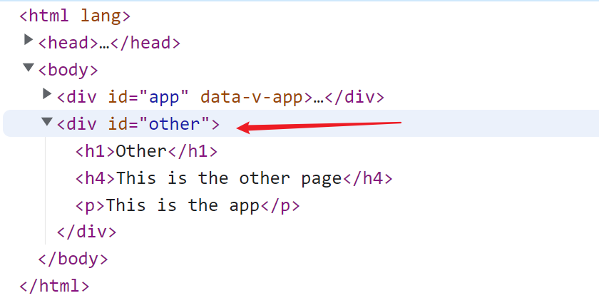

官方栗子是点击按钮的时候出现一个弹窗，但是因为弹窗和当前页面是同一级，如果我们把当前页面的颜色更改后，比如设置了当前页面透明度 ` opacity: 0.8; `,那么弹窗的样式也会受影响，这个时候我们就可以使用传送门解决此类问题。


##### 实例：

- 如果设置了 `<Teleport/>` ,必须先在组件里设置节点

下面的案例中，假设页面头部有一个搜索框，我们在搜索框搜索时，希望列表组件 (兄弟组件)监听搜索框组件的值。

```vue
<script setup name="Navbar">
</script>

<template>
  <nav class="navbar navbar-light bg-white navbar-expand-lg border-bottom">
    <div class="container">
      <div class="d-flex align-items-center">
        
        <a class="navbar-brand" href="#"><strong>Vue</strong> 图片上传</a>
      </div>
      <!--  搜索框传送容器    -->
      <div id="search-form" />
    </div>
  </nav>
</template>

<style lang="scss" scoped>
.icon {
  width: 24px;
  height: 24px;
}
</style>
```

定义搜索框组件：

```vue
<script setup>
defineProps({
  modelValue: {
    type: String
  }
})

const emits = defineEmits(['update:modelValue'])

function handleEnterKey(event) {
  emits('update:modelValue', event.target.value)
}
</script>

<template>
  <div class="mt-2 mt-md-0">
    <input :value="modelValue" class="form-control me-2" type="text" placeholder="Search in Drive" aria-label="Search" @keydown.enter="handleEnterKey">
  </div>
</template>

<style lang="scss" scoped>
</style>
```

在列表组件中使用：


```vue
<script setup>
import axios from 'axios'
import { reactive, watchEffect } from 'vue'
import SearchForm from '../components/SearchForm.vue'
import FileItem from '../components/FileItem.vue'

const files = ref([])

const query = reactive({
  _sort: 'name',
  _order: 'desc',
  q: ''
})

// TODO 使用watchEffect监听数据发生改变,watchEffect每次进入页面都会执行
watchEffect(async () => {
  // new URLSearchParams(query) 把对象转换为&链接的请求参数
  const { data } = await axios.get(
    `http://localhost:3030/files?${  new URLSearchParams(query)}`
  )
  files.value = data
})
</script>

<template>
  <div class="container py-3">
    <!--  请求的列表    -->
    <div class="row">
      <FileItem v-for="file in files" :key="file.id" :file="file" />
    </div>

    <!-- 使用传送门 -->
    <Teleport to="#search-form">
      <SearchForm v-model="query.q" />
    </Teleport>
  </div>
</template>

<style lang="scss" scoped>
</style>
```

效果：
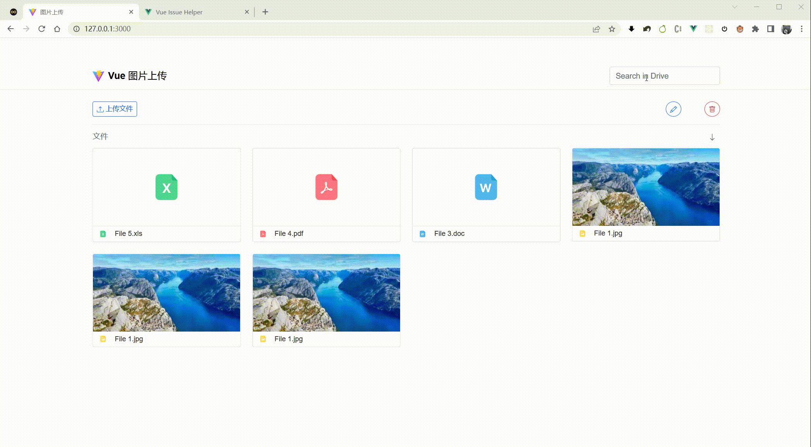


:::tip 参考链接：
- [Teleport传送组件 🔗 👈](https://xiaoman.blog.csdn.net/article/details/122916261)
  - [旧版官方文档 🔗 👈](https://v3.cn.vuejs.org/guide/teleport.html#%E4%B8%8E-vue-components-%E4%B8%80%E8%B5%B7%E4%BD%BF%E7%94%A8)
  -  [新版官方文档🔗 👈 ](https://staging-cn.vuejs.org/guide/built-ins/teleport.html#basic-usage)
:::


### 3. `<Suspense />` 异步组件

::: warning
🐾 实验性功能：
`<Suspense>` 是一项实验性功能。不能保证它会成为稳定版，而且在那之前，相关 API 也可能会发生变化。
:::

- 可在嵌套层级中等待嵌套的异步依赖项
- 等待异步组件时渲染一些额外内容，让应用有更好的用户体验 

使用：

1. 定义一个 异步的子组件 `asyncComponents.vue`

```vue
<script setup>
function query() {
  return new Promise((resolve, reject) => {
    setTimeout(() => {
      resolve({
        data:{
          id: '1000007', 
          name: 'liaoyi',
          age: 22,
          url: 'https://canxiu.oss-cn-hangzhou.aliyuncs.com/2022/user.jpg',
          desc:'Hello 2023!!'
        }
      })
    }, 2000)
  })
}
const { data } = await query()
</script>

<template>
  <h2>用户信息</h2>
  <div> ID：  {{ data.id }} </div>
  <div> 姓名：{{ data.name }} </div>
  <div> 年龄：{{ data.age }} </div>
  <div> 头像：{{ data.url }} </div>
  <div> 描述：{{ data.desc }} </div>
</template>
```

2. 父组件中使用

:::tip
`<Suspense >` 组件内置两个插槽，第一个插槽是 `default` 插槽，我们把异步组件放在里面，第二个插槽为`fallback` 插槽，我们可以传入异步组件没有加载成功时显示的样式。
:::

```vue
<script>
import { defineAsyncComponent } from 'vue'
import syncVue from '@/components/asyncComponents.vue'
</script>

/* 非Setup使用 */
<script setup>
// 导入 defineAsyncComponent 用于注册异步组件
export default {
  components: { syncVue }
}
// 导入异步组件
const syncVue = defineAsyncComponent(() =>
  import('@/components/asyncComponents.vue')
)
</script>

<!-- /* Setup使用 */ -->
<template>
  <h2>使用异步组件</h2>
  <Suspense>
    <template #default>
      <syncVue />
    </template>
    <!-- 设置异步组件没有加载成功时显示的样式 -->
    <template #fallback>
      正在努力加载中...
    </template>
  </Suspense>
</template>
```

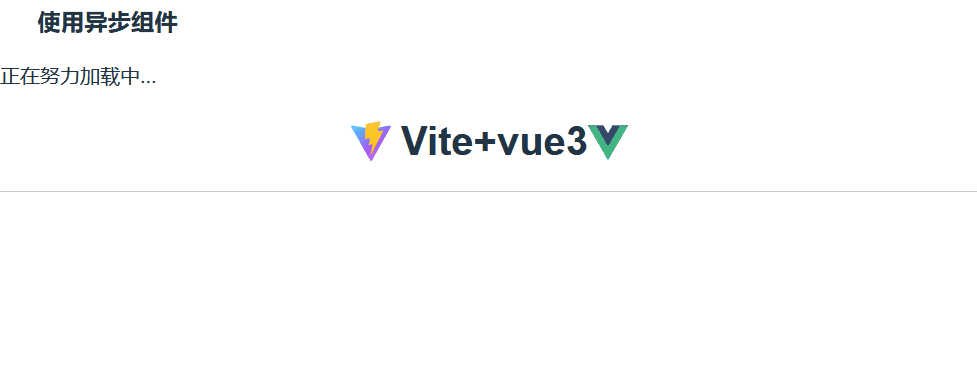


### 4. Custom Renderer API

- 自定义渲染器API
- 用户可以尝试WebGL自定义渲染器

:::tip
在vue中，我们可以虚拟DOM转换为的真实DOM元素，然后以HTML网页形式展现在页面上，在vue3中，用户可以自定义渲染器，**比如把虚拟DOM转换成canvas画布,以图片的形式展现在网页上**。
:::


## 创建Vue3 项目
官方文档：[vue-cli](https://cli.vuejs.org/zh/guide/creating-a-project.html#vue-create)
vite官网：[https://vitejs.cn](https://vitejs.cn)
### 1.使用 vue-cli 创建
```powershell
## 查看@vue/cli版本，确保@vue/cli版本在4.5.0以上
vue --version
## 安装或者升级你的@vue/cli
npm install -g @vue/cli
## 创建
vue create vue_test
## 启动
cd vue_test
npm run serve
```


### 2.使用 vite 创建

- 什么是vite？—— 新一代前端构建工具。
- 优势如下： 
   - 开发环境中，无需打包操作，可快速的冷启动。
   - 轻量快速的热重载（HMR）。
   - 真正的按需编译，不再等待整个应用编译完成。

**传统构建 与 vite构建对比图**

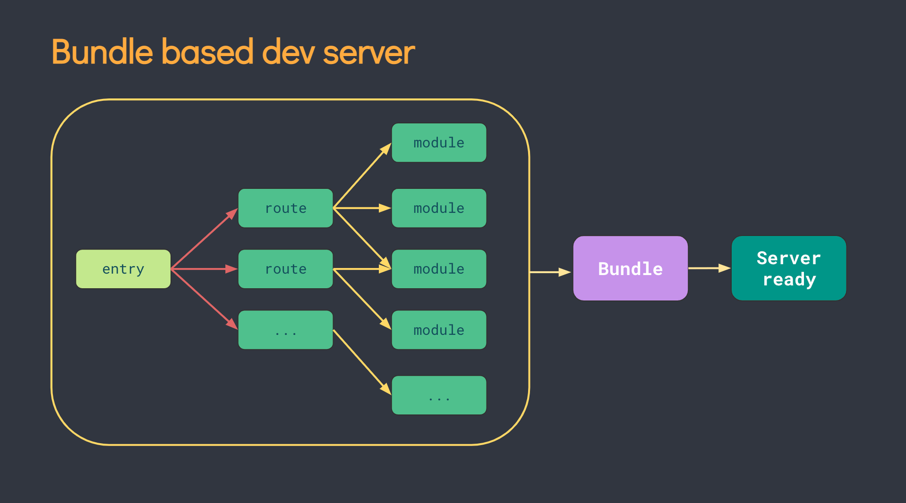

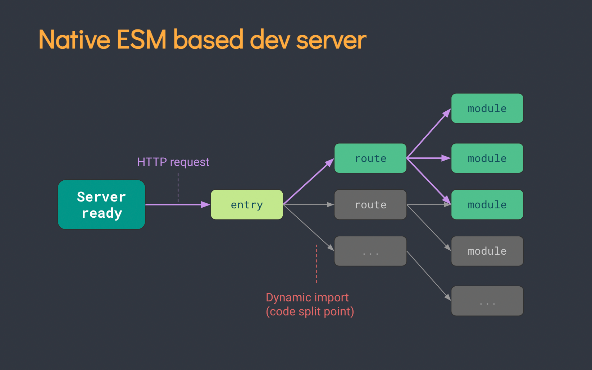


```shell
## 创建工程
npm init vite-app <project-name>
## 进入工程目录
cd <project-name>
## 安装依赖
npm install
## 运行
npm run dev
```


## setup

:::tip  info
**setup**是Vue3.0 中一个新的配置项，值为一个函数。**setup **是所有 **Composition API（组合API）**“ 表演的舞台 ”。组件中所用到的：数据、方法等等，均要配置在setup中。
:::

- 初始化时，setup 在 props和 beforeCreate 之间调用，且只在组件加载时执行。
- setup 函数可以接收 props 和 context 上下文
- this 在 setup() 中不可用
### setup 两种返回值

1. 🌟 若返回一个对象，则对象中的属性、方法, 在模板中均可以直接使用。（重点关注！）

```vue
<script>
export default {
  name: 'HelloWorld',
  setup() {
    const name = '张三'
    const age = 18
    function sayHello() {
      alert(`我叫${name}，我${age}岁了，你好啊！`)
    }
    function test2() {
      console.log(name, age)
    }
    return { name, age, sayHello, test2 }
  }
}
</script>
```

2. 若返回一个渲染函数：则可以自定义渲染内容。（了解）
```vue
<!-- // 注意：如果是返回一个渲染函数，那么此页面上的原有样式将会被覆盖。 -->
<script>
// 我们在vue2中的main.js中已经见过 h 渲染函数了，在vue3中使用需要导入。
import { h } from 'vue'
	export default {
    	name: 'HelloWorld',
    // 	return ()=> return {  h('h1','2022') }
		//返回一个函数（渲染函数）,这个渲染函数必须把h函数调用结果 return 出去。
    // 调用 h函数的时候传入两个参数，第一个参数是dom元素，第二个参数是dom元素里的内容。
		return ()=> h('h1','你好 2022 ！')
}
</script>
```

:::warning  注意

1. 尽量不要与Vue2.x配置混用 
2. Vue2.x配置（data、methos、computed...）中**可以访问到**setup中的属性、方法。
- 但在setup中**不能访问到**Vue2.x配置（data、methos、computed...）。
- 如果有重名, setup优先。
1. ~~setup不能是一个async函数，因为返回值不再是return的对象, 而是promise, 模板看不到return对象中的属性。(后期也可以返回一个Promise实例，但需要Suspense和异步组件的配合)~~
 - 现在的版本已经支持！
:::

### setup的两个注意点

**setup执行的时机** 

在`beforeCreate`之前执行一次，this是 `undefined`

**setup接收的参数**

:::tip

1. props：包含：组件外部传递过来，且组件内部声明接收了的属性。
2. context：上下文对象 
- `attrs`: 包含组件外部传递过来，但没有在`props`配置中声明的属性, 相当于 `this.$attrs`。
- `slots`: 收到的插槽内容, 相当于 `this.$slots`
- `emit`: 分发自定义事件的函数, 相当于 `this.$emit`
:::


## 常用 Composition API

官方文档: [https://v3.cn.vuejs.org/guide/composition-api-introduction.html](https://v3.cn.vuejs.org/guide/composition-api-introduction.html)

### ref 
**ref**(reference) 函数是vue3中新增的函数，常用于定义普通数据类型的响应式数据。

- 返回一个 RefImpl 对象 (ES6中的class类)；
- 必须操作该对象的value值改变数据 （状态）
- 模板中读取数据: 不需要`.value`，直接：`<div>{{xxx}}</div>`
- 响应式依然是靠 `Object.defineProperty()` 的 `get` 与 `set` 完成的 。


```javascript
<script>
import { ref } from "vue";
export default {
  setup() {
   let supNum = ref(10);
   let oppNum = ref(5);
    
   // 如果想修改值，需要操作 value 值
   oppNum.value ++ 
    
   return { supNum,oppNum }
  }
}
</script>
```

:::tip
对于对象类型的数据实现响应式 ：内部 "**求助**" 了Vue3 中的一个新函数—— **reactive**函数。
:::

### reactive

> 定义一个**对象或数组类型**的响应式数据（基本类型不要用它，用ref函数）

- 等同于 vue2 中的 `Vue.observable()`
- 响应式转换是 "`深层的`"：会影响对象内部所有嵌套的属性。


```vue
<template>
  <p>{{ state.supNum }}</p>
  <p>{{ state.oppNum }}</p>
  <p>{{ state.arr[0] }}</p>
  <button @click="change(0)">
    点击修改数据
  </button>
</template>

import { reactive } from "vue";
export default {
  setup() {
    // 比Object.defineProperty好用在于：
    // 对于数据或者并未初始化的对象成员，都可以随意修改值，而且具备响应式的效果
    // const 代理对象= reactive(源对象)
    let state = reactive({
      supNum: 0,
      oppNum: 0,
      arr: [10, 20]
    });
    let change = lx => {
      lx === 0 ? state.supNum++ : state.oppNum++;
      state.arr[0] = state.arr[0] + 1;
    };
    return {
      state,
      change
    };
  }
};
```


### reactive 定义数组异步赋值问题

`reactive` 生成的是一个 `proxy` 代理对象，不能直接赋值，否则会丢失响应式。


我们来看一个例子： 下面代码中，如果直接这样赋值，页面是不会变化，因为会脱离响应式

```vue
<script setup lang="ts">
import { reactive } from 'vue'

let list = reactive<string[]>([])
function getData() {
  setTimeout(() => {
    list = ['钟馗', '姜子牙', '杨戬', '哪吒']
    console.log(list)
  }, 1000)
}
</script>

<template>
  <ul>
    <li v-for="(name, index) in list" :key="index">
      {{ name }}
    </li>
  </ul>
  <button @click="getData">
    获取异步数据
  </button>
</template>
```

解决方案：

1. 使用数组方法 `push`

```vue
<script setup lang="ts">
import { reactive } from 'vue'

const list = reactive<string[]>([])
function getData() {
  setTimeout(() => {
    const arr =  ['钟馗', '姜子牙', '杨戬', '哪吒']
    person.push(...arr)
    console.log(list)
  }, 1000)
}
</script>
```

2. 包裹一层对象再修改

```vue
<script setup lang="ts">
import { reactive } from 'vue'

const list = reactive<{ arr: string[] }>({ arr: [] })
function getData() {
  setTimeout(() => {
    list.arr = ['钟馗', '姜子牙', '杨戬', '哪吒']
    console.log(list)
  }, 1000)
}
</script>

<template>
  <ul>
    <li v-for="(name, index) in list.arr" :key="index">
      {{ name }}
    </li>
  </ul>
  <button @click="getData">
    获取异步数据
  </button>
</template>
```

### reactive 丢失响应式问题 Vu3巨坑

如果你要替换整个数组还要保持响应式，要么用 `ref` ，要么用 `splice(0)` 清空数组，然后再 `push(..item)`。


### reactive配合toRefs使用

上面的代码中使用 `state.xxx` 操作比较麻烦，我们应该可以想到使用解构赋值的方式 `return{ ...state }`导出数据, 但是，如果 **直接使用解构的方式，会丢失响应式**。

解决办法：可以基于 `toRefs` 函数，把`state`状态中的每一项都变为单独的 `RefImpl`对象。

```vue
<template>
  <p>{{ supNum }}</p>
  <p>{{ oppNum }}</p>
  <p>{{ arr[0] }}</p>
  <button @click="change(0)">
    点击修改数据
  </button>
</template>

<stript lang="ts">
import { reactive, toRefs } from "vue";
export default {
  setup() {
    let state = reactive({
      supNum: 0,
      oppNum: 0,
      arr: [10, 20]
    });
    let change = lx => {
      lx === 0 ? state.supNum++ : state.oppNum++;
      state.arr[0] = state.arr[0] + 1;
    };
    return {
      ...toRefs(state),
      change
    };
  }
};
</stript>
```


### 使用 ref  获取DOM元素

在vue3没有`this`，那我们如何像在vue2中通过refs来操作dom元素呢 ？

我们可以通过响应式对象的方式获取DOM元素：

```javascript
<template>
   <!-- 把setup定义的ref响应对象作为dom元素上的ref属性  -->
   <h3 ref="root">{{ title }}</h3>
</template>

import { ref, onMounted } from "vue";
export default {
  setup() {
    let title = ref("你好，2022！"),
    // Vue3中获取DOM元素：把RefImpl对象作为元素的ref属性值，
    // 这样基于“RefImpl对象.value”可以获取此DOM
    let root = ref();  // 和 let root = ref(null) 等价
    onMounted(() => {
      // 获取DOM元素
      console.log(root.value);
    });
    return {
      title,
      root
    };
  }
}
```

```js
<script setup lang="ts">
  import { ref, onMounted } from "vue"

  let title = ref("你好，2022！")
    
  // Vue3中获取DOM元素：把RefImpl对象作为元素的ref属性值，
  // 这样基于“RefImpl对象.value”可以获取此DOM
  let root = ref<HTMLDivElement>() 

  onMounted(() => {
    // 获取DOM元素
    console.log(root.value?.innerText);
  })

<template>
  // <!-- 把setup定义的ref响应对象作为dom元素上的ref属性  -->
  <h3 ref="root"> {{ title }} </h3>
</template>
```

## 计算属性和监听器

### computed

传入一个 `getter` 函数，返回一个默认不可手动修改的 `ref` 对象。计算属性只有当依赖的属性的值发生变化的时候，才会触发他的更改，如果依赖的值不发生变化，使用的是缓存中的属性值。

在vue2中的计算属性我们是可以直接修改值的，但是vue3中如果不适应setup语法糖，如果你尝试那么做，控制台会报错：

```vue
<script>
import { computed, ref } from 'vue'

export default {
  setup() { 
    const count = ref(1)
    const plusOne = computed(() => count.value + 1)
    console.log(plusOne.value) //2
    
    // 这样获取的计算属性值是只读的，当我们尝试去修改的时候，
    // 报警告:computed value is readonly
    plusOne.value++ //错误！
    
    return { count, plusOne }
  }
}
</script>
```


#### 函数形式

```typescript
import { computed, reactive, ref } from 'vue'
let price = ref(0)//$0
 
let m = computed<string>(()=>{
   return `$` + price.value
})
 
price.value = 500
```

#### 对象形式
传入一个拥有 `get` 和 `set` 函数的对象，创建一个可手动修改的计算状态，写法如下：

```vue
<script setup lang="ts">
import { computed, reactive, ref } from 'vue'
  
const price = ref<number | string>(1) //$0
  
const state = reactive({
  	supNum: 12,
  	oppNum: 11
})

const mul = computed({
  get: () => {
    return price.value
  },
  set: (value) => {
    price.value = `set${  value}` 
  }
})

mul.value = 666
console.log(mul.value) // set666

const ratio = computed({
  get: () => {
    const total = state.supNum + state.oppNum
    return total === 0
      ? '--'
      : `${((state.supNum / total) * 100).toFixed(2)  }%`
  }
})
</script>

<template>
  <div>{{ mul }}</div>
  <div @click="mul = 100">
    click
  </div>
</template>
```

小案例：
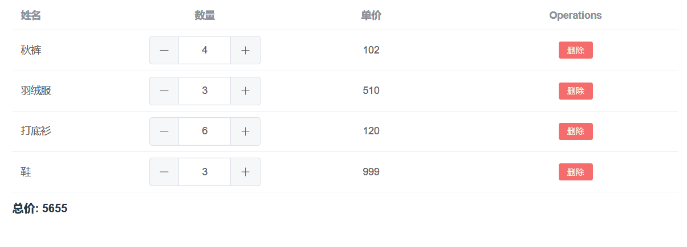


代码实现：
```vue
<script setup lang="ts">
import { computed, reactive, ref } from 'vue'

interface Shop {
  name: string
  num: number
  price: number
}
const $total = ref<number>(0)
const data = reactive<Shop[]>([
  {
    name: '秋裤',
    num: 4,
    price: 102
  },
  {
    name: '羽绒服',
    num: 3,
    price: 510
  },
  {
    name: '打底衫',
    num: 6,
    price: 120
  },
  {
    name: '鞋',
    num: 3,
    price: 999
  }
])


$total.value = computed<number>(() => {
  return data.reduce((prev, next) => {
    return prev + (next.num * next.price)
  }, 0)
})

function handleDelete(index: number): void {
  data.splice(index, 1)
}
</script>

<template>
  <el-table :data="data" style="width: 100%">
    <el-table-column prop="name" label="姓名" width="180" />

    <el-table-column label="数量" width="180" align="center">
      <template #default="scope">
        <div style="display: flex; align-items: center">
          <el-input-number v-model="scope.row.num" :step="1" size="large" :min="0" />
        </div>
      </template>
    </el-table-column>

    <el-table-column prop="price" label="单价" align="center" />
    <el-table-column label="Operations" align="center">
      <template #default="scope">
        <el-button size="small" type="danger" @click="handleDelete(scope.$index)">
          删除
        </el-button>
      </template>
    </el-table-column>
  </el-table>
  <div style="display: flex; align-items: flex-end; padding-top: 10px; font-weight: bold">
    总价: {{ $total }}
  </div>
</template>
```


### watch

与`Vue2.x`中`watch`配置功能一致 ：侦听特定的数据源，并在单独的回调函数中执行副作用。

:::tip 两个小“坑”: 
1. 监视reactive定义的响应式数据时：`oldValue`无法正确获取、强制开启了深度监视（`deep配置失效`）。
2. 监视`reactive`定义的响应式数据中某个属性时：`deep`配置有效。
:::


```javascript
//情况一：监视ref定义的响应式数据
watch(sum,(newValue,oldValue)=>{
	console.log('sum变化了',newValue,oldValue)
},{immediate:true})

//情况二：监视多个ref定义的响应式数据
watch([sum,msg],(newValue,oldValue)=>{
	console.log('sum或msg变化了',newValue,oldValue)
}) 

/* 情况三：监视reactive定义的响应式数据
			若watch监视的是reactive定义的响应式数据，则无法正确获得oldValue！！
			若watch监视的是reactive定义的响应式数据，则默认强制开启了深度监视 
*/
watch(person,(newValue,oldValue)=>{
	console.log('person变化了',newValue,oldValue)
},{immediate:true,deep:false}) //此处的deep配置不再奏效

//情况四：监视reactive定义的响应式数据中的某个属性
watch(()=>person.job,(newValue,oldValue)=>{
	console.log('person的job变化了',newValue,oldValue)
},{immediate:true,deep:true}) 

//情况五：监视reactive定义的响应式数据中的某些属性
watch([()=>person.job,()=>person.name],(newValue,oldValue)=>{
	console.log('person的job变化了',newValue,oldValue)
},{immediate:true,deep:true})

//特殊情况
watch(()=>person.job,(newValue,oldValue)=>{
    console.log('person的job变化了',newValue,oldValue)
},{deep:true}) //此处由于监视的是reactive素定义的对象中的某个属性，所以deep配置有效
```

注意： ref创建的状态直接监听  reactive创建的某个状态要写成函数。


#### 监听路由

```ts
/* 监听路由变化,切换子路由页面时保持tab选中状态 */
watch(
  () => router.currentRoute.value.path,
  (newValue: string) => {
    activeName.value = newValue.split('/')[2]
  },
  { immediate: true }
) 
```


#### watch 的参数

```ts
import { ref, watch } from 'vue'

const message = ref({
  nav:{ bar:{  name:'' } }
})

/* watch 的参数:
 	* 第一个参数：监听源
  * 第二个参数回调函数cb(newVal,oldVal)
  * 第三个参数一个options配置项是一个对象
    {
   		 immediate:true //是否立即调用一次
    	 deep:true //是否开启深度监听
       flush:'pre' // 用于设置watch的执行顺序 (watch基本用不上)
       // pre: 组件更新前调用,sync: 同步调用, post: 组件更新后执行
    } 
 */
watch(message, (newVal, oldVal) => {
  // 如果监听的是引用数据类型，那返回的新值和旧值都一样
  console.log('新的值----', newVal)
  console.log('旧的值----', oldVal)
}, {
  immediate:true,
  deep:true
})
```

#### 监听多个`ref `

注意：监听多个`ref`时应该传入一个数组：

```ts
import { reactive, ref, watch } from 'vue'
 
const message = ref('')
const message2 = ref('')
 
watch([message, message2], (newVal, oldVal) => {
  console.log('新的值----', newVal)
  console.log('旧的值----', oldVal)
})
```

#### 监听reactive

使用`reactive`监听深层对象开启和不开启 `deep` 效果一样 (`deep失效`)


```ts
import { reactive, ref, watch } from 'vue'

const message = reactive({
  nav:{ bar:{ name:'' } }
})

watch(message, (newVal, oldVal) => {
  console.log('新的值----', newVal)
  console.log('旧的值----', oldVal)
})
```

监听单个值时有效：

:::tip 注意：
 如果要监听单一属性，我们需要使用一个get函数返回我们需要监听的属性值
:::

```javascript
import { ref, watch ,reactive} from 'vue'
 
let message = reactive({
    name:'',
  	foo:{
      bar:{
        name: 'liaoyi',
        age: 22
      }
    }
})
 
watch(()=>message.foo.bar.name, (newVal, oldVal) => {
    console.log('新的值----', newVal)
    console.log('旧的值----', oldVal)
})
```

### watchEffect
立即执行传入的一个函数，并响应式追踪其依赖，并在其依赖变更时重新运行该函数


```vue
<script setup lang="ts">
// 第一次加载组件，会触发watchEffect回调
// watchEffect所指定的回调中用到的数据只要发生变化,就会触发callback执行
// 类似于周期函数中的 mounted和updated「只不过只有更改了依赖的状态才会在更新后执行」

const message = ref<string>('hello')
const message2 = ref<string>('2023')

// 用到几个响应式数据就会监听几个，且是非惰性 会默认调用一次(立即调用)
watchEffect(() => {
  console.log('watchEffect配置的回调执行了', message.value,)
  console.log('watchEffect配置的回调执行了', message2.value)
})
</script>

<template>
  <input v-model="message" type="text">
  <input v-model="message2" type="text">
</template>
```


#### 清除副作用
> 可以在触发监听之前会调用一个函数可以处理你的逻辑，例如防抖。

```ts
import { ref, watchEffect } from 'vue'

const message = ref<string>('hello')
const message2 = ref<string>('2023')

watchEffect((oninvalidate) => {
  console.log('message', message.value)
  console.log('message2', message2.value)
  // 回调函数会先执行
  oninvalidate(()=>{
    console.log('before')
  })
})
```

#### 停止监听
> 我们可以手动停止停止 watchEffect 监听，跟踪 watchEffect 返回一个函数， 调用之后将停止更新。

```vue
<script setup lang="ts">
const message = ref<string>('hello')
const message2 = ref<string>('2023')

const stop = watchEffect((oninvalidate) => {
  console.log('message', message.value)
  console.log('message2', message2.value)
  oninvalidate(()=>{
    console.log('before')
  })
})
const stopWatch = () => stop()
</script>

<template>
  <input v-model="message" type="text">
  <input v-model="message2" type="text">
  <button @click="stopWatch">
    停止监听<button />
  </button>
</template>
```

#### 其它的一些配置项

副作用刷新时机 flush配置, 一般使用post

| **pre** | **sync** | **post** |
| --- | --- | --- |
| 组件**更新前**执行 | 强制效果始终同步触发 | 组件**更新后**执行 |


```ts
// onTrigger是vue给我们在开发环境时提供的debugger函数  可以帮助我们调试 watchEffect
import { ref, watchEffect } from 'vue'

const message = ref<string>('')
watchEffect((oninvalidate) => {
  console.log('message2', message.value)
}, {
  flush:'post',
  onTrigger() {
    debugger
  }
})
```

:::tip **watch 和 watchEffect 总结：**
- watch 的套路：
  - 既要指明监视的属性，也要指明监视的回调。
- watchEffect 的套路：
  - 不用指明监视哪个属性，监视的回调中用到哪个属性，那就监视哪个属性。 
  - watchEffect 有点像 `computed`，但`computed`注重的计算出来的值（回调函数的返回值）,所以必须要写返回值;而 `watchEffect` 更注重的是过程（回调函数的函数体），所以不用写返回值。
:::


## 生命周期
> 简单来说就是一个组件从创建到销毁的过程,称为生命周期。

::: details  **vue2.x的生命周期**
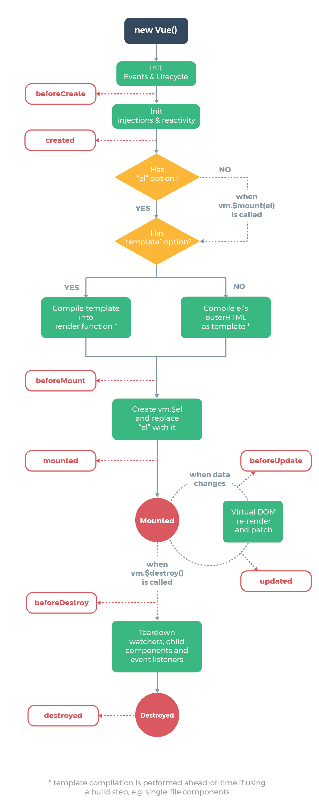
:::


### vue3 的生命周期


### 生命周期钩子

Vue3.0中可以继续使用Vue2.x中的生命周期钩子，但有两个被更名：

- `beforeDestroy`改名为 `beforeUnmount`
- `destroyed`改名为 `unmounted`

Vue3.0也提供了 Composition API 形式的生命周期钩子，与Vue2.x中钩子对应关系如下：`beforeCreate`===>  `setup()`    根元素还不存在（ 啥也没有）
`created`=======> `setup()`    有数据但没有 DOM
`beforeMount` ===>   `onBeforeMount` 有数据但没有 DOM
`mounted`=======> `onMounted`  有数据也有 DOM
`beforeUpdate`===>  `onBeforeUpdate`
`updated` =======> `onUpdated`
`beforeUnmount` ==>   `onBeforeUnmount`
`unmounted` =====>   `onUnmounted`

注意：在我们使用Vue3 组合式API时，是没有 beforeCreate 和 created 这两个生命周期的 。

| **选项式API** | **Hook inside setup** | **说明** |
| --- | --- | --- |
| beforeCreate | Not needed* | 
 |
| created | Not needed* |  |
| beforeMount | onBeforeMount | 组件创建之前，无法获取dom |
| mounted | onMounted | 创建完成，可以获取dom |
| beforeUpdate | onBeforeUpdate | 更新前，获取的是更新前dom |
| updated | onUpdated | 更新完成，获取的是更新后的dom |
| beforeUnmount | onBeforeUnmount | 组件销毁之前 |
| unmounted | onUnmounted | 组件销毁完成 |
| errorCaptured | onErrorCaptured |  |
| renderTracked | onRenderTracked |  |
| renderTriggered | onRenderTriggered | 接收一个target，用于调试 |
| activated | onActivated |  |
| deactivated | onDeactivated |  |


## 组件通讯

### defineProps 父传子

:::tip 💭
父组件通过 v-bind 绑定一个数据，子组件通过`defineProps`接收, 且无须引入，可以在模板直接使用。
:::


父组件：

```vue
<script setup>
import { reactive } from 'vue'

const list = reactive(['子鼠', '丑牛', '寅虎', '卯兔'])
const item = reactive({ name: 'liaoyi', phone: '13245666776' })
</script>

<template>
  <Children title="我是标题" :list="list" :item="item" />
</template>
```

子组件：

```vue
<script setup>
// defineProps无需 import 导入
defineProps({
  title:{
    type: String,
    default: 'Hello 2023!'
  },
  list: {
    type: Array,
    required: true  // 设置为必传
  },
  item:{
    type: Object,
    default: () => {}
  } 
})
</script>

<template>
  <div> {{ title }} </div>
  <div v-for="(item, index) in list" :key="index">
    {{ item }}
  </div>
  <div> 姓名：{{ item.name }} 电话： {{ item.phone }}</div>
</template>
```

:::tip 💭
如果我们在 `script` 标签中想使用 `props` ，需要用一个变量接收。即使我们用常量接收了 `props，我们在模板中还是可以直接使用，不需 {**{props.item}**}
:::

```vue
<script setup>
const props = defineProps({
  title: {
    type: String,
    default: 'Hello 2023!'
  },
  list: {
    type: Array,
    required: true // 设置为必传
  },
  item: {
    type: Object,
    default: () => {}
  }
}) 
// 使用 props
console.log('props', props.item)
</script>
```


##### 在ts中使用
如果你使用 ts ，我们可以使用传递字面量类型的纯类型语法做为参数的方式接收props：
```vue
<script setup lang="ts">
defineProps<{
  	title: string
  	list: number[]
  item: object
}>()
</script>


<template>
  <div> {{ title }} </div>
  <div v-for="(item, index) in list" :key="index">
    {{ item }}
  </div>
  <div> 姓名：{{ item.name }} 电话： {{ item.phone }}</div>
</template>
```
上面的写法，无法约束props的默认值，我们可以使用 TS 特有的默认值方式：

:::tip 💭
 withDefaults( ) 函数也是无须引入开箱即用接收一个 defineProps 函数，第二个参数是给一个对象,我们可以设置不同props的默认值。
:::

```vue
<script setup lang="ts">
interface Item {
  name?: string
  phone?: string
}
  
// 采用ts专有声明，有默认值
/* interface Props {
  		title: string;
  		list?: string[];
  		item: Item;
} */
  
interface Props {
  title: string
  list?: string[]
  item: Item
}
  
withDefaults(defineProps<Props>(), {
  title: '张三',
  list: () => []
})
</script>

<template>
  <div>{{ title }}</div>
  <div v-for="(item, index) in list" :key="index">
    {{ item }}
  </div>
  <div>姓名：{{ item.name }} 电话： {{ item.phone }}</div>
</template>
```


```vue
<!-- 父组件  -->
<Children :paging="paging" />

<script setup lang="ts">
const paging = reactive({
  		limit: 101,
  		total: 999
})
</script>


// 子组件
<script setup lang="ts">
interface IPagenation {
  limit: number
  total: number
  page?: number
  pagesizes?: Array<number>
  background?: boolean
  layout?: any
  autoScroll?: boolean
}

const props = withDefaults(
  defineProps<{
    paging: IPagenation
  }>(),
  {
    paging: (): IPagenation => {
      return {
        limit: 1,
        total: 9
      }
    }
  }
)
</script>

<template>
  <div>{{ paging.limit }} -- {{ paging.total }} </div>
</template>
```

### defineEmits 子向父事件传递
```vue
<script setup lang="ts">
import { reactive } from 'vue'

/* 非ts */
// const emit = defineEmits(['on-click'])

/* ts专有 */
const emit = defineEmits<{
  (e: 'on-click', list: number[]): void
  // (e: 'ochange', name: string ): void; 多个写法
}>()

const list = reactive<number[]>([4, 5, 6])

function clickThis() {
  emit('on-click', list)
}
</script>

<template>
  <button @click="clickThis">
    点我给父组件传值
  </button>
</template>
```

父组件接收自定义事件：
```vue
<script setup lang="ts">
function getList(list: number[]) {
  console.log('父组件接受子组件数据', list)
}
</script>

<template>
  <children @on-click="getList" />
</template>
```

### defineExpose 子向父暴露属性

:::tip 💭
 在使用vue2开发时，我们经常使用 `ref` 来获取子组件的数据、方法等，但在vue3 中setup语法糖模式时，会返回 `{_v_skin:true}` 这个信息，表示数据无法响应，这个时候我们需要使用 defineExpose 来暴露当前组件的一些属性、方法。点击查看 [vue3 definEexpose](https://cn.vuejs.org/api/sfc-script-setup.html#defineexpose)。
:::

子组件暴露方法和属性：

```vue
<script setup lang="ts">
import { reactive, ref } from 'vue'
  
const list = reactive<number[]>([4, 5, 6])
const title = ref('Hello 2023！！！')
  
function handleNodeClick() {
  console.log('我是暴露的方法~~')
}

// 将属性、方法暴露出去
defineExpose({ 
  list,
  title,
  name: 'liaoyi',
  handleNodeClick,
  open: ()=>{
    console.log('~~~~~')
  }   
})
</script>

<template>
  <div>  我是子组件  </div>
</template>
```

我们从父组件获取子组件实例通过ref

::: code-group

```vue [示例1]
<script setup lang="ts">
// ts写法 --这样获取是有代码提示的
// 使用ts自带的工具 InstanceType,它接收一个泛型，我们再通过 typeof 读取 childRef 的类型
const childRef = ref<InstanceType<typeof childRef>>()

/* 非ts */
// const childRef = ref()

function handleClick() {
  console.log(childRef.value)
  childRef.value.handleNodeClick()
}
</script>

<template>
  <children ref="childRef" @on-click="getList" />
  <button @click="handleClick">
    获取children组件暴露参数
  </button>
</template>
```

```js [示例二]
// 子组件 tree
const handleNodeClick = () => {
 console.log('要执行的方法')
}
//将方法暴露出
defineExpose({ handleNodeClick})


// 父组件  通过ref
<tree :show="show"  ref="treeRef"> </tree>   
const treeRef = ref()
```
:::


### provide 、inject 依赖注入

:::tip 💭
依赖注入用于实现祖与后代组件间通信 ，父组件有一个 `provide` 选项来提供数据，后代组件有一个 `inject` 选项来接收使用这些数据 。
:::

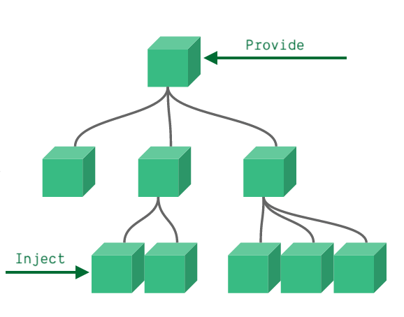

####  具体写法

::: code-group

```javascript [1. 祖组件中]
let car = reactive({name:'奔驰',price:'40万'})
// 传递响应式数据
provide('car',car)
```

```javascript [2. 后代组件中接收]
 const car = inject('car')
```
:::


实例：

::: code-group

```vue [父级组件]
<script setup lang="ts">
import { provide, readonly, ref } from 'vue'

const colorVal = ref<string>('red')
// provide 默认是可以让子组件修改的
provide('color', colorVal)
// 如果不想要被修改
provide('bg', readonly(colorVal))
</script>

<template>
  <el-card class="box-card">
    <template #header>
      <div class="card-header">
        <span>provide、inject 依赖注入</span>
      </div>
    </template>
    <div>
      <label>
        <input v-model="colorVal" value="red" type="radio" name="color">
        红色
      </label>
      <label>
        <input v-model="colorVal" value="green" type="radio" name="color">
        绿色
      </label>
      <label>
        <input v-model="colorVal" value="blue" type="radio" name="color">
        蓝色
      </label>
      <label>
        <input v-model="colorVal" value="orange" type="radio" name="color">
        橙色
      </label>
    </div>

    <div class="box" />
    

    <ProvideA />
  </el-card>
</template>

<style>
.box-card {
  margin-top: 30px;
}
.box {
  margin-top: 10px;
  width: 80px;
  height: 80px;
  /* vue3新增语法糖,css可以使用v-band() 变量动态绑定 */
  background-color: v-bind(colorVal);
}
</style>

```

```vue [子组件]
<script setup lang="ts">
import { inject } from 'vue'

// 直接使用 inject 会提unknown类型，因为我们传入的是ref类型的string，我们在这里传入泛型
import type { Ref } from 'vue'

const color = inject<Ref<string>>('color')
</script>

<template>
  <h3>provideA.vue (儿子级别组件)</h3>
  <div class="box" />
  <ProvideB />
</template>

```

```vue [孙组件]
<script setup lang="ts">
import { inject } from 'vue'
import type { Ref } from 'vue'

const color = inject<Ref<string>>('color')
const bg = inject<Ref<string>>('bg')

function change() {
  // 可选链操作符无法赋值，因为返回的类型可能是 Ref<string> 或者 undefined
  // 解决方式有两种
  // 1. 使用非空断言
  color!.value = 'pink'
}

function changeBg() {
  bg!.value = 'blue'
}

// 2. 传入默认值的方式
// const color = inject<Ref<string>>('color',ref('red'));
</script>

<template>
  <h3>provideB.vue (孙子级别组件)</h3>
  <div style="margin-bottom: 20px">
    <el-button @click="change">
      修改provide为 pink
    </el-button>
    <el-button @click="changeBg">
      修改provide值 - (!设置了 readonly)
    </el-button>
  </div>
  <div class="box" />
</template>
```
:::


效果：
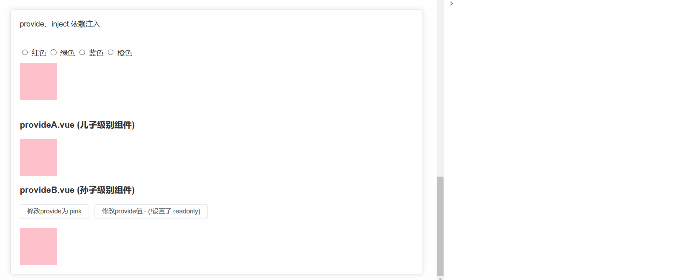


### globalProperties 全局属性
```javascript
const app = createApp(App);
app.config.globalProperties.$user = {
    name: '梅长苏',
    weapons: '长剑',
    title: '刺客'
}

<p>姓名：{{$user.name}} </p>

const { proxy } = getCurrentInstance()
console.log(proxy.$user)
```

### getCurrentInstance 获取组件实例
> 获取当前组件实例

```javascript
const { proxy } = getCurrentInstance()
console.log(proxy.$user)
```


## 动态组件
> 动态组件就是：让多个组件使用同一个挂载点，并动态切换。


### vue2 写法
```vue
<script>
import A from './z-a.vue'
import B from './z-b.vue'
import C from './z-c.vue'

export default {
  components: { A, B, C },
  data() {
    return {
      componentId: 'A', // 默认显示的组件
      tabList: [
        { name: 'A组件', com: 'A' },
        { name: 'B组件', com: 'B' },
        { name: 'C组件', com: 'C' }
      ]
    }
  },
  methods: {
    changeTab(item) {
      this.componentId = item.com
    }
  }
}
</script>

<template>
  <div>
    <div style="display: flex">
      <div
        v-for="(item, index) in tabList" :key="index"
        class="tab-item"
        :class="[{ active: item.com === componentId }]"
        @click="changeTab(item)"
      >
        {{ item.name }}
      </div>
    </div>
    <!-- 1. component标签是vue内置的 作用：组件的占位符 -->
    <!-- 2. is属性的值，表示要渲染的组件的名字(组件在components节点下的注册名称) -->
    <!-- 使用keep-alive 把组件进行缓存，而不是销毁组件 -->
    <keep-alive>
      <component :is="componentId" />
    </keep-alive>
  </div>
</template>
```
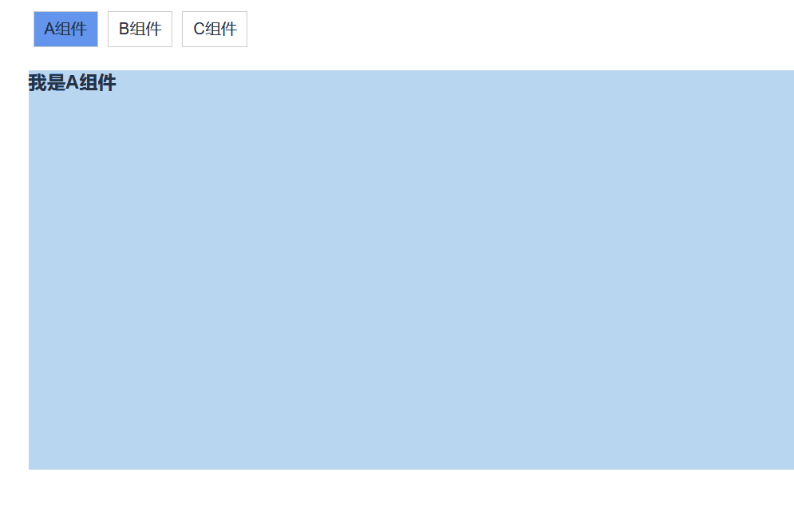


### vue3 写法
在vue3中我们会尝试这么写：

```vue
<script setup>
import { markRaw, reactive, shallowRef } from 'vue'
import A from './z-a.vue'
import B from './z-b.vue'
import C from './z-c.vue'


const componentId = ref(A)

const tabList = reactive([
  {
    name: 'A组件',
    com: A
  },
  {
    name: 'B组件',
    com: B
  },
  {
    name: 'C组件',
    com: C
  }
])

function changeTab(item) {
  componentId.value = item.com
}
</script>

<template>
  <div>
    <div style="display: flex">
      <div
        v-for="(item, index) in tabList" :key="index"
        class="tab-item"
        :class="[{ active: item.com === componentId }]"
        @click="changeTab(item)"
      >
        {{ item.name }}
      </div>
    </div>
    <component :is="componentId" />
  </div>
</template>

<style scoped>
.tab-item {
  border: solid 1px #ccc;
  padding: 5px 10px;
  margin: 5px;
  cursor: pointer;
}
.active {
  background-color: cornflowerblue;
}
</style>

```
在Vue2 的时候 is 是通过组件名称切换的, 在Vue3 setup 是通过组件实例切换的，这么写控制台会给出警告:


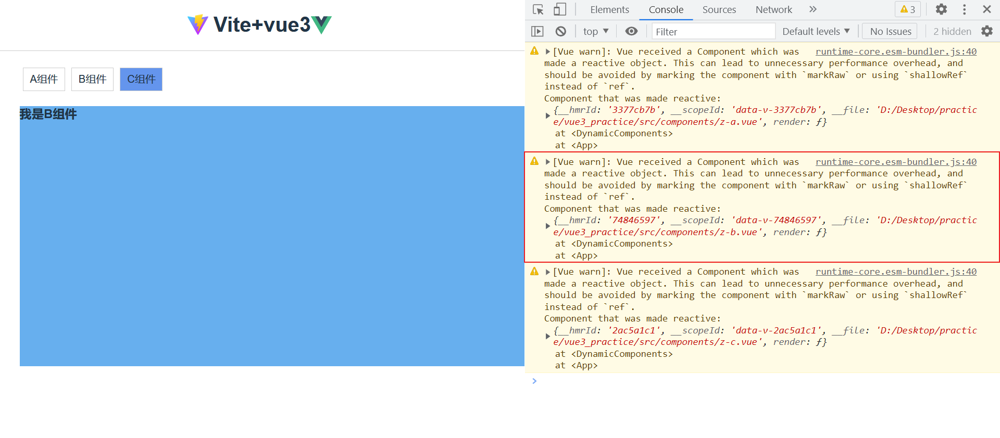

> 这是因为 `reactive` 会进行 `proxy `代理，而我们组件代理之后毫无用处，为了节省性能开销,vue推荐我们使`shallowRef` 或者 `markRaw` 跳过 `proxy` 代理来标记组件或使用。


```vue
<script setup>
import { markRaw, reactive, shallowRef } from 'vue'
import A from './z-a.vue'
import B from './z-b.vue'
import C from './z-c.vue'


// 这里也需要使用 shallowRef 去指定默认的
const componentId = shallowRef(A)

const tabList = reactive([
  {
    name: 'A组件',
    // vue源码中,使用markRaw时,会给这个对象加一个 __slip__属性,reactive如果碰到这个属性,会跳过 proxy 代理
    com: markRaw(A)
  },
  {
    name: 'B组件',
    // 也可以使用 shallowRef 不进行对象的响应式处理
    com: shallowRef(B)
  },
  {
    name: 'C组件',
    com: markRaw(C)
  }
])

function changeTab(item) {
  componentId.value = item.com
}
</script>
```


### 组合式写法

当然你也可以使用双 script 的方式来使用动态组件 （组合式和响应式api结合）:

```vue
<script setup>
import { reactive, ref } from 'vue'
import A from './z-a.vue'
import B from './z-b.vue'
import C from './z-c.vue'


const componentId = ref('A')

const tabList = reactive([
  { name: 'A组件', com: 'A' },
  { name: 'B组件', com: 'B' },
  { name: 'C组件', com: 'C' }
])

function changeTab(item) {
  componentId.value = item.com
}
</script>

<script>
// 使用vue2 的方式导入组件
export default {
  components: { A, B, C }
}
</script>
```

## slot 插槽

:::tip 💭
插槽就是子组件中的提供给父组件使用的一个占位符，用<slot></slot> 表示，父组件可以在这个占位符中填充任何模板代码，如 HTML、组件等，填充的内容会替换子组件的<slot></slot>标签。
:::

### 匿名插槽
1. 定义一个子组件
```vue
<template>
  <div>
    <h3> 我是子组件 </h3>
    <slot />
  </div>
</template>
```

2. 父组件使用,给子组件填充内容
```vue
<template>
  <Children>
    <!--   template写法使用插槽,在编译时会忽略这个标签   -->
    <template #default>
      <div>我是插槽内容！</div>
    </template>
  </Children>
</template>

/*  直接填充插槽写法
    <Children>
      <div>我是插槽内容！</div>
    </Children> 
*/
```


### 具名插槽

:::tip 💭
具名插槽其实就是给插槽取个名字。一个子组件可以放多个插槽，而且可以放在不同的地方，而父组件填充内容时，可以根据这个名字把内容填充到对应插槽中。
:::

```vue
<div>
  <slot name="header"></slot>
  <slot></slot>
  <slot name="footer"></slot>
</div>
```

父组件使用：
```vue
<template>
  <Children>
    <template #header>
      <div>我是头部插槽</div>
    </template>
    <template #default>
      <div>我是默认插槽</div>
    </template>
    <template #footer>
      <div>我是底部插槽</div>
    </template>
  </Children>
</template>
```
简写方式：
```vue
<template>
  <Children>
    <!--  header不传将会展示子组件内定义的默认样式  -->
    <template #header>
      <div>我是头部插槽</div>
    </template>
    <template #default>
      <div>我是默认插槽</div>
    </template>
    <template #footer>
      <div>我是底部插槽</div>
    </template>
  </Children>
</template>
```

### 作用域插槽

> 在子组件动态绑定参数,派发给父组件的slot去使用。

```vue
<script setup lang="ts">
import { reactive } from 'vue'

interface names {
  name: string
  age: number
}
const data = reactive<names[]>([
  { name: 'liaoyi', age: 22 },
  { name: '李欣', age: 24 },
  { name: '夏琪', age: 20 },
  { name: '张三', age: 26 }
])
</script>

<template>
  <div class="child">
    <slot name="header" />
    <div v-for="(item, index) in data" :key="index">
      <slot :data="item" />
    </div>
    <slot name="footer" />
  </div>
</template>
```

父组件通过ES6解构方式获取值：

```vue
<template>
  <Children>
    <template #header>
      <div>我是头部插槽</div>
    </template>
    <template #default="{ data, index }">
      <div>{{ index }} -- {{ data.name }} -- {{ data.age }}</div>
    </template>
    <template #footer>
      <div>我是底部插槽</div>
    </template>
  </Children>
</template>
```


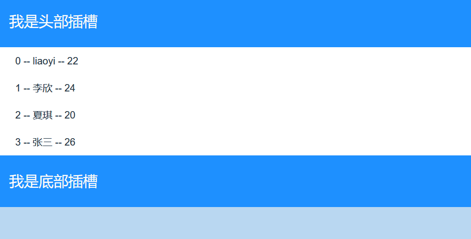

### 动态插槽


> 插槽可以是一个变量名

```vue
<script setup>
import { ref } from 'vue'

const slotName = ref('header')
</script>

<template>
  <Children>
    <template #[name]>
      <div> 动态插槽 </div>
    </template>
  </Children>
  <button @click="slotName = 'default'">
    修改插槽
  </button>
</template>
```

## keep-alive 缓存组件

:::tip 💭
有时候我们不希望组件被重新渲染影响使用体验 (比如切换多个表单组件时不想表单被清空), 或者处于性能考虑，避免多次重复渲染降低性能。而是希望组件可以缓存下来,维持当前的状态。这时候就需要用到`keep-alive`组件。
:::


开启 keep-alive 后会新增两个生命周期，`onActivated` 和 `onDeactivated`。
下面是生命周期变化：

- 初次进入时： 先触发 `onMounted` 然后触发 `onActivated`
- 退出后触发 `onDeactivated`
- 再次进入：只会触发 `onActivated`


:::tip 💭
所以我们可以从上总结出，如果一些组件中定义的方法，只想执行一次，就放在 onMounted 中，如果组件每次进入后都要执行的方法就放在 onActivated 中。
:::

### 基本使用


```vue
<!-- 基本 -->
<keep-alive>
  <component :is="view"></component>
</keep-alive>
 
<!-- 多个条件判断的子组件 -->
<keep-alive>
  <comp-a v-if="a > 1"></comp-a>
  <comp-b v-else></comp-b>
</keep-alive>
 
<!-- 和 `<transition>` 一起使用 -->
<transition>
  <keep-alive>
    <component :is="view"></component>
  </keep-alive>
</transition>
```

### include 和 exclude

> `include` 和 `exclude` 允许组件有条件地缓存。二者都可以用逗号分隔字符串、正则表达式或一个数组来表示。

```vue
<!-- 注意在 setup语法糖中，组件name 默认为组件文件名  -->
// include 定义需要缓存的组件 
<keep-alive :include="['compA','compB']">
   <compA />
   <compB />
</keep-alive>

// exclude: 定义不缓存的组件 
<keep-alive :exclude="['compA']">
   <compA />
   <compB />
</keep-alive>

// max: 指定缓存组件的最大数量 (比如有11个组件,只想缓存9个) 会优先缓存活跃组件 
<keep-alive :max="10">
  <component :is="view"></component>
</keep-alive>
```

## 自定义hook函数

-  什么是hook？—— 本质是一个函数，把setup函数中使用的 **`Composition API`** 进行了封装。 
-  类似于`vue2.x`中的 `mixin`。 
-  自定义`hook`的优势: 复用代码, 让setup中的逻辑更清楚易懂。 

## 其它 Composition API

vue3 到底给我们提供了多少 API 呢，我们可以在`main.js`中输出一下:

```javascript
import * as Vue from 'vue';
console.dir(Vue); 
```

控制台输出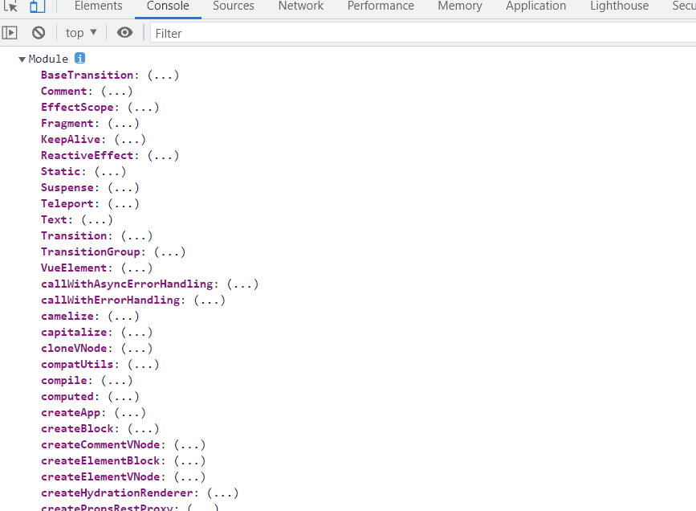

### ref 其它 api

#### isRef

> `isRef`: 用与判断是不是一个ref对象, vue源码中用的比较多。

```typescript
import { ref,isRef } from 'vue'
let message: Ref<string | number> = ref("我是message")
let notRef:number = 123
const changeMsg = () => {
  message.value = "change msg"
  console.log(isRef(message)); //true
  console.log(isRef(notRef)); //false
}
```


#### shallowRef

`shallowRef`：只处理基本数据类型的响应式, 不进行对象的响应式处理。 

```typescript
<template>
  <div>
    <button @click="changeRef">改变ref</button>
    <button @click="changeShallowRef">改变shallowRef</button>
    <div>ref: {{ refObj.name }}</div>
    <hr>
    <div>shallowRef: {{ shallowRefObj.name }}</div>
  </div>
</template>
 
<script setup>
import { ref, shallowRef } from 'vue'
// ref 深层次响应数据  shallowRef 浅层次响应数据
let refObj = shallowRef({
  name: "liaoyi"
}) 
// 创建一个跟踪自身 .value 变化的 ref，但不会使其值也变成响应式的
let shallowRefObj = shallowRef({
  name: "liaoyi"
})

const changeRef = () => {
  refObj.value.name = '王二狗'
}

const changeShallowRef = () => {
  // 因为其属性是非响应式，虽然数据变了但是页面不会更新
  shallowRefObj.value.name = '张全蛋'
  // 我们可以给shallowRefMessage对象直接复赋值
  shallowRefObj.value = { name: '李四' }
}

// 下面这种写法是错误的
//  ref 和 shallowRef 不能一起使用，会影响shallowRef 造成视图更新
const changeMsg = () => {
	refObj.value.name = '王二狗'
  shallowRefMessage.value = '我被影响了，导致视图更新！'
}
</script>
```

#### triggerRef

**triggerRef**： 用于强制更新页面DOM。

上面的代码里，我们在一个方法中同时修改`ref`和 `shallowRef` 值，出现了影响 `shallowRef` 造成视图更新的现象，那这个问题是如何产生的呢 ？这时候我们就可以介绍 **triggerRef** 。因为使用 `ref` 更改值的时候，`ref` 底层中会调用一次 `triggerRef` 方法，所以才会影响 `shallowRef` 造成视图更新。为了更好的理解，你也可以把`ref`想象成 `shallowRef` + `triggerRef` 结合。

```typescript
<template>
  <div>
    <button @click="changeMsg">change</button>
    <div>{{ message }}</div>
  </div>
</template>
 
 
<script setup>
import { Ref, shallowRef,triggerRef } from 'vue'

let message = shallowRef({
  name: "小满"
})
 
const changeMsg = () => {
  message.value.name = '大满'
  triggerRef(message)
}
</script> 
 
 
<style>
</style>
```
#### customRef

作用：用于创建一个自定义的 ref，并对其依赖项跟踪和更新触发进行显式控制。 

如实现防抖效果： 

```vue
<!-- 简单理解： customRef 是个工厂函数  -->
<!-- 要求我们返回一个对象 并且实现 get 和 set  适合去做防抖之类的 -->
<script setup>
import { customRef, ref } from 'vue'

// let keyword = ref('hello') //使用Vue准备好的内置ref
//自定义一个myRef
function myRef(value, delay) {
  let timer
  /**
 		* 通过customRef去实现自定义
 		* @param { callback } track - 用于收集依赖
 		* @param { callback } trigger - 用于处理依赖
 		*/
  return customRef((track, trigger)=>{
    return {
      get() {
        track() //告诉Vue这个value值是需要被“追踪”的
        return value
      },
      set(newValue) {
        clearTimeout(timer)
        timer = setTimeout(()=>{
          value = newValue
          trigger() //告诉Vue去更新界面
        }, delay)
      }
    }
  })
}
const keyword = myRef('hello', 500) //使用程序员自定义的ref
</script>

<template>
  <input v-model="keyword" type="text">
  <h3>{{ keyword }}</h3>
</template>
```

### reactive 其它api 

#### shallowReactive

`shallowReactive`：只处理对象最外层属性的响应式（浅响应式）。 

```vue
<script setup lang="ts">
import { shallowReactive } from 'vue' 
 
const obj = {
  a: 1,
  first: {
    b: 2,
    second: {
      c: 3
    }
  }
}
 
const state = shallowReactive(obj)
 
function change1() {
  // 虽然 state.a 值改变了，但视图不会更新
  state.a = 7
}
function change2() {
  // 只能到获取到对象的第一层数据
  state.first.b = 8 
  state.first.second.c = 9
  console.log(state)
}
</script>
 
<template>
  <div>
    <div>{{ state }}</div>
    <button @click="change1">
      test1
    </button>
    <button @click="change2">
      test2
    </button>
  </div>
</template> 
```


#### readonly 与 shallowReadonly


`readonly`: 让一个响应式数据变为只读，并且是深度只读（深只读）。


```vue
<script setup lang="ts">
import { reactive, readonly, ref, } from 'vue'

const state = reactive({
  name:'liaoyi',
  age:12,
  car:{
    name:'奔驰',
    color:'red'
  }
})
const state2 = readonly(state)
function update() {
  // 无法修改 state2为只读
  state2.name += '---'
  state2.car.name += '---'
}
</script>

<template>
  <h2>readonly</h2>
  <h3> {{ state }}</h3>
  <button @click="update">
    更新数据
  </button>
</template>
```

`shallowReadonly`：让一个响应式数据变成浅层的属性为只读，深层次属性可以修改（浅只读）。


```vue
<script setup lang="ts">
import { reactive, readonly, ref, } from 'vue'

const state = reactive({
  name:'liaoyi',
  age:12,
  car:{
    name:'奔驰',
    color:'red'
  }
})
const state2 = shallowReadonly(state)
function update() {
	  // state2.name += '---'   无法修改浅层次值
  state2.car.name += '---'  // 深层次值可以被修改
	  console.log('数据变化了~')
}
</script>
```
:::tip 💭
应用场景:**不希望数据被修改时。**
:::


#### 什么时候使用 shallowReactive 与 shallowRef ? 

:::tip 💭
- 如果有一个对象数据，结构比较深, 但变化时只是外层属性变化 ===> shallowReactive。
- 如果有一个对象数据，后续功能不会修改该对象中的属性，而是生新的对象来替换 ===> shallowRef。
:::

### toRef 与 toRefs
<br/>

#### toRef

> **toRef** 只能用于响应式数据，非响应式数据使用时视图不会有变化 (毫无卵用)。
> 使用： 接收两个参数：第一个参数是响应式对象，第二个参数为对象的key。 类似于vue2中的$set。


```vue
<script setup lang="ts">
import { reactive, toRef } from 'vue'

const obj = { foo: 1, bar: 1 }

// bar 转化为响应式对象
const state = toRef(obj, 'bar')

const main = reactive({ name: 'liaoyi', like: 'Code' })
const like =  toRef(obj, 'like')
  
function change() {
  // 数据虽然发生变化，但是视图不会更新
  state.value ++
  console.log(obj, state)
}

function changeState() {
  like.value  = 'reap'
  console.log(like)
}
</script>
 
<template>
  <div>
    <button @click="change">
      非响应式数据使用toRef后修改值
    </button>
    <button @click="changeState">
      响应式数据使用toRef后修改值
    </button>
    {{ state }}
  </div>
</template>
```

#### toRefs 

前面我们其实使用过`toRefs`，它批量创建`ref`对象，方便我们解构使用。

```js
import { reactive, toRefs } from 'vue'

const obj = reactive({
  foo: 1,
  bar: 1
})
 
const { foo, bar } = toRefs(obj)
 
foo.value++
console.log(foo, bar)
```

### toRaw 与 markRaw

<br/>

#### toRaw

- 作用：将一个由`reactive`生成的 响应式对象 转为 普通对象。
- 使用场景：用于读取响应式对象对应的普通对象，对这个普通对象的所有操作，不会引起页面更新。

```js
import { reactive, toRaw } from 'vue'
 
const obj = reactive({
  foo: 1,
  bar: 1
})
 
const state = toRaw(obj)
// 响应式对象转化为普通对象
 
function change() {
  console.log(obj, state)
}
```


#### markRaw
`**markRaw**`： 用于标记一个对象，使其永远不会再成为响应式对象。
**应用场景: **

1. 有些值不应被设置为响应式的，例如复杂的第三方类库等。
2. 当渲染具有不可变数据源的大列表时，跳过响应式转换可以提高性能。


### 响应式数据的判断
`isRef`: 检查一个值是否为一个 ref 对象
`isReactive`: 检查一个对象是否是由 `reactive` 创建的响应式代理
`isReadonly`: 检查一个对象是否是由 `readonly` 创建的只读代理
`isProxy`: 检查一个对象是否是由 `reactive` 或者 `readonly` 方法创建的代理

## vuex 使用
> vue3中使用的是vuex4版本，我们不在使用import方式导入vuex，而是使用官方提供的函数式api方式使用。参考链接：[vuex4.x 官网](https://vuex.vuejs.org/zh/guide/#%E6%9C%80%E7%AE%80%E5%8D%95%E7%9A%84-store)


1. 在项目根目录 新建`store/index.js `文件：

```javascript
import { createStore, createLogger } from 'vuex';
const env = process.env.NODE_ENV; // 开发环境变量
const store = createStore({
    state: { x: 0, y: 10 },
    mutations: {
        changeX(state, payload = 1) {
            state.x += +payload;
        },
        changeY(state, payload = 1) {
            state.y -= +payload;
        }
    },
    actions: {
        changeYAsync({ commit }, payload) {
            setTimeout(() => {
                commit('changeY', payload);
            }, 1000);
        }
    },
   // 开发环境开启Logger调试
    plugins: env === "production" ? [] : [createLogger()]
});
export default store
```


:::tip 💭
`createLogger `是vuex内置的插件，方便我们在开发时使用vuex时控制台返回日志输出，如果你不了解vuex内置插件 [Vuex 内置 Logger 插件](https://vuex.vuejs.org/zh/guide/plugins.html#%E5%86%85%E7%BD%AE-logger-%E6%8F%92%E4%BB%B6)。
:::


2. 在`main.j`文件上导入store:

```javascript
import { createApp } from 'vue';
import App from './App.vue';
import store from './store/index';

const app = createApp(App);
app.use(store);
app.mount('#app');
```

3. 在组件中使用
```javascript
<template>
  测试Vuex公共状态管理 
  x:{{ x }} 
  y:{{ y }} 
  <button @click="setX(10)">改变X</button>
  <button @click="setY(2)">改变Y</button>
</template>

<script>
import { computed, ref, reactive } from "vue"
import { useStore } from "vuex"

export default {
  name: "Test",
  setup() {
    const store = useStore();
    let x = computed(() => store.state.x)
    let y = computed(() => store.state.y)

    const setX = (val) => {
      store.commit("changeX", val)
    }
    const setY = (val) => {
      store.dispatch("changeYAsync", val)
    }

    return { x,  y, setX, setY };
  },
};
</script>
```


注意：在vue3中的setup中无法通过辅助函数的方式操作store。

## Router 使用

1. 在根目录新建 `router/index.js `文件写入:

```javascript
import { createRouter, createWebHashHistory } from "vue-router";
import Vote from "@/pages/Vote.vue";
import Test from "@/pages/Test.vue";

const routes = [{
    path: '/',
    component: Vote,
}, {
    path: '/test',
    component: Test,
}, {
    path: '/:pathMatch(.*)*',
    redirect: '/'
}]

const router = createRouter({
    history: createWebHashHistory(),
    routes
})
export default router;
```

2. 在main.js 导入

```javascript
import { createApp } from 'vue';
import App from './App.vue';
import router from "./router/index";

const app = createApp(App);
app.use(router);
app.mount('#app');
```

## 其他改变

## 全局API的转移

Vue 2.x 有许多全局 API 和配置, 例如：注册全局组件、注册全局指令等。 

```javascript
//注册全局组件
Vue.component('MyButton', {
  data: () => ({
    count: 0
  }),
  template: '<button @click="count++">Clicked {{ count }} times.</button>'
})

//注册全局指令
Vue.directive('focus', {
  inserted: el => el.focus()
}
```

:::tip 💭
  `Vue3.0` 中对这些API做出了调整, 将全局的 `API`，即：`Vue.xxx`调整到应用实例（`app`）上。 
:::

| 2.x 全局 API（Vue） | 3.x 实例 API (app) |
| --- | --- |
| Vue.config.xxxx | `app.config.xxxx` |
| Vue.config.productionTip | `移除` |
| Vue.component | `app.component` |
| Vue.directive | `app.directive` |
| Vue.mixin | `app.mixin` |
| Vue.use | `app.use` |
| Vue.prototype | `app.config.globalProperties` |


### globalProperties 


::: tip 💭
由于Vue3 没有 Prototype 属性，需要使用 app.config.globalProperties ，去定义变量和函数。
:::

```javascript
// Vue 2
// Vue.prototype.$http = () => {}

// Vue 3
import { createApp } from 'vue'
import App from './App.vue'

const app =  createApp(App)
app.mount('#app')

// 定义全局变量
app.config.globalProperties.$env = 'dev'
// 定义全局方法
app.config.globalProperties.$http = () => {}

// vue3已经移除了过滤器 我们可以使用全局函数代替 filters
app.config.globalProperties.$filters = {
  format<T extends any>(str: T): string {
    return `filters-${str}`
  }
}
```

在页面中使用:

```vue
<template>
	<!-- 在template中可以直接使用 -->
  <div> {{ $env }}</div>
  <div> {{ $filters.format('Hello') }}</div>
</template>

<script setup lang="ts">
  // 在js里使用 全局变量和方法有两种方式
  
  // 第一种：引入 getCurrentInstance 用于获取当前实例
  import { getCurrentInstance } from 'vue';
  
  const app = getCurrentInstance()
  console.log(app?.proxy?.$filters.format('typescript'))
  console.log(app?.proxy?.$env)

  // 第二种：引入 ComponentInternalInstance 
  import { ComponentInternalInstance } from 'vue';
  const { appContext } = <ComponentInternalInstance>getCurrentInstance()
  console.log(appContext.config.globalProperties.$env)
  
</script>
```

这里如果使用 `typescript` 的话，因为没有声明文件 ，TS无法正确类型，推导时会报错:


```ts
// <!-- 我们在main.ts中自己手动加入声明文件 -->
interface Filter {
  format<T>(str: T): string
}

// 声明要扩充@vue/runtime-core包的声明.
// 这里扩充"ComponentCustomProperties"接口, 因为他是vue3中实例的属性的类型.
declare module 'vue' {
  export interface ComponentCustomProperties {
    $filters: Filter
  }
}
```

## 其他改变

1. `data`选项应始终被声明为一个函数。 
2. 过度类名的更改： 

```css
.v-enter,
.v-leave-to {
  opacity: 0;
}
.v-leave,
.v-enter-to {
  opacity: 1;
}
```
 Vue3.x写法 
```css
.v-enter-from,
.v-leave-to {
  opacity: 0;
}

.v-leave-from,
.v-enter-to {
  opacity: 1;
}
```

3.  移除 `keyCode` 作为 `v-on` 的修饰符，同时也不再支持 `config.keyCodes` 
4.  移除 `v-on.native` 修饰符 

```js
<my-component
  v-on:close="handleComponentEvent"
  v-on:click="handleNativeClickEvent"
/>
```

```vue
<script>
export default {
  emits: ['close']
}
</script>
```

5. `移除过滤器`（`filter`） 

:::tip 💭
  过滤器虽然这看起来很方便，但它需要一个自定义语法，打破大括号内表达式是 “只是 JavaScript” 的假设，这不仅有学习成本，而且有实现成本！建议用方法调用或计算属性去替换过滤器。
:::

##  vueUse


### useCssVar
```js
const el = ref(null); 
const cssVar = useCssVar('--el-color-primary', el);

// 等同于 
const el = document.documentElement; 
getComputedStyle(el).getPropertyValue('--el-color-primary')

/**
  1. 当属性--primary不存在时 默认 #d060d0
  2. 设置属性: document.getElementById('app').style.setProperty('--primary', 'red');
  2. 获取属性: document.getElementById('app').style.getPropertyValue('--primary')
  3. 通过以上方法设置主题
 */
$primary: var(--el-color-primary);
```


### 节流


```javascript
const debouncedFn = useDebounceFn((entries) => {
  const entry = entries[0];
  const { width } = entry.contentRect;
  console.log('output=>', width);
}, 1000);

useResizeObserver(app, debouncedFn);
```


## 源码解析

#### toRef

如果是 `ref` 对象直接返回 否则 调用  `ObjectRefImpl` 创建一个类`ref`对象

```typescript
export function toRef<T extends object, K extends keyof T>(
  object: T,
  key: K,
  defaultValue?: T[K]
): ToRef<T[K]> {
  const val = object[key]
  return isRef(val)
    ? val
    : (new ObjectRefImpl(object, key, defaultValue) as any)
}
```

类 `ref` 对象只是做了值的改变并未处理 收集依赖和触发依赖的过程 所以 普通对象无法更新视图


```typescript
class ObjectRefImpl<T extends object, K extends keyof T> {
  public readonly __v_isRef = true
 
  constructor(
    private readonly _object: T,
    private readonly _key: K,
    private readonly _defaultValue?: T[K]
  ) {}
 
  get value() {
    const val = this._object[this._key]
    return val === undefined ? (this._defaultValue as T[K]) : val
  }
 
  set value(newVal) {
    this._object[this._key] = newVal
  }
}
```

### keep-alive 源码

:::tip 💭
- 源码目录  runtime-core/src/components/KeepAlive.ts
:::

#### props 

```javascript
props: {
  // 配置了该属性，那么只有名称匹配的组件会被缓存
  include: [String, RegExp, Array], 
    // 配置了该属性，那么任何名称匹配的组件都不会被缓存
    exclude: [String, RegExp, Array], 
    // 最多可以缓存多少组件实例
    max: [String, Number]
},

setup(props: KeepAliveProps, { slots }: SetupContext) {
  const instance = getCurrentInstance()!
  const sharedContext = instance.ctx as KeepAliveContext
})
```


```javascript
const { include, exclude, max } = props
//如果include 子组件名称 不包含， 和  exclude包含的名字 就不该缓存 直接返回
if (
  (include && (!name || !matches(include, name))) ||
  (exclude && name && matches(exclude, name))
) {
  current = vnode
  return rawVNode
}
```


```javascript
watch(
  () => [props.include, props.exclude],
  ([include, exclude]) => {
    //props 是响应式的 所以这个操作需要在做一遍
    include && pruneCache(name => matches(include, name))
    exclude && pruneCache(name => !matches(exclude, name))
  },
  // prune post-render after `current` has been updated
  { flush: 'post', deep: true }
)
```

#### 缓存设计
```javascript
//KeepAlive 组件的缓存管理
const cache: Cache = new Map()
const keys: Keys = new Set()
```
```javascript
let pendingCacheKey: CacheKey | null = null
//缓存函数
const cacheSubtree = () => {
  // fix #1621, the pendingCacheKey could be 0
  if (pendingCacheKey != null) {
    cache.set(pendingCacheKey, getInnerChild(instance.subTree))
  }
}

//KeepLive 组件中对缓存的管理时，首先会在组件的 onMounted 或 onUpdated 生命周期钩子函数中设置缓存，如下代码所示：
onMounted(cacheSubtree)
onUpdated(cacheSubtree)
```


```javascript
//Vnode 的key 作为缓存的key
pendingCacheKey = key
//KeepLive组件返回的函数中根据 vnode 对象的 key 去缓存中查找是否有缓存的组件，
//如果缓存存在，则继承组件实例，并将用于描述组件的 vnode 对象标记为 COMPONENT_KEPT_ALIVE，
//这样渲染器就不会重新创建新的组件实例；如果缓存不存在，则将 vnode 对象的key 添加到 keys 集合中
if (cachedVNode) {
  // 如果缓存中存在缓存的组件,直接读取缓存实例
  vnode.el = cachedVNode.el
  vnode.component = cachedVNode.component
  //无须创建组件实例，继承缓存的组件即可
  if (vnode.transition) {
    // 如果组件上有动画，处理动画
    setTransitionHooks(vnode, vnode.transition!)
  }
  // 标记Vnode 不会重新渲染
  vnode.shapeFlag |= ShapeFlags.COMPONENT_KEPT_ALIVE
  // make this key the freshest
  keys.delete(key)
  keys.add(key)
} else {
  //将 vnode 的key 添加到 keys 集合中，keys 集合用户维护缓存组件的 key
  keys.add(key)
  // prune oldest entry
  if (max && keys.size > parseInt(max as string, 10)) {
    pruneCacheEntry(keys.values().next().value)
  }
}
```

#### 生命周期

```javascript
//隐藏容器
const storageContainer = createElement('div')
//在实例上注册两个钩子函数 activate，  deactivate
sharedContext.activate = (vnode, container, anchor, isSVG, optimized) => {
  const instance = vnode.component!
  move(vnode, container, anchor, MoveType.ENTER, parentSuspense)
  // props 可能会发生变化，因此需要执行 patch 过程
  patch(
    instance.vnode,
    vnode,
    container,
    anchor,
    instance,
    parentSuspense,
    isSVG,
    vnode.slotScopeIds,
    optimized
  )
  queuePostRenderEffect(() => {
    instance.isDeactivated = false
    if (instance.a) {
      invokeArrayFns(instance.a)
    }
    const vnodeHook = vnode.props && vnode.props.onVnodeMounted
    if (vnodeHook) {
      invokeVNodeHook(vnodeHook, instance.parent, vnode)
    }
  }, parentSuspense)
  if (__DEV__ || __FEATURE_PROD_DEVTOOLS__) {
    // Update components tree
    devtoolsComponentAdded(instance)
  }
}
sharedContext.deactivate = (vnode: VNode) => {
  const instance = vnode.component!
  //将组件移动到隐藏容器中
  //在 “卸载” 组件时，并不是真正的卸载，而是调用 move 方法，将组件搬运到一个隐藏的容器中
  move(vnode, storageContainer, null, MoveType.LEAVE, parentSuspense)
  queuePostRenderEffect(() => {
    if (instance.da) {
      invokeArrayFns(instance.da)
    }
    const vnodeHook = vnode.props && vnode.props.onVnodeUnmounted
    if (vnodeHook) {
      invokeVNodeHook(vnodeHook, instance.parent, vnode)
    }
    instance.isDeactivated = true
  }, parentSuspense)
  if (__DEV__ || __FEATURE_PROD_DEVTOOLS__) {
    // Update components tree
    devtoolsComponentAdded(instance)
  }
}
```
